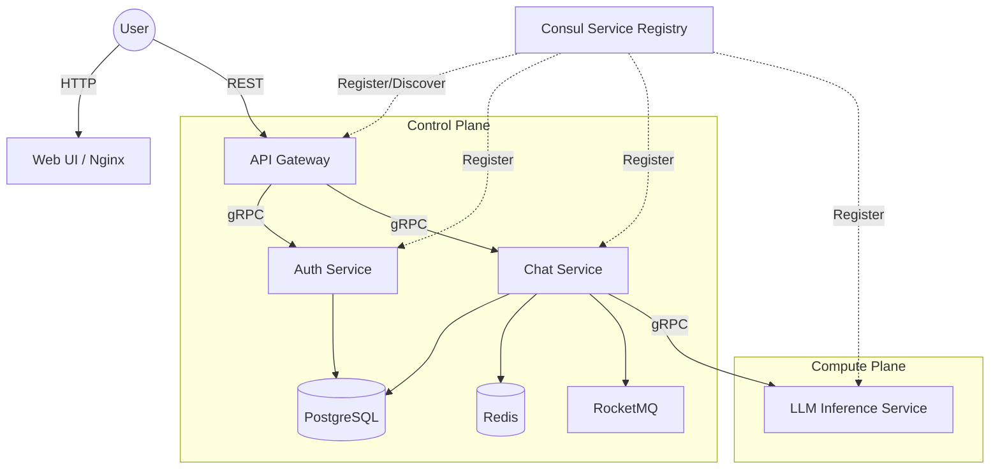
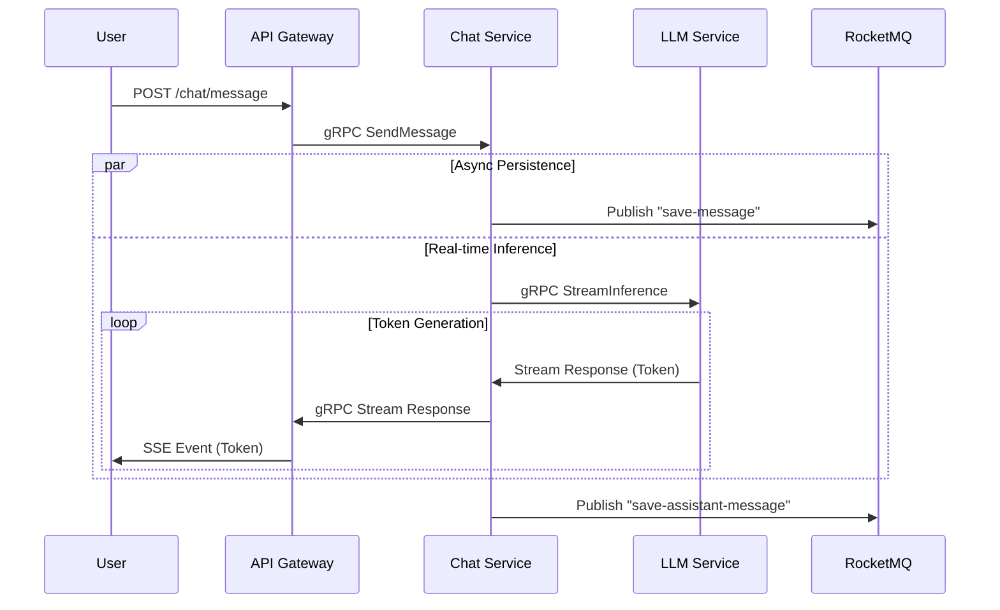

# Free Chat

**No-nonsense, microservices-based LLM chat platform.**
Go backend, Python inference, distributed-ready.

[English](README.md) | [中文](README_CN.md)

## 🏗 Architecture

Standard microservices pattern. No magic, just solid engineering.



## 🔄 Data Flow

Request path for a chat message. Pure streaming via SSE.



## 🚀 Quick Start

### 1. Single Node (Development)
The classic way. Runs everything on your local machine.

```bash
# Clone
git clone https://github.com/einspanner/free-chat.git
cd free-chat

# Run
docker compose up -d --build
```

Access: `http://localhost:3000`

### 2. Distributed Deployment (Production-Ready)
Split the brain (Control Plane) from the muscle (GPU Compute).

**Server A (Control Plane):**
Runs Gateway, Auth, DB, MQ, Consul.
```bash
export ADVERTISE_IP=100.100.1.1  # Server A's Tailscale/LAN IP
docker-compose -f docker-compose-control.yml up -d
```

**Server B (GPU Compute):**
Runs Chat Service, LLM Inference.
```bash
export ADVERTISE_IP=100.100.1.2  # Server B's Tailscale/LAN IP
export CONTROL_PLANE_IP=100.100.1.1 # Connect to Server A
docker-compose -f docker-compose-compute.yml up -d
```

### 3. Run with Qwen-3B (High Performance)
Don't settle for the tiny 0.6B model if you have the VRAM.

**Method A: Environment Variable (Recommended)**
Modify `docker-compose.yml` or your export command:
```bash
export MODEL_NAME="Qwen/Qwen2.5-3B-Instruct"
```

**Method B: Docker Compose Override**
```yaml
  llm-inference:
    environment:
      - MODEL_NAME=Qwen/Qwen2.5-3B-Instruct
```
*Note: Ensure your GPU has at least 8GB VRAM for 3B models.*

## 🛠 Tech Stack
- **Go**: High-concurrency services (Gateway, Auth, Chat).
- **Python**: PyTorch/HuggingFace inference.
- **gRPC**: Low-latency inter-service communication.
- **RocketMQ**: Asynchronous message persistence.
- **Consul**: Dynamic service discovery.
- **Tailscale**: Secure mesh networking for distributed nodes.

## 📂 Project Structure

```text
.
├── cmd/                # Shared command-line tools
├── config/             # Global configuration files
├── deploy/             # Deployment configurations (e.g., HF Spaces)
├── pkg/                # Shared Go packages (Proto, Utils)
├── services/           # Microservices source code
│   ├── api-gateway/    # HTTP Gateway
│   ├── auth-service/   # Authentication Service
│   ├── chat-service/   # Chat Business Logic
│   ├── llm-inference/  # Python LLM Service
│   └── web-ui/         # Frontend Static Files
└── docker-compose.yml  # Local development orchestration
```
