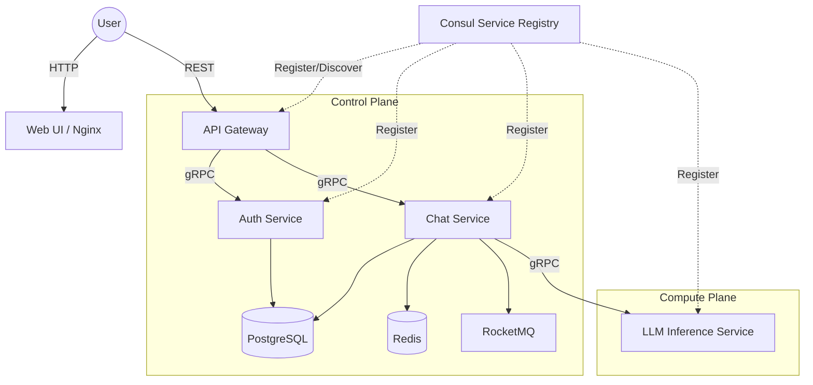
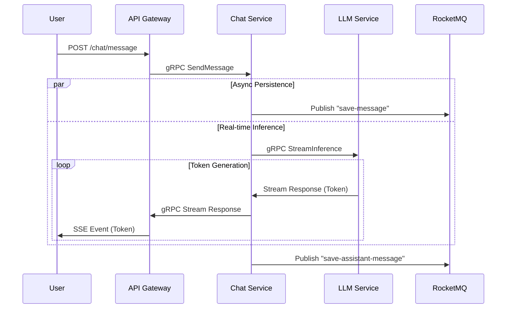

# Free Chat

Microservices-based LLM chat platform with Go backend, Python inference, and distributed deployment support.

[English](README.md) | [中文](README_CN.md)

## Architecture

Standard microservices pattern with control plane and compute plane separation.


```mermaid
graph TD
    User((User)) -->|HTTP| WebUI[Web UI / Nginx]
    User -->|REST| Gateway[API Gateway]
    
    subgraph "Control Plane"
        Gateway -->|gRPC| Auth[Auth Service]
        Gateway -->|gRPC| Chat[Chat Service]
        Auth --> DB[(PostgreSQL)]
        Chat --> DB
        Chat --> Redis[(Redis)]
        Chat --> MQ[RocketMQ]
    end
    
    subgraph "Compute Plane"
        Chat -->|gRPC| LLM[LLM Inference Service]
    end
    
    Consul[Consul Service Registry] -.->|Register/Discover| Gateway
    Consul -.->|Register| Auth
    Consul -.->|Register| Chat
    Consul -.->|Register| LLM
```

## Data Flow

Request path for a chat message with SSE streaming and async persistence via RocketMQ.


```mermaid
sequenceDiagram
    participant U as User
    participant G as API Gateway
    participant C as Chat Service
    participant L as LLM Service
    participant M as RocketMQ
    
    U->>G: POST /chat/message
    G->>C: gRPC SendMessage
    
    par Async Persistence
        C->>M: Publish "save-message"
    and Real-time Inference
        C->>L: gRPC StreamInference
        
        loop Token Generation
            L->>C: Stream Response (Token)
            C->>G: gRPC Stream Response
            G->>U: SSE Event (Token)
        end
    end
    
    C->>M: Publish "save-assistant-message"
```

## Context Management

The context system manages LLM context window with token budget, automatic compression, topic analysis, and attention sink optimization.

### Pipeline

```
User Message → SaveMessage (token_count)
            → GetHistory (last 10 messages)
            → ContextBuilder.Build()
                 ├─ Budget check (tiktoken-go estimation)
                 ├─ Under budget?  → Full context
                 ├─ Over budget?   → Compressor (level-based)
                 └─ Severely over? → TopicAnalyzer → SSE topic_select
            → JSON → LLM Inference (Python)
```

### Token Counting

| Layer | Method | Accuracy | Use |
|-------|--------|----------|-----|
| Python (source of truth) | `tokenizer.encode(text)` | Exact | Input/output metrics |
| Go (estimation) | `tiktoken-go` + model map | ±3-5% | Real-time budget decisions |
| Go (fallback) | `len(text)/2` | Rough | Unknown model support |

### Compression Strategy (Automatic)

When token budget is insufficient, messages are compressed by age:

| Level | Range | Treatment |
|-------|-------|-----------|
| 0 (verbatim) | Last 5 turns | Full content preserved |
| 1 (light) | Turns 6-20 | Truncated to first 100 chars |
| 2 (medium) | Turns 21-50 | Truncated to first 50 chars |
| 3 (heavy) | Turns 51+ | Replaced with "[compressed]" |
| 4 (discard) | Beyond budget | Removed from context |

### Topic Analysis (Interactive)

When compression is insufficient and conversation exceeds 3 turns, topic analysis triggers:

1. Chat Service sends history to LLM with analysis prompt
2. LLM returns structured JSON with identified topics
3. First SSE event carries `event: topic_select` with topics
4. User selects a topic via `topic_id` in next request
5. Context is rebuilt using only the selected topic's history

### Attention Sink Optimization

Context messages are structured to mitigate attention sink distortion:

```
Position 0:  "\n\n"                          ← Sink token (absorbs excess attention)
Position 1:  System: global instruction       ← Primacy effect
Position N:  History (chronological)          ← Conversation turns
Position N+1: System: instruction repeat      ← Recency effect  
Position N+2: User: current input             ← Current query
```

## Quick Start

### 1. Single Node (Development)

Run all services on a single machine using Docker Compose.

```bash
git clone https://github.com/einspanner/free-chat.git
cd free-chat

# Copy and customize environment variables
cp .env.example .env

docker compose up -d --build
```

Access: `http://localhost:3000`

### 2. Distributed Deployment (Production-Ready)

Separate control plane services from GPU compute services across two machines.

**Server A (Control Plane):** Runs Gateway, Auth, DB, MQ, Consul.

```bash
export ADVERTISE_IP=100.100.1.1  # Server A's Tailscale/LAN IP
docker-compose -f docker-compose-control.yml up -d
```

**Server B (GPU Compute):** Runs Chat Service, LLM Inference.

```bash
export ADVERTISE_IP=100.100.1.2  # Server B's Tailscale/LAN IP
export CONTROL_PLANE_IP=100.100.1.1 # Connect to Server A
docker-compose -f docker-compose-compute.yml up -d
```

### 3. Run with Qwen-3B (High Performance)

Default model is 0.6B. For better quality, use Qwen-3B (requires 8GB+ VRAM).

```bash
export MODEL_NAME="Qwen/Qwen2.5-3B-Instruct"
```

For Docker, add to environment section:
```yaml
  llm-inference:
    environment:
      - MODEL_NAME=Qwen/Qwen2.5-3B-Instruct
```

## Configuration

All configuration is centralized via `.env` file. Copy `.env.example` to `.env` and customize:

```bash
cp .env.example .env
```

Key variables:

| Variable | Description | Default |
|----------|-------------|---------|
| `ADVERTISE_IP` | Fixed IP for Consul registration (distributed mode) | auto-detect |
| `AUTH_JWT_SECRET` | JWT signing secret | `change-me` |
| `POSTGRES_PASSWORD` | Database password | `change-me` |
| `LLM_MODEL_NAME` | HuggingFace model path | `Qwen/Qwen2.5-0.5B-Instruct` |
| `CONTROL_PLANE_IP` | Control plane address for compute nodes | (required in distributed) |

## Tech Stack

- **Go**: Chat service, Auth service, API Gateway
- **Python**: LLM inference with PyTorch/HuggingFace Transformers
- **gRPC**: Inter-service communication
- **RocketMQ**: Async message persistence
- **Consul**: Dynamic service discovery
- **Redis**: Caching, rate limiting, model load balancing
- **PostgreSQL**: Message and session persistence
- **Tailscale**: Mesh networking for distributed nodes (optional)

## Project Structure

```text
.
├── .env.example               # Environment variable template
├── config/                    # Global configuration
│   ├── config.go              # Viper-based config loader
│   └── config.yml             # Default configuration
├── pkg/                       # Shared packages
│   ├── proto/                 # gRPC proto definitions
│   └── registry/              # Consul service discovery
├── services/
│   ├── api-gateway/           # HTTP gateway (Gin)
│   ├── auth-service/          # JWT auth + user management
│   ├── chat-service/          # Chat business logic + context management
│   │   └── internal/
│   │       ├── application/   # Use cases
│   │       ├── domain/        # Entities + interfaces
│   │       └── infrastructure/
│   │           ├── context/   # ContextBuilder, Budget, Compressor, TopicAnalyzer
│   │           ├── mq/        # RocketMQ producer/consumer
│   │           ├── persistence/ # Redis cache + PostgreSQL (GORM)
│   │           └── tokenizer/ # tiktoken-go counting
│   ├── llm-inference/         # Python LLM service (gRPC)
│   └── web-ui/                # Frontend (Nginx)
├── testapi/                   # Bruno API collection
├── docker-compose.yml         # Single-node orchestration
├── docker-compose-control.yml # Distributed: control plane
└── docker-compose-compute.yml # Distributed: compute plane
```

## API Testing

The project includes a [Bruno](https://www.usebruno.com) API collection in `testapi/` covering all 10 routes:

| Method | Path | Description |
|--------|------|-------------|
| GET | `/health` | Health check |
| POST | `/api/v1/auth/login` | User login |
| POST | `/api/v1/auth/register` | User registration |
| POST | `/api/v1/auth/refresh` | Token refresh |
| POST | `/api/v1/chat/sessions` | Create session |
| GET | `/api/v1/chat/sessions` | List sessions |
| GET | `/api/v1/chat/sessions/:id/history` | Get history |
| DELETE | `/api/v1/chat/sessions/:id` | Delete session |
| POST | `/api/v1/chat/sessions/messages` | Send message (SSE stream) |
| POST | `/api/v1/chat/sessions/stream` | Send message (SSE stream) |

## Test Coverage

```
pkg/registry/consul_test.go              — ResolveAdvertiseIP
services/api-gateway/internal/
  handler/chat_handler_test.go           — SSE sentinel, topic_id
  middleware/                             — CORS, JWT auth, rate limit
services/auth-service/internal/
  infrastructure/security/jwt_test.go    — JWT expiry, claims, refresh
services/chat-service/internal/
  domain/entity_test.go                  — Message.TokenCount
  infrastructure/
    context/                             — Budget, Builder, Compressor,
                                           TopicAnalyzer, Attention Sink (23 tests)
    tokenizer/                           — tiktoken-go (5 tests)
```
