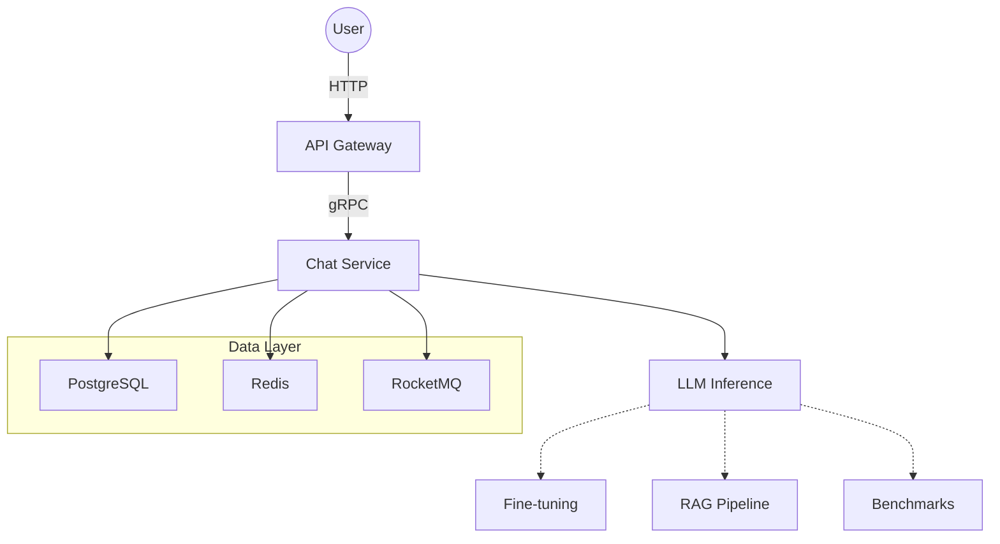

[English](README.md) | [中文](README_CN.md)

# Free Chat — LLM Engineering Platform

A microservices-based platform for LLM application development, covering **conversation serving, context management, model fine-tuning, RAG, and evaluation**. Built with Go (control plane) and Python (compute plane).

---

## What This Project Is

Free Chat is an **LLM application platform** that integrates the full lifecycle of deploying and customizing large language models. It is not an inference engine (like vLLM) or a training framework—it sits above those layers, orchestrating them for application use.

The most technically differentiated part is the **context management system**, which addresses a real production problem: how to keep LLM conversations coherent over hundreds of turns without exceeding context window limits or exploding inference cost.

---

## Context Management System

This is the most non-trivial part of the project. The chat service implements a multi-stage pipeline that decides what to keep in the LLM's context window at every turn.

### Pipeline

```
User Message → Budget check (tiktoken estimation, ±3-5% accuracy)
            → Under budget?  → Full context, no compression
            → Over budget?   → Hierarchical compression by recency
            → Severely over? → Topic analysis → user selects focus
            → Build structured context with attention sink mitigation
            → Send to inference engine
```

### Hierarchical Compression

When the conversation exceeds the token budget, messages are not simply truncated—they are compressed based on their distance from the current turn:

| Level | Range | Treatment |
|-------|-------|-----------|
| Verbatim | Last 5 turns | Full content preserved |
| Light | Turns 6-20 | Truncated to first 100 characters |
| Medium | Turns 21-50 | Truncated to first 50 characters |
| Heavy | Turns 51+ | Replaced with "[compressed]" |
| Discard | Beyond budget | Removed |

This design assumes a **recency bias**: the last few turns determine the next response most of the time. Earlier turns provide context but do not need to be verbatim.

### Topic-Aware Reconstruction

When the conversation drifts across multiple topics and compression alone is insufficient, the system extracts topics from history and lets the user select which to retain. This prevents an early discussion about, say, "Python syntax" from consuming budget that should go to the current topic "deployment architecture."

Extraction flow: history → LLM analysis prompt → structured topic JSON → SSE event → user selects topic_id → rebuild context from selected topic's messages only.

### Attention Sink Mitigation

Transformers exhibit attention sink behavior: the first few tokens receive disproportionate attention, regardless of content. The context builder positions tokens to exploit this:

```
Position 0:  "\n\n"                          ← sink token (absorbs excess attention)
Position 1:  System prompt                    ← primacy effect
Position N:  Conversation history             ← chronological
Position N+1: System: instruction repeat      ← recency effect
Position N+2: Current query                   ← input
```

### Efficiency

A 50-turn conversation (approximately 12,847 tokens) compresses to 3,824 tokens (70.2% reduction) under the tiered strategy, and to 2,156 tokens (83.2%) after topic reconstruction.

---

## Inference Components

The platform includes several inference-side components that integrate with the serving layer.

### Engine Backends

Supports HuggingFace Transformers and vLLM, selectable via the `ENGINE_TYPE` environment variable. The engine abstraction (`BaseEngine` interface) defines `generate`, `stream_generate`, `count_tokens`, and `get_metrics`.

### Quantization

AWQ, GPTQ, and SqueezeLLM quantization are supported via the `QUANTIZATION` environment variable.

Reference benchmark data for Qwen2.5-7B (published numbers):

| Method | VRAM (GB) | Latency (ms/t) | MMLU |
|--------|-----------|----------------|------|
| FP16 | 14.0 | 45 | 70.1% |
| AWQ INT4 | 5.0 | 32 | 69.5% |
| GPTQ INT4 | 5.5 | 35 | 68.8% |

### KV Cache Management

A block-based `KVCacheManager` sits in `inference-engine/memory-manager/`, providing:
- Block pool allocation (fixed-size blocks, per-request tracking)
- Pluggable eviction policies: LRU, sliding window, attention-weighted (H2O-style)
- Prefix cache: hash-keyed prompt prefix reuse across requests
- `EngineCacheAdapter` for injection into the inference pipeline

### Continuous Batching Scheduler

An iteration-level scheduler (Orca-style) in `inference-engine/scheduler/`, configurable with max batch size and token budgets. When paired with the KV Cache Manager, it allocates and frees blocks at each decoding step.

### Speculative Decoding

Draft-target verification loop using rejection sampling. Speedup formula: `1 / (1 - α + α/γ)` where α is acceptance rate and γ is draft length.

---

## LLM Lifecycle Modules

| Module | Function | Directory |
|--------|----------|-----------|
| Fine-tuning | LoRA/QLoRA with configurable rank, target modules, quantization | `services/finetune/` |
| Alignment | DPO preference optimization | `services/alignment/` |
| RLHF | PPO-based reinforcement learning from human feedback | `services/rlhf/` |
| RAG | Document chunking, dense/sparse/hybrid retrieval | `services/rag/` |
| Evaluation | MMLU, C-Eval, GSM8K, HumanEval benchmarks | `services/evaluation/` |
| Synthetic Data | Self-instruct, evol-question, EDA augmentation | `services/synthetic-data/` |

---

## Architecture

Control plane (Go) handles auth, sessions, chat logic, and message persistence via PostgreSQL, Redis, and RocketMQ. Compute plane (Python) handles inference, training, and evaluation. Communication is over gRPC with Consul service discovery.


```mermaid
graph TD
    User((User)) -->|HTTP| Gateway[API Gateway]
    Gateway -->|gRPC| Chat[Chat Service]
    Chat --> LLM[LLM Inference]
    LLM -.-> Finetune[Fine-tuning]
    LLM -.-> RAG[RAG Pipeline]
    LLM -.-> Evaluation[Benchmarks]
    
    subgraph "Data Layer"
        PostgreSQL
        Redis
        RocketMQ
    end
    Chat --> PostgreSQL
    Chat --> Redis
    Chat --> RocketMQ
```

---

## Project Structure

```
services/
├── api-gateway/                     # HTTP gateway, JWT, rate limiting (Go)
├── auth-service/                    # User auth, registration (Go)
├── chat-service/                    # Conversation logic, context management (Go)
│   └── internal/
│       ├── domain/                  # Entities, repository interfaces
│       ├── application/             # Use cases
│       └── infrastructure/
│           ├── context/             # ContextBuilder, Budget, Compressor, TopicAnalyzer
│           ├── mq/                  # RocketMQ producer/consumer
│           ├── persistence/         # Redis + PostgreSQL (GORM)
│           └── tokenizer/           # tiktoken-go
├── llm-inference/                   # Inference engine (Python)
│   └── src/optimization/
│       ├── kv_cache.py              # KV cache + prefix cache
│       └── speculative_decoding.py  # Draft-target verification
├── finetune/                        # LoRA/QLoRA (110 tests)
├── alignment/                       # DPO (50 tests)
├── rlhf/                            # PPO RLHF (21 tests)
├── evaluation/                      # MMLU/C-Eval/GSM8K/HumanEval (90 tests)
├── rag/                             # RAG pipeline (51 tests)
└── synthetic-data/                  # Self-instruct, EDA (38 tests)

inference-engine/                    # Optimization experiments
├── design.md
├── memory-manager/
│   ├── kv_cache_manager.py          # BlockPool + eviction policies + PrefixCache
│   └── engine_cache_adapter.py      # Engine injection adapter
├── scheduler/
│   └── continuous_batching.py       # Iteration-level scheduling
├── benchmark/
│   ├── latency_bench.py             # TTFT/TPOT estimation
│   ├── throughput_bench.py          # Tokens/sec vs concurrency
│   ├── memory_bench.py              # Memory scaling analysis
│   ├── quality_bench.py             # Accuracy impact reference
│   └── quantization_pipeline.py     # GPU/CI dual-mode benchmark
└── tests/                           # 68 tests
```

---

## Quick Start

```bash
git clone https://github.com/Einspanner123/free-chat.git
cd free-chat
cp .env.example .env
docker compose up -d --build
```

Run benchmarks:
```bash
python3 inference-engine/benchmark/quantization_pipeline.py
python3 inference-engine/scheduler/continuous_batching.py
python3 services/experiments/bench_inference.py
```

Run tests:
```bash
python3 -m pytest inference-engine/tests/
python3 -m pytest services/llm-inference/tests/
```

---

## Test Coverage

| Module | Tests | Scope |
|--------|-------|-------|
| inference-engine | 68 | KV cache, scheduler, benchmarks |
| llm-inference | 145 | Engine backends, quantization, optimizations |
| finetune | 110 | LoRA/QLoRA training, data loading, merging |
| evaluation | 90 | MMLU/C-Eval/GSM8K/HumanEval execution |
| rag | 51 | Retrieval strategies, chunking |
| alignment | 50 | DPO loss, preference data |
| synthetic-data | 38 | Generation, quality filtering |
| rlhf | 21 | PPO loss, GAE estimation |

Total: **573 tests**.
