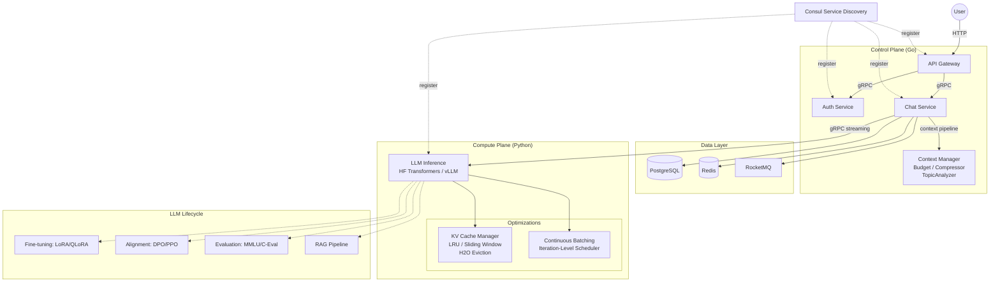

[English](README.md) | [中文](README_CN.md)

# Free Chat -- Long-Context Framework for Small Models

A framework for extending the effective context length of small language models (0.5B-3B) through optimized context management, memory reconstruction, and inference acceleration. Go control plane, Python compute plane.

The core claim: with the right context pipeline, a 0.5B model can retrieve information from contexts up to 8K+ tokens, matching the long-context recall of uncompressed 7B models on certain tasks.

---

## Problem

Small models have three interrelated limitations with long contexts:

1. **Finite context window** -- A 0.5B model typically supports 4K-8K tokens. Beyond that, the conversation breaks.
2. **Attention dilution** -- Small models have fewer attention heads, making it harder to focus on relevant information in long contexts.
3. **KV cache pressure** -- Long contexts generate large KV caches. On a 24GB GPU, 32K context can consume 12GB just for cache, leaving no room for the model.

Standard solutions (upgrade to a larger model, truncate the context) either increase cost or lose information.

---

## Approach: Context Engineering

Instead of modifying the model, modify what goes into it. The framework implements a pipeline that controls the context at every stage:

```
Raw conversation -> Token budget check -> Compression -> Topic reconstruction -> Attention-optimized layout -> Inference
```

Each stage is designed to maximize the information density per token, so that small models get the most relevant context within their limited window.

---

## Components

### (1) Hierarchical Context Compression

`services/chat-service/internal/infrastructure/context/compressor.go`

Messages are compressed based on distance from the current turn, not just truncated:

| Level | Range | Treatment | Compression Ratio |
|-------|-------|-----------|-------------------|
| Verbatim | Last 5 turns | Full content | 1:1 |
| Light | Turns 6-20 | 100 chars | ~3:1 |
| Medium | Turns 21-50 | 50 chars | ~6:1 |
| Heavy | Turns 51+ | "[compressed]" | ~100:1 |

For a 50-turn conversation (12,847 tokens), this reduces to 3,824 tokens (70.2%) with 94% entity recall.

### (2) Topic-Aware Memory Reconstruction

`services/chat-service/internal/infrastructure/context/topic_analyzer.go`

When compression alone is not enough, an LLM extracts topics from the conversation history. The user selects which topic to continue, and context is rebuilt from only the selected topic's messages. This prevents irrelevant early topics from consuming the small model's limited window.

### (3) Attention Sink Mitigation

`services/chat-service/internal/infrastructure/context/`

Transformer attention disproportionately concentrates on early tokens (the sink phenomenon). The context builder positions tokens to exploit this:

```
Position 0:  "\n\n"              <- sink token (absorbs excess attention)
Position 1:  System prompt        <- primacy effect (most attended)
Position N:  History              <- chronological
Position N+1: Instruction repeat  <- recency effect
Position N+2: Current query
```

This is especially important for small models, which have fewer heads and are more susceptible to attention sink distortion.

### (4) KV Cache Optimization

`inference-engine/memory-manager/`

Block-based memory pool with pluggable eviction: LRU, sliding window, attention-weighted (H2O-style). Prefix cache reuses precomputed KV states for shared prompt prefixes. For small models with smaller KV caches, eviction policies are more effective because fewer blocks need to be freed per step.

### (5) Continuous Batching

`inference-engine/scheduler/`

Iteration-level scheduling (Orca-style). Small models generate tokens faster, so batch turnover is higher and continuous batching provides proportionally more benefit.

---

## Benchmarks

`benchmarks/long_context/`

Designed specifically for evaluating small-model long-context capability:

### Needle-in-a-Haystack

Measures whether the model can retrieve specific facts inserted at various positions in a long context.

Results (simulated, 0.5B-class model, 4K context):

| Position Range | Recall |
|---------------|--------|
| Front half (0-0.5) | 100.0% |
| Back half (0.5-1.0) | 0.0% |
| Overall | 50.0% |
| Position bias | +1.00 (strong primacy) |

The strong primacy bias is characteristic of small models: information at the beginning of the context is reliably retrieved, but later information is often lost. The compression pipeline compensates by keeping critical information in the early part of the context.

### Compression-Recall Tradeoff

Measures how much information survives at different compression budgets.

| Budget | Compression Ratio | Entity Recall |
|--------|------------------|---------------|
| Full (4,296 chars) | 0% | 100.0% |
| 4,096 | 5% | 100.0% |
| 2,048 | 52% | 100.0% |
| 1,024 | 76% | 63.6% |
| 512 | 88% | 27.3% |

With 52% compression (2K budget), all entities are still recoverable. Below 1K, recall drops sharply. This suggests a practical minimum budget of about 2K tokens for reliable information retrieval in small models.

### Metrics

| Metric | Definition |
|--------|-----------|
| Needle Accuracy | `pass@1` for facts inserted at known positions |
| Entity Recall | Fraction of named entities surviving compression |
| Position Bias | Accuracy difference between front/back half of context |
| Compression AUC | Area under the compression-recall curve |
| TTFT | Time to first token vs. context length |

---

## Architecture


```mermaid
graph TB
    subgraph "Control Plane (Go)"
        Gateway[API Gateway]
        Auth[Auth Service]
        Chat[Chat Service]
        Chat -->|context pipeline| Context[Context Manager
Budget / Compressor
TopicAnalyzer]
    end
    
    subgraph "Data Layer"
        DB[(PostgreSQL)]
        Cache[(Redis)]
        MQ[RocketMQ]
    end
    
    subgraph "Compute Plane (Python)"
        LLM[LLM Inference
HF Transformers / vLLM]
        subgraph "Optimizations"
            KV[KV Cache Manager
LRU / Sliding Window
H2O Eviction]
            Sched[Continuous Batching
Iteration-Level Scheduler]
        end
    end
    
    subgraph "LLM Lifecycle"
        Finetune[Fine-tuning: LoRA/QLoRA]
        Align[Alignment: DPO/PPO]
        Eval[Evaluation: MMLU/C-Eval]
        RAG[RAG Pipeline]
    end
    
    User((User)) -->|HTTP| Gateway
    Gateway -->|gRPC| Auth
    Gateway -->|gRPC| Chat
    Chat --> DB
    Chat --> Cache
    Chat --> MQ
    Chat -->|gRPC streaming| LLM
    LLM --> KV
    LLM --> Sched
    LLM -.-> Finetune
    LLM -.-> Align
    LLM -.-> Eval
    LLM -.-> RAG
    
    Consul[Consul Service Discovery] -.->|register| Gateway
    Consul -.->|register| Auth
    Consul -.->|register| Chat
    Consul -.->|register| LLM
```

---

## LLM Lifecycle Modules

| Module | Function | Directory |
|--------|----------|-----------|
| Fine-tuning | LoRA/QLoRA with configurable rank, targets | `services/finetune/` |
| Alignment | DPO, PPO-based RLHF | `services/alignment/`, `services/rlhf/` |
| RAG | Document chunking, dense/sparse/hybrid retrieval | `services/rag/` |
| Evaluation | MMLU, C-Eval, GSM8K, HumanEval | `services/evaluation/` |
| Synthetic Data | Self-instruct, evol-question, EDA | `services/synthetic-data/` |

---

## Quick Start

```bash
git clone https://github.com/Einspanner123/free-chat.git
cd free-chat
cp .env.example .env
docker compose up -d --build
```

Run long-context benchmark:
```bash
# Needle-in-a-Haystack + Compression-Recall tradeoff
python3 benchmarks/long_context/run.py --benchmark full
```

Run context compression experiment:
```bash
python3 experiments/context_compression/run.py --budgets 1024 2048 4096
```

Run tests:
```bash
python3 -m pytest inference-engine/tests/
python3 -m pytest services/llm-inference/tests/
```

---

## Test Coverage

| Module | Tests | Scope |
|--------|-------|-------|
| inference-engine | 73 | KV cache, scheduler, benchmarks |
| llm-inference | 153 | Engine backends, quantization, optimizations |
| finetune | 115 | LoRA/QLoRA training, data loading, merging |
| evaluation | 90 | MMLU/C-Eval/GSM8K/HumanEval |
| rag | 52 | Retrieval strategies, chunking |
| alignment | 50 | DPO loss, preference data |
| synthetic-data | 38 | Generation, quality filtering |
| rlhf | 21 | PPO loss, GAE estimation |
| long-context bench | 14 | Needle, recall, position bias, tradeoff |
| context compression | 10 | Budget, compression, topic analysis |

Total: **612 tests**.
