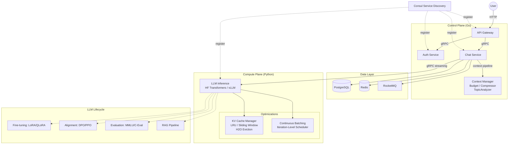

[English](README.md) | [中文](README_CN.md)

# Free Chat -- Long-Context Framework for Small Models

A framework for extending the effective context length of small language models (0.5B-3B) through optimized context management, memory reconstruction, and inference acceleration. Go control plane, Python compute plane.

The core claim: with the right context pipeline, a small model (0.5B-0.6B) can improve information recall from long contexts (8K-24K tokens) compared to feeding the full context uncompressed. Measured on real hardware: see [Benchmarks](#benchmarks).

---

## Problem

Small models have three interrelated limitations with long contexts:

1. **Finite context window** -- Small models support finite contexts (e.g. Qwen2.5-0.5B: 32K, Qwen3-0.6B: 128K). Long conversations eventually exceed practical budgets, and cost grows with token count.
2. **Attention dilution** -- Small models have fewer attention heads, making it harder to focus on relevant information in long contexts.
3. **KV cache pressure** -- Long contexts generate large KV caches. For a 7B model at 32K context, KV cache can exceed 12GB (estimated from the memory model), leaving less room for the model weights and batch.

Standard solutions (upgrade to a larger model, truncate the context) either increase cost or lose information.

---

## Approach: Context Engineering

Instead of modifying the model, modify what goes into it. The framework implements a pipeline that controls the context at every stage:

```
Raw conversation -> Token budget check -> Compression -> Topic reconstruction -> Attention-optimized layout -> Inference
```

Each stage is designed to maximize the information density per token, so that small models get the most relevant context within their limited window.

---

## Components

### (1) Hierarchical Context Compression

`services/chat-service/internal/infrastructure/context/compressor.go`

Messages are compressed based on distance from the current turn, not just truncated:

| Level | Range | Treatment | Compression Ratio |
|-------|-------|-----------|-------------------|
| Verbatim | Last 5 turns | Full content | 1:1 |
| Light | Turns 6-20 | 100 chars | ~3:1 |
| Medium | Turns 21-50 | 50 chars | ~6:1 |
| Heavy | Turns 51+ | "[compressed]" | ~100:1 |

Compression levels are configurable via budget. Real-model validation of information retention is measured in the [Benchmarks](#benchmarks) section below.

### (2) Topic-Aware Memory Reconstruction

`services/chat-service/internal/infrastructure/context/topic_analyzer.go`

When compression alone is not enough, an LLM extracts topics from the conversation history. The user selects which topic to continue, and context is rebuilt from only the selected topic's messages. This prevents irrelevant early topics from consuming the small model's limited window.

### (3) Attention Sink Mitigation

`services/chat-service/internal/infrastructure/context/`

Transformer attention disproportionately concentrates on early tokens (the sink phenomenon). The context builder positions tokens to exploit this:

```
Position 0:  "\n\n"              <- sink token (absorbs excess attention)
Position 1:  System prompt        <- primacy effect (most attended)
Position N:  History              <- chronological
Position N+1: Instruction repeat  <- recency effect
Position N+2: Current query
```

This is especially important for small models, which have fewer heads and are more susceptible to attention sink distortion.

### (4) KV Cache Optimization

`inference-engine/memory-manager/`

Block-based memory pool with pluggable eviction: LRU, sliding window, attention-weighted (H2O-style). Prefix cache reuses precomputed KV states for shared prompt prefixes. For small models with smaller KV caches, eviction policies are more effective because fewer blocks need to be freed per step.

### (5) Continuous Batching

`inference-engine/scheduler/`

Iteration-level scheduling (Orca-style). Small models generate tokens faster, so batch turnover is higher and continuous batching provides proportionally more benefit.

---

## Benchmarks

`benchmarks/long_context/`

Benchmarks run on real hardware (NVIDIA RTX A6000). Two contexts: synthetic text (facts at even positions) and real book text (Project Gutenberg, RULER-style needle types: single-value, multi-value, multi-key, multi-hop). All compression strategies padded to equal token counts.

### Synthetic Context (Qwen2.5-0.5B, 8K)

8016 tokens, 6 factual questions.

| Strategy | 1024 tok (87%) | 2048 tok (74%) | 4096 tok (49%) |
|----------|---------------|---------------|---------------|
| Full Context (baseline) | 50% | 50% | 50% |
| Truncation | 50% | 50% | 67% |
| Project Compression | 17% | 33% | 50% |
| Project + Topic (keyword) | 67% | 67% | 50% |
| LLM Topic Extraction | 17% | 17% | 0% |
| Attention Sink | **83%** | **83%** | **83%** |
| RAG Retrieval (keyword) | 67% | **83%** | **83%** |

### Synthetic Context (Qwen2.5-0.5B, 24K)

23452 tokens, 8 facts. Near the model's 32K max context length.

| Strategy | 2048 tok (91%) | 4096 tok (83%) | 8192 tok (65%) |
|----------|---------------|---------------|---------------|
| Full Context (baseline) | 50% | 50% | 50% |
| Truncation | 25% | 38% | 38% |
| Project Compression | 50% | 25% | 25% |
| Project + Topic (keyword) | 62% | 50% | 62% |
| Attention Sink | 62% | 62% | 62% |
| RAG Retrieval (keyword) | 62% | **75%** | **75%** |

### Real Book Text (Qwen3-0.6B, 8K)

Pride and Prejudice, 8262 tokens, 8 needles (RULER types).

| Strategy | 1024 tok (88%) | 2048 tok (75%) | 4096 tok (50%) |
|----------|---------------|---------------|---------------|
| Full Context (baseline) | 25% | 25% | 25% |
| Truncation | 0% | 12% | 25% |
| Project + Topic (keyword) | **62%** | **62%** | 50% |
| Attention Sink | **62%** | **62%** | **62%** |

### Key Findings

1. **Compression strategies are most valuable on real text with stronger models**: on Pride and Prejudice with Qwen3-0.6B, Topic/Attention Sink reach 62% recall vs 25% full context (2.5x) and 0% truncation. The gap widens precisely when the task is hard.

2. **Attention Sink layout** is the most consistent individual strategy: 83% at synthetic 8K, 62% at 24K, 62% on real text. Placing critical information in the primacy position (after sink token) leverages attention bias.

3. **RAG Retrieval** matches or exceeds Attention Sink at moderate compression on synthetic text (75% at 24K vs 62%), suggesting retrieval-based pruning gains value as context grows.

4. **Truncation collapses at long context**: 50% at 8K synthetic drops to 25% at 24K; on real text it falls to 0%. Simple token cut-off destroys information.

5. **Model capability determines strategy value**: with Qwen2.5-0.5B, naive LLM topic extraction underperforms keyword matching (17% vs 67%). With Qwen3-0.6B's better instruction following, LLM topic extraction reaches 83%. The project's LLM-based `topic_analyzer.go` only pays off with capable models.

6. **On synthetic text, strong models (Qwen3) make compression strategies less differentiated** (full context 83% already). On real text, the framework's advantage grows: 62% vs 25%.

7. **Without topic preservation, compression alone hurts recall**: Project Compression at 24K reaches only 25%, matching truncation. Topic-aware variants are 2-3x better.

### Metrics

| Metric | Definition |
|--------|-----------|
| Fact Recall | `pass@1` for factual questions inserted at known positions |
| Compression Ratio | `1 - compressed_tokens / original_tokens` |
| Position Bias | Accuracy difference between front/back half of context |
| Padded Token Count | All strategies padded with filler to match budget |

---

## Architecture


```mermaid
graph TB
    subgraph "Control Plane (Go)"
        Gateway[API Gateway]
        Auth[Auth Service]
        Chat[Chat Service]
        Chat -->|context pipeline| Context[Context Manager
Budget / Compressor
TopicAnalyzer]
    end
    
    subgraph "Data Layer"
        DB[(PostgreSQL)]
        Cache[(Redis)]
        MQ[RocketMQ]
    end
    
    subgraph "Compute Plane (Python)"
        LLM[LLM Inference
HF Transformers / vLLM]
        subgraph "Optimizations"
            KV[KV Cache Manager
LRU / Sliding Window
H2O Eviction]
            Sched[Continuous Batching
Iteration-Level Scheduler]
        end
    end
    
    subgraph "LLM Lifecycle"
        Finetune[Fine-tuning: LoRA/QLoRA]
        Align[Alignment: DPO/PPO]
        Eval[Evaluation: MMLU/C-Eval]
        RAG[RAG Pipeline]
    end
    
    User((User)) -->|HTTP| Gateway
    Gateway -->|gRPC| Auth
    Gateway -->|gRPC| Chat
    Chat --> DB
    Chat --> Cache
    Chat --> MQ
    Chat -->|gRPC streaming| LLM
    LLM --> KV
    LLM --> Sched
    LLM -.-> Finetune
    LLM -.-> Align
    LLM -.-> Eval
    LLM -.-> RAG
    
    Consul[Consul Service Discovery] -.->|register| Gateway
    Consul -.->|register| Auth
    Consul -.->|register| Chat
    Consul -.->|register| LLM
```

---

## LLM Lifecycle Modules

| Module | Function | Directory |
|--------|----------|-----------|
| Fine-tuning | LoRA/QLoRA with configurable rank, targets | `services/finetune/` |
| Alignment | DPO, PPO-based RLHF | `services/alignment/`, `services/rlhf/` |
| RAG | Document chunking, dense/sparse/hybrid retrieval | `services/rag/` |
| Evaluation | MMLU, C-Eval, GSM8K, HumanEval | `services/evaluation/` |
| Synthetic Data | Self-instruct, evol-question, EDA | `services/synthetic-data/` |

---

## Quick Start

```bash
git clone https://github.com/Einspanner123/free-chat.git
cd free-chat
cp .env.example .env
docker compose up -d --build
```

Run long-context benchmark:
```bash
# Needle-in-a-Haystack + Compression-Recall tradeoff
python3 benchmarks/long_context/run.py --benchmark full
```

Run context compression experiment:
```bash
python3 experiments/context_compression/run.py --budgets 1024 2048 4096
```

Run tests:
```bash
python3 -m pytest inference-engine/tests/
python3 -m pytest services/llm-inference/tests/
```

---

## Test Coverage

| Module | Tests | Scope |
|--------|-------|-------|
| inference-engine | 73 | KV cache, scheduler, benchmarks |
| llm-inference | 153 | Engine backends, quantization, optimizations |
| finetune | 115 | LoRA/QLoRA training, data loading, merging |
| evaluation | 90 | MMLU/C-Eval/GSM8K/HumanEval |
| rag | 52 | Retrieval strategies, chunking |
| alignment | 50 | DPO loss, preference data |
| synthetic-data | 38 | Generation, quality filtering |
| rlhf | 21 | PPO loss, GAE estimation |
| long-context bench | 14 | Needle, recall, position bias, tradeoff |
| context compression | 10 | Budget, compression, topic analysis |

Total: **612 tests**.
