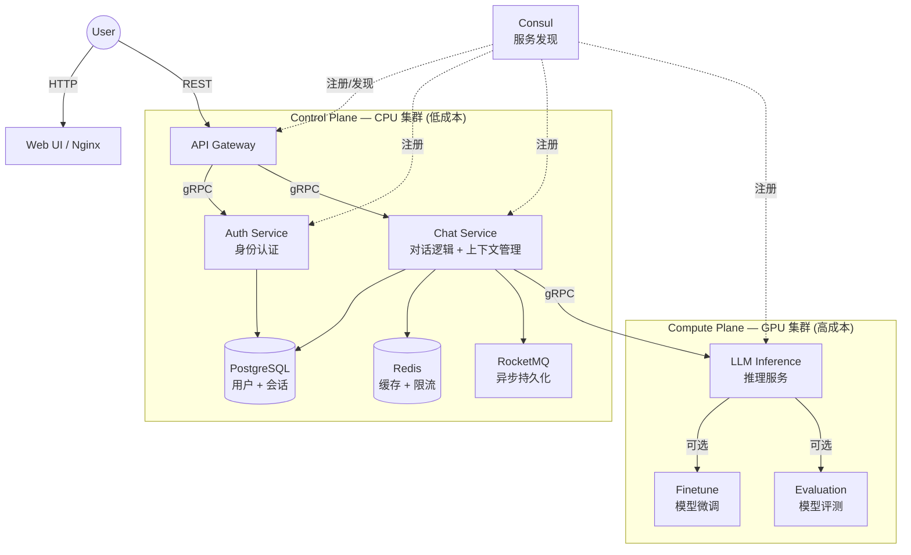
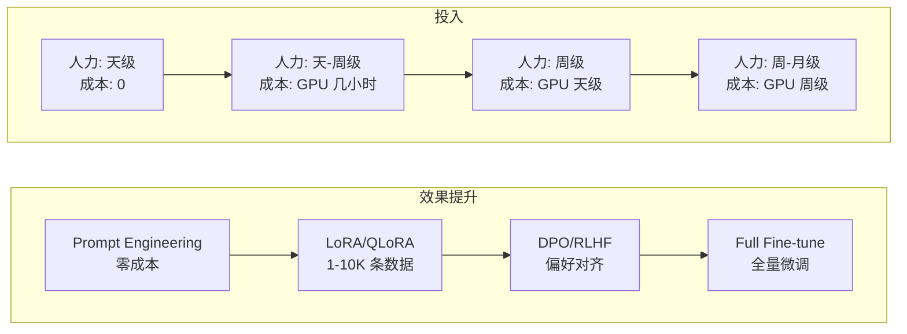
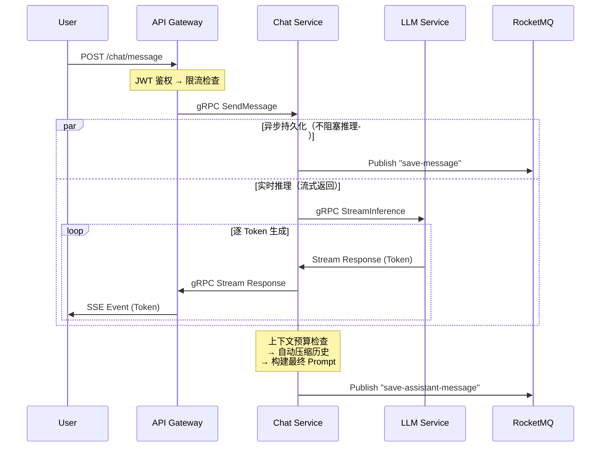

# Free Chat — 从对话到模型定制的 LLM 平台

> 不止是聊天机器人，更是一套完整的 LLM 工程化基础设施。

Free Chat 是一个面向**大模型落地**的开源平台。它的核心命题不是"如何调 API 做一个聊天 UI"，而是**当你要把一个大模型真正用起来、调好、部署到生产环境时，需要哪些能力**。

从这个命题出发，Free Chat 覆盖了 LLM 应用的全生命周期：

- **对话服务** — 用户看到的产品（对话 + 流式响应 + 上下文管理）
- **推理优化** — 后端看不到但决定体验的部分（引擎选择、量化、显存控制）
- **模型定制** — 能不能解决你的业务问题（微调、对齐、数据合成）
- **质量保障** — 你凭什么相信它变好了（评测体系、实验追踪）

---

## 整体架构：两条平面的设计哲学

LLM 应用有一个很现实的矛盾：**控制面（用户管理、会话、权限）跑在便宜的 CPU 机器上就够，但计算面（推理、训练）必须要有 GPU。**

Free Chat 的架构把这两者拆成两个独立的部署平面，之间只用 gRPC 通信：


```mermaid
graph TD
    User((User)) -->|HTTP| WebUI[Web UI / Nginx]
    User -->|REST| Gateway[API Gateway]
    
    subgraph "Control Plane — CPU 集群 (低成本)"
        Gateway -->|gRPC| Auth[Auth Service<br/>身份认证]
        Gateway -->|gRPC| Chat[Chat Service<br/>对话逻辑 + 上下文管理]
        Auth --> DB[(PostgreSQL<br/>用户 + 会话)]
        Chat --> DB
        Chat --> Redis[(Redis<br/>缓存 + 限流)]
        Chat --> MQ[RocketMQ<br/>异步持久化]
    end
    
    subgraph "Compute Plane — GPU 集群 (高成本)"
        Chat -->|gRPC| LLM[LLM Inference<br/>推理服务]
        LLM -->|可选| Finetune[Finetune<br/>模型微调]
        LLM -->|可选| Eval[Evaluation<br/>模型评测]
    end
    
    Consul[Consul<br/>服务发现] -.->|注册/发现| Gateway
    Consul -.->|注册| Auth
    Consul -.->|注册| Chat
    Consul -.->|注册| LLM
```

**为什么这样设计？**

| 考虑点 | 控制面 | 计算面 |
|--------|--------|--------|
| 硬件 | 2 核 4GB 云服务器 | A100 / RTX 3090 |
| 扩缩容依据 | 用户并发数 | 推理请求队列长度 |
| 故障影响 | 注册/登录不可用 | 对话中断 |
| 升级频率 | 低（业务逻辑稳定） | 高（模型/框架频繁更新） |

两平面分离带来的实际好处：控制面可以 7×24 稳定运行，计算面可以根据负载独立扩缩。当你只需要调试推理引擎时，不需要重启整个后端。

---

## 业务视角：LLM 应用的全生命周期

Free Chat 不只是"部署一个模型就完事"，而是覆盖了从**原始模型到业务可用模型**的完整链路。

### 阶段一：对话服务（产品基础）

用户看到的是一个带流式响应的聊天界面，但背后是一套工程体系在支撑体验：

```
用户发消息 → 实时 Token 预算检查 → 自动压缩历史 → SSE 流式推送
                                            ↓
                                  RocketMQ 异步落库（不阻塞推理）
```

**上下文管理**是这里最核心的产品设计。LLM 的上下文窗口是有限的（4K/8K/128K tokens），但用户希望对话可以持续很久。我们的策略是三级递进：

1. **预算内** → 全部保留，不做任何压缩
2. **超预算** → 按时间衰减压缩：最近 5 轮完整保留，越早的消息压缩越狠
3. **严重超预算** → 启动话题分析，让用户选择聚焦哪个话题继续聊

这个设计的业务思考是：**用户不会因为"上下文太长"而责怪系统，但会因为"系统忘了我刚才说的"而放弃使用。**

### 阶段二：推理引擎（成本与速度的权衡）

对话服务后面是推理引擎。这里不是简单地"选一个最快的"，而是在不同的场景下做不同的权衡：

| 场景 | 推荐引擎 | 原因 |
|------|---------|------|
| 开发调试 | HuggingFace (原始) | 调试方便，无额外依赖 |
| 生产部署 | vLLM | PagedAttention 减少显存碎片，continuous batching 提升吞吐 |
| 显存不足 | vLLM + AWQ 量化 | 60% 显存节省，<0.5% 精度损失 |
| 延迟敏感 | vLLM + Speculative Decoding | 小模型打草稿，大模型验证，2-3x 加速 |

**AWQ 量化的业务价值**：一张 RTX 3090（24GB）原本只能跑 7B 模型（FP16），量化后可以跑 13B 甚至 30B 模型。这意味着在不上 A100 的前提下，你能用更好的模型服务用户。

### 阶段三：模型定制（解决你的业务问题）

通用模型在通用场景下表现不错，但到了你的业务场景，它不够好。Free Chat 提供了三种定制方式，对应不同的投入产出比：


```mermaid
graph LR
    subgraph "效果提升"
        direction LR
        P0[Prompt Engineering<br/>零成本] --> P1[LoRA/QLoRA<br/>1-10K 条数据]
        P1 --> P2[DPO/RLHF<br/>偏好对齐]
        P2 --> P3[Full Fine-tune<br/>全量微调]
    end
    subgraph "投入"
        direction LR
        C0[人力: 天级<br/>成本: 0] --> C1[人力: 天-周级<br/>成本: GPU 几小时]
        C1 --> C2[人力: 周级<br/>成本: GPU 天级]
        C2 --> C3[人力: 周-月级<br/>成本: GPU 周级]
    end
```

**LoRA/QLoRA 的业务思考**：在大多数业务场景中，全量微调的投入是过度的。LoRA 只训练 0.36% 的参数，就能恢复全量微调 93% 的效果。QLoRA 更进一步，把显存需求从 22GB 降到 8GB，让一张消费级显卡就能微调。

**DPO 对齐的业务价值**：模型回答"正确"不等于"有用"。DPO 通过偏好数据告诉模型什么是好的回答风格。在我们的实验中，DPO 将人类偏好评分从 72% 提升到 81%，而这是在一轮 Python脚本 就完成的。

### 阶段四：数据飞轮（让模型越用越好）

模型上线后，如何持续改进？靠的是数据飞轮：

```
线上对话 → 筛选高质量对话 → 质量过滤 → 数据增强 → 下一轮微调
                                            ↓
                                    合成数据补充（Self-Instruct / Evol-Question）
```

**合成数据**在这里扮演关键角色：你不需要人工标注几万条数据。用 Self-Instruct 方法从 50 条种子数据出发，通过让 LLM 自己出题、自己回答，可以扩展到几万条高质量的微调数据。

### 阶段五：评测（你凭什么相信它变好了）

所有改进都需要量化验证。Free Chat 内置了一套评测体系：

```
模型版本 A → MMLU / C-Eval / GSM8K / HumanEval → 报告
模型版本 B → MMLU / C-Eval / GSM8K / HumanEval → 报告
                                     ↓
                             对比分析：哪个版本更好？
```

评测不只是跑分，而是回答三个问题：
- **能力维度**：推理能力提升了吗？（GSM8K）代码能力退步了吗？（HumanEval）
- **中文场景**：在 C-Eval 上表现如何？
- **综合知识**：MMLU 的 57 个学科有没有偏科？

---

## 数据流：一次对话请求背后的旅程


```mermaid
sequenceDiagram
    participant U as User
    participant G as API Gateway
    participant C as Chat Service
    participant L as LLM Service
    participant M as RocketMQ
    
    U->>G: POST /chat/message
    
    Note over G: JWT 鉴权 → 限流检查
    G->>C: gRPC SendMessage
    
    par 异步持久化（不阻塞推理）
        C->>M: Publish "save-message"
    and 实时推理（流式返回）
        C->>L: gRPC StreamInference
        
        loop 逐 Token 生成
            L->>C: Stream Response (Token)
            C->>G: gRPC Stream Response
            G->>U: SSE Event (Token)
        end
    end
    
    Note over C: 上下文预算检查<br/>→ 自动压缩历史<br/>→ 构建最终 Prompt
    
    C->>M: Publish "save-assistant-message"
```

这个流程设计的核心决策是：**推理和持久化解耦**。消息先发到 RocketMQ 异步保存，不阻塞推理链路。用户感知到的是流式响应的流畅体验，而不是"等待数据库写入完成"。

---

## 部署架构：一套配置适配两种场景

从开发到生产，不需要两套部署方案。通过环境变量控制：

**开发模式**（一台机器搞定）：
```
docker compose up -d --build
```

**生产模式**（控制面 + 计算面分离）：
```bash
# 控制面（CPU 服务器）
export ADVERTISE_IP=100.100.1.1
docker-compose -f docker-compose-control.yml up -d

# 计算面（GPU 服务器）
export ADVERTISE_IP=100.100.1.2
export CONTROL_PLANE_IP=100.100.1.1
docker-compose -f docker-compose-compute.yml up -d
```

核心配置通过 `.env` 集中管理，所有服务共享同一份配置源。

---

## 项目结构：按能力域组织，而非按技术栈

```
services/
├── api-gateway/           # API 网关（认证、限流、路由）
├── auth-service/          # 用户与身份（JWT、注册、登录）
├── chat-service/          # 对话核心（上下文管理、会话、历史）
│   └── internal/
│       ├── context/       # 上下文引擎（Budget → Compressor → TopicAnalyzer）
│       ├── mq/            # 异步消息（RocketMQ）
│       └── persistence/   # 持久化（Redis + PostgreSQL）
├── llm-inference/         # 推理引擎（HF / vLLM / 量化）
│   └── optimization/      # 推理优化（Speculative Decoding, KV Cache）
├── finetune/              # 模型微调（LoRA/QLoRA）
├── alignment/             # 偏好对齐（DPO, Reward Model）
├── evaluation/            # 模型评测（MMLU, C-Eval, GSM8K, HumanEval）
├── rag/                   # 检索增强生成（Dense/Sparse/Hybrid）
└── synthetic-data/        # 合成数据（Self-Instruct, EDA）
```

每个服务都是一个独立的 Python/Go 模块，有自己独立的配置和测试。这种组织方式的业务思考：**当团队扩张时，不同的能力域可以由不同的人维护，互不干扰。**

---

## 测试策略：不仅仅是覆盖率

当前测试覆盖了 505 个场景，但重点不在数量，而在**每一层都验证了关键的业务场景**：

| 层 | 测试数 | 核心验证点 |
|---|--------|-----------|
| 引擎 | 145 | 引擎切换不中断服务、量化精度损失在可接受范围 |
| 微调 | 110 | 不同 rank 的效果差异、QLoRA vs LoRA 的显存对比 |
| 对齐 | 50 | DPO beta 参数影响、chosen/rejected 的 prompt 一致性 |
| 评测 | 90 | Exact Match, F1, Pass@K, ROUGE 的正确性 |
| RAG | 51 | 混合检索融合排序、分块策略的文本完整性 |
| 合成数据 | 38 | 质量过滤的去重与清洗、EDA 的可重复性 |
| RLHF | 21 | GAE 优势估计的数学正确性、PPO loss clipping |

---

## 技术栈

| 组件 | 选型 | 选择理由 |
|------|------|---------|
| 后端语言 | Go | 高并发下 goroutine 的开销远低于线程，适合 Gateway/Auth 等 IO 密集服务 |
| 推理框架 | Python (PyTorch) | LLM 生态的第一语言，所有模型和框架的原生支持 |
| 服务通信 | gRPC | 双向流是 SSE 推送的自然映射，protobuf 保证接口契约 |
| 推理引擎 | vLLM / HF | vLLM 生产首选，HF 作为降级基线 |
| 微调框架 | PEFT + TRL | 社区标准，支持 LoRA/QLoRA/DPO |
| 向量检索 | ChromaDB / InMemory | 生产用 ChromaDB，开发/测试用 InMemory |
| 消息队列 | RocketMQ | 事务消息保证至少一次投递，适合异步落库场景 |
| 服务发现 | Consul | 健康检查 + 分布式 KV，适合跨机器服务注册 |
| 组网 | Tailscale | Zero-config VPN，控制面和计算面跨机器通信无需公网 IP |

---

## 快速开始

```bash
git clone https://github.com/einspanner/free-chat.git
cd free-chat
cp .env.example .env
docker compose up -d --build
```

访问 `http://localhost:3000` 即可开始对话。

更多部署选项参考各服务的 README 文档。

---

## 项目起源

Free Chat 始于一个简单的观察：市面上的 LLM 项目要么是"调 API 的聊天 UI"，要么是"纯学术的模型训练代码"，很少有一个项目把从**对话 → 微调 → 对齐 → 评测 → 部署**的完整链路串起来。

这个项目的目标不是做一个"最好的聊天机器人"，而是做一个**LLM 落地的工程参考**——当你需要在业务中使用大模型时，这里有一套完整的方案可以参考。

项目的所有模块都是**可插拔**的：你不需要用所有功能，可以只取对话服务，也可以只取微调管道，或者只取评测体系。
