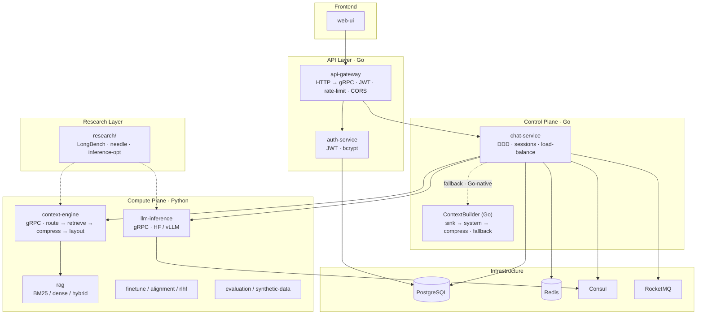
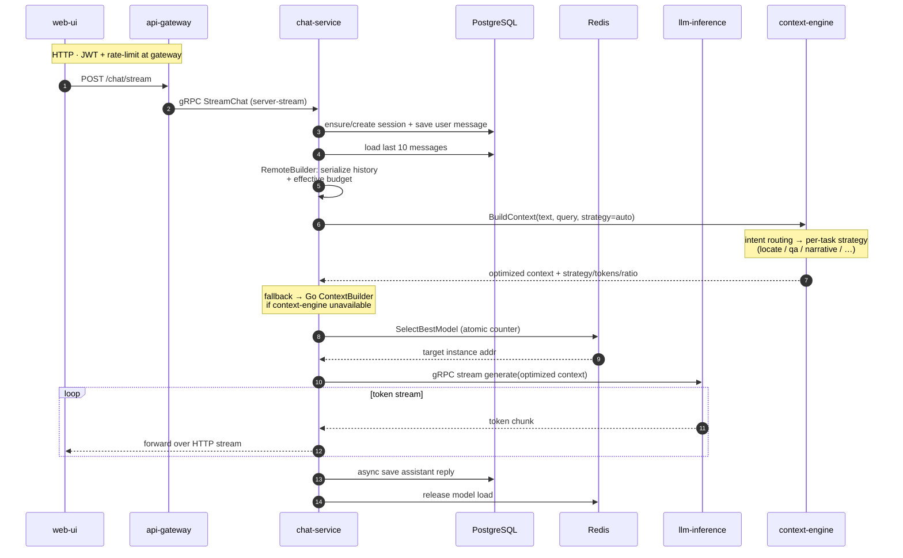

# Free Chat — Long-Context Framework for Small Models

[English](README.md) | [中文](README_CN.md)

Extend the effective context length of **small language models (0.5B–3B)** through context management and RAG-based retrieval — validated by benchmarks on real hardware (RTX A6000), not by simulation.

Go control plane, Python compute plane. A microservice chat platform plus a research layer that measures *what actually works*.

---

## Highlights

| | Result | vs Baseline |
|---|---|---|
| **Paragraph localization** (LongBench passage_retrieval_en) | **98%** with BM25 top-1 retrieval | 10% with truncation |
| **Framework gain across model scales** | **7.4×** (0.6B) / **10×** (7B) | over truncation |
| **Batch decoding throughput** | **6.23×** at batch 8 | vs batch 1 |
| **Prefix-cache prefill** | **up to 2.97×** | vs full re-prefill |

---

## Core Contributions

1. **Layered context engine** — a `retrieve → compress → layout` pipeline that prepares optimized contexts for small models under a hard token budget. Killer feature: paragraph localization at 98%.
2. **Scale-invariance finding** — the framework's gain holds across model sizes (7.4× on 0.6B, 10× on 7B), so the method generalizes to the whole small-model family.
3. **Real-hardware inference measurements** — batching, prefix caching, and KV-cache analysis measured on a real GPU, feeding serving decisions such as batch sizing and prefix-cache reuse.
4. **Dual-stack platform** — Go services (gateway, auth, chat) + Python services (inference, context, RAG, fine-tuning, evaluation), gRPC contracts, service discovery, MQ-backed persistence.

---

## Architecture


```mermaid
flowchart TB
    subgraph FE["Frontend"]
        UI["web-ui"]
    end

    subgraph API["API Layer · Go"]
        GW["api-gateway<br/>HTTP → gRPC · JWT · rate-limit · CORS"]
        AUTH["auth-service<br/>JWT · bcrypt"]
    end

    subgraph CONTROL["Control Plane · Go"]
        CHAT["chat-service<br/>DDD · sessions · load-balance"]
        GOCTX["ContextBuilder (Go)<br/>sink → system → compress · fallback"]
    end

    subgraph COMPUTE["Compute Plane · Python"]
        LLM["llm-inference<br/>gRPC · HF / vLLM"]
        CE["context-engine<br/>gRPC · route → retrieve → compress → layout"]
        RAG["rag<br/>BM25 / dense / hybrid"]
        TRAIN["finetune / alignment / rlhf"]
        EVAL["evaluation / synthetic-data"]
    end

    subgraph INFRA["Infrastructure"]
        PG[("PostgreSQL")]
        RD[("Redis")]
        CSL["Consul"]
        RMQ["RocketMQ"]
    end

    subgraph RESEARCH["Research Layer"]
        RES["research/<br/>LongBench · needle · inference-opt"]
    end

    UI --> GW
    GW --> AUTH
    GW --> CHAT
    AUTH --> PG
    CHAT --> CE
    CE --> RAG
    CHAT -.->|"fallback · Go-native"| GOCTX
    CHAT --> LLM
    CHAT --> PG
    CHAT --> RD
    CHAT --> RMQ
    CHAT --> CSL
    LLM --> CSL
    RES -.-> CE
    RES -.-> LLM
```

**Design notes**

- The **main chat path** (solid lines) builds context through the Python `context-engine` via a `RemoteBuilder` (`route → retrieve → compress → layout`), then streams inference from `llm-inference`. The Go-native `ContextBuilder` remains as an automatic fallback (dashed edge) when the remote service is unavailable.
- The **`context-engine`** is exposed as a standalone gRPC service; the Go side implements `domain.ContextOptimizer` and wires it as the primary builder, with `strategy=auto` intent routing by default.
- The **Research layer** feeds the compute plane: findings on context compression and inference optimization land in `context-engine` and `llm-inference`.

---

## Request Flow


```mermaid
sequenceDiagram
    autonumber
    participant UI as web-ui
    participant GW as api-gateway
    participant CS as chat-service
    participant PG as PostgreSQL
    participant RD as Redis
    participant LI as llm-inference
    participant CE as context-engine

    Note over UI,GW: HTTP · JWT + rate-limit at gateway
    UI->>GW: POST /chat/stream
    GW->>CS: gRPC StreamChat (server-stream)
    CS->>PG: ensure/create session + save user message
    CS->>PG: load last 10 messages
    CS->>CS: RemoteBuilder: serialize history<br/>+ effective budget
    CS->>CE: BuildContext(text, query, strategy=auto)
    Note over CE: intent routing → per-task strategy<br/>(locate / qa / narrative / …)
    CE-->>CS: optimized context + strategy/tokens/ratio
    Note over CS: fallback → Go ContextBuilder<br/>if context-engine unavailable
    CS->>RD: SelectBestModel (atomic counter)
    RD-->>CS: target instance addr
    CS->>LI: gRPC stream generate(optimized context)
    loop token stream
        LI-->>CS: token chunk
        CS-->>UI: forward over HTTP stream
    end
    CS->>PG: async save assistant reply
    CS->>RD: release model load
```

---

## Key Findings

Experiments run on an **NVIDIA RTX A6000** with **Qwen3-0.6B** and **Qwen2.5-7B**.

### Long-context application (RAG)

**passage_retrieval_en** — given a multi-paragraph document, find the paragraph matching a description. 200 samples, ~12.7K tokens each.

| Method | Accuracy |
|---|---|
| Truncation | 10% |
| Keyword compression | 74% |
| **BM25 retrieval (top-1)** | **98%** |

BM25 hit rate is 100% (the answer paragraph is always in top-1); a 0.6B model reaches 98% from a single retrieved paragraph.

**L2 validation (production pipeline)** — the intent router (`strategy=auto`) classifies all 50/50 queries as `locate` and routes to BM25 top-1, reaching **98%** (budget 1024) — identical to the hand-picked strategy, no manual selection. Validation also caught a real pitfall: an answer hint like `(e.g., Paragraph 5)` anchors the 0.6B to output "5" (75% → 95% once removed), and an empty BM25 result now falls back to recency truncation instead of an empty context.

**Model-scale invariance** — same compressed context, two model sizes (20 samples):

| Strategy | Qwen3-0.6B | Qwen2.5-7B |
|---|---|---|
| Truncation | 10% | 10% |
| Project + Topic | 74% | 95% |
| Attention Sink | 60% | 100% |
| Sink + Topic | 60% | 100% |

Framework gain is **scale-invariant** (7.4× vs 10× over truncation); strategy value grows with model capability (the 7B exploits layout better).

**Task boundary** — the method is a *localization* tool, not a panacea:

| Task type | Framework effect |
|---|---|
| Passage location (passage_retrieval_en) | 98–100% (killer feature) |
| Single-doc QA (multifieldqa_en) | F1 0.174 → 0.357 (2.1×) |
| Science QA (qasper) | F1 0.132 → 0.253 (1.9×) |
| Narrative generation (narrativeqa) | No gain (answer synthesis, not location) |
| Chinese comprehension / classification | Limited (0.6B comprehension boundary) |

### Inference optimization (real hardware)

| Experiment | Result | Takeaway |
|---|---|---|
| Batch decoding | 6.23× throughput @ batch 8 | Memory-bound bandwidth amortization |
| Prefix caching | 1.68–2.97× prefill speedup | Avoids re-prefilling shared prefixes |
| INT8 (bitsandbytes) on Ampere | 5.7× **slower** | Dequantization overhead; INT8 buys memory, not speed here |
| KV eviction (StreamingLLM sink+window) | decode 0.97–1.0× (no speed), but **KV 1794MB → 28MB = 63× more context** on the same GPU; 7B ppl 3.12 → 3.3; needle retrieval in the evicted region collapses | Eviction's value is **memory**, not speed; the tradeoff is a measurable memory × quality curve |
| KV low-rank analysis | rank95≈2 (layer 0) vs ≈50 (mid) | Token redundancy → token pruning; per-token dim PCA ≈ MLA's latent compression (inference-side analog) |
| RoPE extension (NTK/YaRN) | default RoPE already 100% needle @ 30K–80K; YaRN adds nothing, drops to 75% @ 80K | The 0.6B never needed YaRN |

Measurements that came back negative are reported too — they define where a technique does and doesn't pay off, so it doesn't get re-tried blindly.

---

All inference measurements report **p50/p95/p99 tail latency** (not just means) — production serving is governed by tail latency, not averages. See `research/inference_optimization/run_decode_optimization.py` and `run_kv_cache_speedup.py`.

## Quick Start

```bash
# 1. Install dependencies
uv venv --python 3.12 --seed .venv
source .venv/bin/activate
pip install torch transformers

# 2. Run the chat platform
cp .env.example .env
docker compose up -d --build

# 3. Start the llm-inference service
ENGINE_TYPE=hf MODEL_NAME=Qwen/Qwen3-0.6B .venv/bin/python -m grpc_server --port 8089

# 4. Run a benchmark (downloads data first)
python scripts/download_benchmark_data.py
.venv/bin/python research/longbench_v1/run_passage_retrieval.py
```

---

## Project Structure

```
services/                    # Application layer
├── api-gateway/             # HTTP gateway (Go)
├── auth-service/            # User auth, JWT (Go)
├── chat-service/            # Chat with context management (Go)
├── llm-inference/           # Inference: HF / vLLM engines, quantization (Python)
├── context-engine/          # Context optimization: strategies/retriever/pipeline + gRPC (Python)
├── rag/                     # Chunking, embedding, BM25/dense/hybrid retrieval (Python)
├── finetune/                # LoRA / QLoRA fine-tuning (Python)
├── alignment/               # DPO preference alignment (Python)
├── rlhf/                    # PPO RLHF (Python)
├── evaluation/              # MMLU, C-Eval, GSM8K, HumanEval (Python)
├── synthetic-data/          # Self-instruct, data augmentation (Python)
└── web-ui/                  # Frontend shell

research/                    # Research layer — benchmarks & findings
├── long_context/            # Needle-in-a-haystack, compression ablations
├── longbench_v1/            # LongBench multi-task evaluation
├── longbench/               # LongBench-style QA (v2)
├── loong/                   # Chinese multi-doc QA
├── zero_scrolls/            # Long-text comprehension
└── inference_optimization/  # Real inference measurements (JSON results in results/)

pkg/proto/                   # Shared gRPC contracts (Go + Python stubs)
scripts/download_benchmark_data.py  # Fetch benchmark datasets on demand
```

### Application / Research boundary

| Layer | Purpose | Data | Stability |
|---|---|---|---|
| `services/` | Production features | No external datasets | Tested (559+ tests) |
| `research/` | Experiments, benchmarks, findings | Large datasets (gitignored) | Exploratory |
| `pkg/proto/` | Shared contracts | — | Stable interface |

Benchmark datasets (495MB) are not committed; fetch via `scripts/download_benchmark_data.py`.

---

## Test Coverage

| Module | Tests |
|---|---|
| llm-inference | 175 |
| evaluation | 90 |
| rag | 52 |
| context-engine | 74 |
| alignment | 50 |
| synthetic-data | 38 |
| finetune | 115 |
| rlhf | 21 |
| long_context research | 14 |
| chat-service (Go) | + gRPC / context-client tests |

---

## Deep Dive

- **context-engine** (`services/context-engine/`) — the layered pipeline is three stateless stages: `strategies` (chunking, keyword extraction, truncation, tiered compression, attention-sink layout) → `retriever` (BM25 / keyword / optional dense, behind one interface) → `pipeline` (orchestration). Fronted by an intent router (`strategy=auto`): a deterministic rule classifier maps the request to the strategy the benchmarks show works for that task (locate → BM25 top-1, QA → topic selection, narrative → no compression), with budget + confidence guards. Recency questions with no local document (latest/today/新闻) route to a new `web_search` strategy — a pluggable provider registry (design borrowed from hermes, ships a no-key DuckDuckGo backend) pulls live results into the context budget, bridging the model's knowledge cutoff. Exposed as gRPC.
- **llm-inference** (`services/llm-inference/`) — pluggable HF / vLLM engines with quantization. The serving path uses vLLM (`AsyncLLM`) for true token-level streaming; the HF engine is the fallback.
- **Repository size** — benchmark data is excluded from git; the repo is ~51MB of source + generated artifacts, with data fetched on demand.
