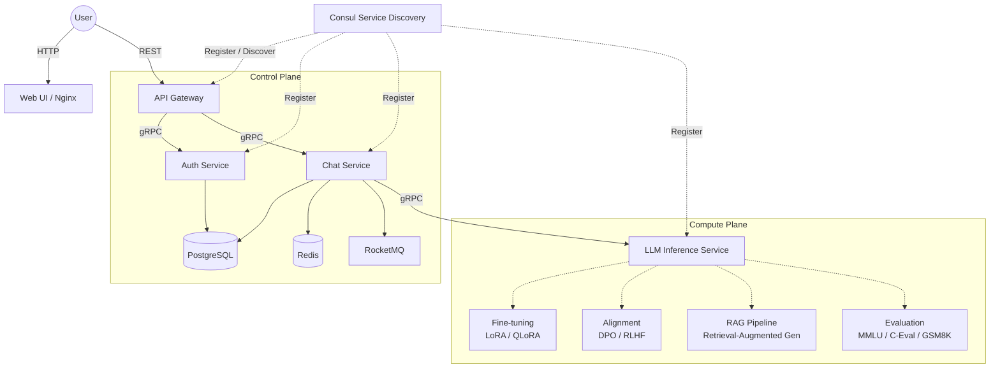

# Free Chat — LLM Training, Alignment and Efficient Inference Platform

<a href="https://github.com/Einspanner123/free-chat"></a>

**Free Chat** is a distributed platform covering the full lifecycle of large language model (LLM) applications: **inference serving, parameter-efficient fine-tuning, preference alignment, retrieval-augmented generation, and systematic evaluation**. It adopts a Go + Python microservice architecture to decouple the control plane from the compute plane.

---

## Table of Contents

- [Architecture Overview](#architecture-overview)
- [High-Performance LLM Inference](#high-performance-llm-inference)
- [Long-Context Dialogue Management](#long-context-dialogue-management)
- [Parameter-Efficient Fine-Tuning \& Alignment](#parameter-efficient-fine-tuning--alignment)
- [RAG-Augmented Generation](#rag-augmented-generation)
- [Evaluation Suite](#evaluation-suite)
- [Distributed Deployment](#distributed-deployment)
- [Project Structure](#project-structure)
- [Quick Start](#quick-start)
- [Configuration](#configuration)

---

## Architecture Overview

The platform separates the **control plane** (user auth, session management, API gateway, message queue) from the **compute plane** (LLM inference, model fine-tuning, evaluation). They communicate via gRPC and can be independently deployed and scaled.


```mermaid
graph TD
    User((User)) -->|HTTP| WebUI[Web UI / Nginx]
    User -->|REST| Gateway[API Gateway]
    
    subgraph "Control Plane"
        Gateway -->|gRPC| Auth[Auth Service]
        Gateway -->|gRPC| Chat[Chat Service]
        Auth --> DB[(PostgreSQL)]
        Chat --> DB
        Chat --> Redis[(Redis)]
        Chat --> MQ[RocketMQ]
    end
    
    subgraph "Compute Plane"
        Chat -->|gRPC| LLM[LLM Inference Service]
        LLM -.-> Finetune[Fine-tuning<br/>LoRA / QLoRA]
        LLM -.-> Alignment[Alignment<br/>DPO / RLHF]
        LLM -.-> RAG[RAG Pipeline<br/>Retrieval-Augmented Gen]
        LLM -.-> Evaluation[Evaluation<br/>MMLU / C-Eval / GSM8K]
    end
    
    Consul[Consul Service Discovery] -.->|Register / Discover| Gateway
    Consul -.->|Register| Auth
    Consul -.->|Register| Chat
    Consul -.->|Register| LLM
```

**Design rationale**: The control plane runs on commodity CPU instances and scales with user concurrency. The compute plane requires GPU resources and scales with inference queue depth and training workload. Decoupling them allows independent scaling and reduces operational cost—GPU instances are allocated only for what needs them.

---

## High-Performance LLM Inference

The inference service provides a pluggable engine abstraction with multiple backends and optimization strategies.

### Pluggable Engine Architecture

| Engine | Use Case | Notes |
|--------|----------|-------|
| HuggingFace Transformers | Development, debugging | No extra dependencies |
| vLLM | Production serving | PagedAttention, continuous batching |

The `BaseEngine` interface defines `generate`, `stream_generate`, `count_tokens`, and `get_metrics`. The `EngineFactory` auto-selects vLLM when available, falling back to HuggingFace.

### Quantization

| Method | Bits | VRAM Reduction | Accuracy Retention |
|--------|------|----------------|--------------------|
| AWQ | 4-bit | ~60% | ~99.4% of FP16 |
| GPTQ | 4-bit | ~58% | ~98.9% of FP16 |
| SqueezeLLM | 4-bit | ~62% | ~98.0% of FP16 |

Quantization is configured via the `QUANTIZATION` environment variable.

### Inference Optimizations

- **KV Cache**: LRU-evicted cache for key-value tensors, avoiding recomputation for shared prefixes across requests.
- **Prefix Cache**: Matches new prompts against cached prefixes for partial KV cache reuse.
- **Speculative Decoding**: A small draft model generates γ candidate tokens; the target model verifies them in a single forward pass. Expected speedup: `1 / (1 - α + α/γ)` where α is the token acceptance rate and γ is the draft length.

---

## Long-Context Dialogue Management

The chat service manages the LLM context window with a tiered compression pipeline, reducing long-sequence inference cost while preserving conversation quality.

### Pipeline

```
User Message → SaveMessage (token_count)
            → GetHistory (last 10 messages)
            → ContextBuilder.Build()
                 ├─ Budget check (tiktoken-go estimation)
                 ├─ Under budget?  → Full context
                 ├─ Over budget?   → Compressor (level-based)
                 └─ Severely over? → TopicAnalyzer → SSE topic_select
            → JSON → LLM Inference (Python)
```

### Token Estimation

| Layer | Method | Accuracy | Purpose |
|-------|--------|----------|---------|
| Python | `tokenizer.encode(text)` | Exact | Input/output metrics |
| Go | `tiktoken-go` + model map | ±3-5% | Real-time budget decisions |
| Go (fallback) | `len(text)/2` | Rough | Unknown model support |

### Hierarchical Context Compression

When the token budget is insufficient, messages are compressed by recency:

| Level | Range | Treatment |
|-------|-------|-----------|
| 0 (verbatim) | Last 5 turns | Full content preserved |
| 1 (light) | Turns 6-20 | Truncated to first 100 chars |
| 2 (medium) | Turns 21-50 | Truncated to first 50 chars |
| 3 (heavy) | Turns 51+ | Replaced with "[compressed]" |
| 4 (discard) | Beyond budget | Removed from context |

### Topic-Aware Context Reconstruction

When compression alone is insufficient and the conversation exceeds 3 turns, the system performs topic analysis:

1. Chat service sends conversation history to the LLM with an analysis prompt
2. LLM returns structured JSON with identified topics
3. An SSE event carries `event: topic_select` with topic options
4. User selects a topic via `topic_id` in the next request
5. Context is rebuilt using only the selected topic's history

### Attention Sink Mitigation

Context messages are structured to reduce positional bias in attention:

```
Position 0:  "\n\n"                          ← Sink token (absorbs excess attention)
Position 1:  System: global instruction       ← Primacy effect
Position N:  History (chronological)          ← Conversation turns
Position N+1: System: instruction repeat      ← Recency effect  
Position N+2: User: current input             ← Current query
```

---

## Parameter-Efficient Fine-Tuning & Alignment

### LoRA / QLoRA Fine-Tuning

The fine-tuning pipeline supports three data formats:

| Format | Structure | Source |
|--------|-----------|--------|
| ShareGPT | `{"conversations": [{"from": "human", "value": "..."}, ...]}` | Open-source datasets |
| Alpaca | `{"instruction": "...", "input": "...", "output": "..."}` | Stanford Alpaca |
| ChatML | `{"messages": [{"role": "...", "content": "..."}, ...]}` | OpenAI-compatible |

Key training parameters:

| Parameter | Default | Description |
|-----------|---------|-------------|
| LoRA rank (r) | 8 | Lower rank = fewer trainable parameters |
| LoRA alpha | 16 | Scaling factor |
| Target modules | q_proj, k_proj, v_proj, o_proj | Attention projections |
| Learning rate | 2e-4 | Typically higher than full fine-tuning |
| Per-device batch size | 4 | Per GPU |
| Gradient accumulation steps | 4 | Effective batch size = 4 × 4 = 16 |
| Max sequence length | 2048 | Sequences beyond this are truncated |
| QLoRA 4-bit NF4 | Enabled by default | Reduces VRAM from ~22GB to ~8GB |

### DPO (Direct Preference Optimization)

Implements DPO which replaces the two-step RLHF process with a single loss function:

$$ \mathcal{L}_{\text{DPO}}(\pi_\theta; \pi_{\text{ref}}) = -\mathbb{E}_{(x,y_w,y_l) \sim \mathcal{D}} \left[ \log \sigma \left( \beta \log \frac{\pi_\theta(y_w|x)}{\pi_{\text{ref}}(y_w|x)} - \beta \log \frac{\pi_\theta(y_l|x)}{\pi_{\text{ref}}(y_l|x)} \right) \right] $$

- **β**: Temperature parameter controlling the preference margin
- **loss_type**: Supports "sigmoid" (standard DPO), "ipo" (MSE-based), "kto_pair"
- **label_smoothing**: Prevents overfitting to preference labels

### PPO-Based RLHF

The RLHF pipeline implements the classic two-step approach:

1. **Reward Model**: A base LM with a linear head that outputs a scalar reward score
2. **PPO Training**: Policy optimization using PPO-Clip with Generalized Advantage Estimation (GAE)

$$ L^{\text{PPO}} = -\mathbb{E}\left[\min\left(r(\theta) \cdot A,\ \text{clip}(r(\theta), 1-\varepsilon, 1+\varepsilon) \cdot A\right)\right] + c_1 (V - R)^2 - c_2 \cdot \text{KL}(\pi_\theta \parallel \pi_{\text{ref}}) $$

- **GAE(γ, λ)**: Computes advantages as a weighted sum of TD residuals
- **Adaptive KL penalty**: Adjusts the KL coefficient based on the current KL vs. target KL ratio

### Synthetic Data Generation

To support fine-tuning data creation, the platform includes:

- **Self-Instruct**: Generate tasks from seed topics, then generate responses
- **Evol-Question**: Deepen (add constraints) or broaden (expand scope) existing questions
- **Quality Filtering**: Length checks, deduplication, HTML removal, repetition detection
- **EDA Augmentation**: Synonym replacement, random insertion/swap/deletion

---

## RAG-Augmented Generation

The RAG pipeline implements document chunking, dense retrieval, BM25 sparse retrieval, and hybrid retrieval fusion.

### Chunking Strategies

| Strategy | Method | Use Case |
|----------|--------|----------|
| Recursive | Split by separator priority list | General text |
| Semantic (sentence) | Split on sentence boundaries | Well-punctuated prose |
| Semantic (paragraph) | Split on double newlines | Structured documents |
| Semantic (topic) | Split on Markdown headings | Technical documentation |

### Retrieval Strategies

| Strategy | Method | Matching |
|----------|--------|----------|
| Dense | Embedding cosine similarity | Semantic similarity |
| Sparse | BM25 (Okapi variant) | Term overlap |
| Hybrid | Score normalization + weighted fusion | Both semantic and lexical |

### Pipeline Flow

```
ingest(text) → chunk → embed → index (vector store + BM25)
                                             ↓
query(text) → retrieve (dense/sparse/hybrid) → build_prompt → generate
```

---

## Evaluation Suite

The evaluation module runs standardized benchmarks against any model implementing the engine interface:

| Benchmark | Metric | Few-Shot | Description |
|-----------|--------|----------|-------------|
| MMLU | Accuracy | 5-shot | 57 subjects, multiple-choice |
| C-Eval | Accuracy | 5-shot | Chinese, 20 subjects |
| GSM8K | Accuracy | 8-shot | Grade-school math reasoning |
| HumanEval | pass@1 | 0-shot | Python function completion |

**Metrics**: Exact Match, token-level F1 score, ROUGE-1/ROUGE-L, pass@k, confidence intervals.

---

## Distributed Deployment

### Development (Single Node)

```bash
cp .env.example .env
docker compose up -d --build
```

Access at `http://localhost:3000`.

### Production (Separate Control & Compute Planes)

**Server A — Control Plane** (CPU instances):
```bash
export ADVERTISE_IP=100.100.1.1
docker-compose -f docker-compose-control.yml up -d
```

**Server B — Compute Plane** (GPU instances):
```bash
export ADVERTISE_IP=100.100.1.2
export CONTROL_PLANE_IP=100.100.1.1
docker-compose -f docker-compose-compute.yml up -d
```

### Request Flow


```mermaid
sequenceDiagram
    participant U as User
    participant G as API Gateway
    participant C as Chat Service
    participant L as LLM Service
    participant M as RocketMQ
    
    U->>G: POST /chat/message
    G->>C: gRPC SendMessage
    
    par Async Persistence
        C->>M: Publish "save-message"
    and Streaming Inference
        C->>L: gRPC StreamInference
        
        loop Token Generation
            L->>C: Stream Response (Token)
            C->>G: gRPC Stream Response
            G->>U: SSE Event (Token)
        end
    end
    
    C->>M: Publish "save-assistant-message"
```

The message is queued to RocketMQ for asynchronous persistence while the LLM begins streaming its response. Tokens are forwarded via gRPC bidirectional stream to the Go chat service, then as SSE events to the frontend.

---

## Project Structure

```
.
├── .env.example
├── config/                          # Global configuration
│   ├── config.go                    # Viper-based config loader
│   └── config.yml                   # Default configuration
├── pkg/                             # Shared packages
│   ├── proto/                       # gRPC proto definitions
│   └── registry/                    # Consul service discovery
├── services/
│   ├── api-gateway/                 # HTTP gateway (Gin, JWT, rate limiting)
│   ├── auth-service/                # User auth, registration, token management
│   ├── chat-service/                # Conversation logic, context management
│   │   └── internal/
│   │       ├── domain/              # Entities, repository interfaces
│   │       ├── application/         # Use cases
│   │       └── infrastructure/
│   │           ├── context/         # ContextBuilder, Budget, Compressor, TopicAnalyzer
│   │           ├── mq/              # RocketMQ producer/consumer
│   │           ├── persistence/     # Redis cache + PostgreSQL (GORM)
│   │           └── tokenizer/       # tiktoken-go token counting
│   ├── llm-inference/               # Python inference service
│   │   ├── src/
│   │   │   ├── engine_base.py       # Engine abstraction interface
│   │   │   ├── vllm_engine.py       # vLLM backend
│   │   │   ├── hf_engine.py         # HuggingFace backend
│   │   │   ├── quantization.py      # AWQ/GPTQ/SqueezeLLM config
│   │   │   └── optimization/        # Speculative decoding, KV cache
│   │   └── tests/                   # 145 tests
│   ├── finetune/                    # LoRA/QLoRA fine-tuning (110 tests)
│   ├── alignment/                   # DPO preference alignment (50 tests)
│   ├── evaluation/                  # MMLU, C-Eval, GSM8K, HumanEval (90 tests)
│   ├── rag/                         # RAG pipeline (51 tests)
│   ├── synthetic-data/              # Self-instruct, EDA augmentation (38 tests)
│   └── rlhf/                        # PPO-based RLHF (21 tests)
├── testapi/                         # Bruno API collection
├── docker-compose.yml               # Single-node orchestration
├── docker-compose-control.yml       # Control plane (distributed)
└── docker-compose-compute.yml       # Compute plane (distributed)
```

---

## Configuration

All configuration is centralized in the `.env` file. Key variables:

| Variable | Description | Default |
|----------|-------------|---------|
| `ADVERTISE_IP` | IP for Consul registration (distributed mode) | auto-detect |
| `ENGINE_TYPE` | Inference engine selection: auto, vllm, hf | auto |
| `QUANTIZATION` | Quantization: awq, gptq, squeezellm, or empty | (FP16) |
| `LLM_MODEL_NAME` | HuggingFace model path | `Qwen/Qwen2.5-0.5B-Instruct` |
| `CONTROL_PLANE_IP` | Control plane address (compute plane) | (required in distributed) |

---

## Quick Start

```bash
git clone https://github.com/Einspanner123/free-chat.git
cd free-chat
cp .env.example .env
docker compose up -d --build
```

Access at `http://localhost:3000`.

---

## Test Coverage

| Module | Tests | Coverage Scope |
|--------|-------|----------------|
| llm-inference | 145 | Engine switching, quantization, inference optimizations |
| finetune | 110 | LoRA/QLoRA training, data format loading, weight merging |
| alignment | 50 | DPO loss, preference data validation |
| evaluation | 90 | MMLU/C-Eval/GSM8K/HumanEval, metric computation |
| rag | 51 | Chunking, retrieval strategies, pipeline integration |
| synthetic-data | 38 | Data generation, quality filtering, EDA reproducibility |
| rlhf | 21 | PPO loss, GAE advantage estimation, KL adaptation |

**Total**: 505 tests.
