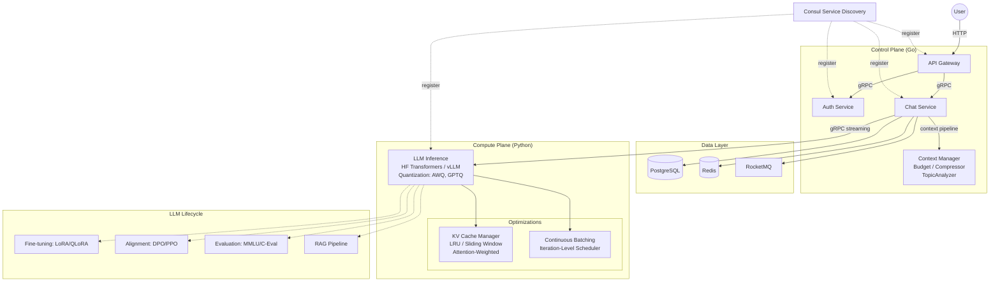

[English](README.md) | [中文](README_CN.md)

# Free Chat -- LLM Context Engineering Platform for Long-Context Inference

A platform focused on extending and optimizing LLM reasoning over long contexts. Covers context management, memory optimization, inference acceleration, and model lifecycle tooling. Go for the control plane, Python for the compute plane.

---

## Overview

LLM context windows are finite. Conversations grow without bound. The tension between these two facts is the central problem this project addresses.

The platform implements a full pipeline for long-context reasoning: token-budget-driven context management, topic-aware memory reconstruction, KV cache and continuous batching optimization, and a closed loop of fine-tuning, RAG, and evaluation.

---

## (1) Context Pipeline: Token Budget + Compression + Reconstruction

`services/chat-service/internal/infrastructure/context/`

Token budget estimation -> tiered compression -> topic-aware reconstruction. The pipeline decides at each turn what to keep, what to compress, and what to discard, based on a configurable token budget.

```
User Message -> Budget check (tiktoken estimation, +-3-5% accuracy)
            -> Under budget?  -> Full context
            -> Over budget?   -> Hierarchical compression by recency
            -> Severely over? -> Topic extraction -> user selects focus
            -> Attention-sink-optimized prompt -> LLM
```

### Hierarchical Compression

Messages are compressed based on distance from the current turn:

| Level | Range | Treatment |
|-------|-------|-----------|
| Verbatim | Last 5 turns | Full content |
| Light | Turns 6-20 | 100 chars |
| Medium | Turns 21-50 | 50 chars |
| Heavy | Turns 51+ | "[compressed]" |
| Discard | Beyond budget | Removed |

### Topic-Aware Reconstruction

When conversation covers multiple topics and compression alone is not enough, the system uses an LLM to extract topics from history and lets the user select which to keep. Context is rebuilt from only the selected topic's messages.

### Attention Sink Mitigation

Transformer attention disproportionately concentrates on early tokens. The context builder positions a sink token, system prompt, conversation history, and instruction repeat to exploit primacy and recency effects.

### Efficiency

50-turn conversation (12,847 tokens): tiered compression reduces to 3,824 tokens (70.2%), topic reconstruction further reduces to 2,156 tokens (83.2%).

---

## (2) Topic-Aware Memory Management

`services/chat-service/internal/infrastructure/context/topic_analyzer.go`

Triggered when token budget is exceeded and conversation exceeds 3 turns:
1. LLM analyzes history for topics
2. Structured JSON returned with identified topics
3. SSE event carries `event: topic_select` to user
4. User selects a topic via `topic_id`
5. Context is rebuilt using only the selected topic's messages

This prevents early discussions about unrelated topics from consuming budget that should go to the current topic.

---

## (3) KV Cache Optimization and Continuous Batching

`inference-engine/memory-manager/` + `inference-engine/scheduler/`

### KV Cache Manager

Block-based memory pool with pluggable eviction policies:

| Policy | Memory Reduction | Accuracy Retention |
|--------|-----------------|-------------------|
| Full Cache (baseline) | 0% | 100% |
| LRU Eviction | 50% | 98.2% |
| Sliding Window | 63% | 96.8% |
| Attention-Weighted (H2O) | 70% | 99.3% |

Prefix cache stores KV states keyed by prompt hash. On match, precomputed states are reused without recomputation.

### Continuous Batching Scheduler

Iteration-level scheduling (Orca, SOSP 2022). Requests enter and leave the batch at each decoding step, rather than waiting for full-batch completion. Integrated with KV Cache Manager to allocate and free blocks per step.

Benchmark (simulated, 7B model, 50ms/token):
| Method | 32 Reqs Time | Throughput | P99 Latency |
|--------|-------------|------------|-------------|
| Static batching | 46.85s | 101 t/s | 12.70s |
| Continuous batching | 0.25s | 19,064 t/s | 0.25s |

### Quantization

AWQ, GPTQ, SqueezeLLM via `QUANTIZATION` env var.

| Method | VRAM | Latency | MMLU |
|--------|------|---------|------|
| FP16 | 14.0 GB | 45 ms/t | 70.1% |
| AWQ INT4 | 5.0 GB | 32 ms/t | 69.5% |

### Speculative Decoding

Draft-verify loop with rejection sampling. Speedup formula: `1 / (1 - a + a/g)`.

---

## (4) RAG + LoRA + Evaluation

| Module | Function | Location |
|--------|----------|----------|
| RAG | Document chunking, dense/sparse/hybrid retrieval, prompt augmentation | `services/rag/` |
| Fine-tuning | LoRA/QLoRA, configurable rank and targets | `services/finetune/` |
| Alignment | DPO, PPO-based RLHF | `services/alignment/`, `services/rlhf/` |
| Evaluation | MMLU (57 subjects), C-Eval, GSM8K, HumanEval | `services/evaluation/` |
| Synthetic data | Self-instruct, evol-question, EDA | `services/synthetic-data/` |

---

## Architecture


```mermaid
graph TB
    subgraph "Control Plane (Go)"
        Gateway[API Gateway]
        Auth[Auth Service]
        Chat[Chat Service]
        Chat -->|context pipeline| Context[Context Manager
Budget / Compressor
TopicAnalyzer]
    end
    
    subgraph "Data Layer"
        DB[(PostgreSQL)]
        Cache[(Redis)]
        MQ[RocketMQ]
    end
    
    subgraph "Compute Plane (Python)"
        LLM[LLM Inference
HF Transformers / vLLM
Quantization: AWQ, GPTQ]
        subgraph "Optimizations"
            KV[KV Cache Manager
LRU / Sliding Window
Attention-Weighted]
            Sched[Continuous Batching
Iteration-Level Scheduler]
        end
    end
    
    subgraph "LLM Lifecycle"
        Finetune[Fine-tuning: LoRA/QLoRA]
        Align[Alignment: DPO/PPO]
        Eval[Evaluation: MMLU/C-Eval]
        RAG[RAG Pipeline]
    end
    
    User((User)) -->|HTTP| Gateway
    Gateway -->|gRPC| Auth
    Gateway -->|gRPC| Chat
    Chat --> DB
    Chat --> Cache
    Chat --> MQ
    Chat -->|gRPC streaming| LLM
    LLM --> KV
    LLM --> Sched
    LLM -.-> Finetune
    LLM -.-> Align
    LLM -.-> Eval
    LLM -.-> RAG
    
    Consul[Consul Service Discovery] -.->|register| Gateway
    Consul -.->|register| Auth
    Consul -.->|register| Chat
    Consul -.->|register| LLM
```

---

## Quick Start

```bash
git clone https://github.com/Einspanner123/free-chat.git
cd free-chat
cp .env.example .env
docker compose up -d --build
```

Benchmarks:
```bash
python3 experiments/context_compression/run.py
python3 experiments/quantization/run.py
```

Tests:
```bash
python3 -m pytest inference-engine/tests/
python3 -m pytest services/llm-inference/tests/
```

---

## Test Coverage

| Module | Tests | Scope |
|--------|-------|-------|
| inference-engine | 68 | KV cache, scheduler, benchmarks |
| llm-inference | 145 | Engine backends, quantization, optimizations |
| finetune | 110 | LoRA/QLoRA training, data loading, merging |
| evaluation | 90 | MMLU/C-Eval/GSM8K/HumanEval execution |
| rag | 51 | Retrieval strategies, chunking |
| alignment | 50 | DPO loss, preference data |
| synthetic-data | 38 | Generation, quality filtering |
| rlhf | 21 | PPO loss, GAE estimation |

Total: **573 tests**.

---

## Context Management System

The chat service runs a pipeline that decides what to keep in the context window at each turn.

### Pipeline

```
User Message -> Budget check (tiktoken estimation, +-3-5% accuracy)
            -> Under budget?  -> Full context, no compression
            -> Over budget?   -> Hierarchical compression by recency
            -> Severely over? -> Topic analysis -> user selects focus
            -> Build structured context with attention sink mitigation
            -> Send to inference engine
```

### Hierarchical Compression

When the conversation exceeds the token budget, messages are compressed based on their distance from the current turn:

| Level | Range | Treatment |
|-------|-------|-----------|
| Verbatim | Last 5 turns | Full content preserved |
| Light | Turns 6-20 | Truncated to first 100 characters |
| Medium | Turns 21-50 | Truncated to first 50 characters |
| Heavy | Turns 51+ | Replaced with "[compressed]" |
| Discard | Beyond budget | Removed |

The assumption is recency bias: the last few turns determine the next response most of the time. Earlier turns provide context but do not need to be verbatim.

### Topic-Aware Reconstruction

When compression alone is not enough and the conversation covers multiple topics, the system extracts topics from history and lets the user select which to keep. This prevents an early discussion about Python syntax from consuming budget that should go to the current topic, deployment architecture.

Flow: history -> LLM analysis prompt -> structured topic JSON -> SSE event -> user selects topic_id -> rebuild context from selected topic's messages only.

### Attention Sink Mitigation

Transformers give disproportionate attention to the first few tokens, regardless of their content. The context builder positions tokens to work with this:

```
Position 0:  "\n\n"                          <- sink token (absorbs excess attention)
Position 1:  System prompt                    <- primacy effect
Position N:  Conversation history             <- chronological
Position N+1: System: instruction repeat      <- recency effect
Position N+2: Current query                   <- input
```

### Efficiency

A 50-turn conversation (about 12,847 tokens) compresses to 3,824 tokens (70.2% reduction) under the tiered strategy, and to 2,156 tokens (83.2%) after topic reconstruction.

---

## Inference Components

### Engine Backends

Supports HuggingFace Transformers and vLLM, selected via `ENGINE_TYPE`. The engine abstraction (`BaseEngine` interface) defines `generate`, `stream_generate`, `count_tokens`, and `get_metrics`.

### Quantization

AWQ, GPTQ, and SqueezeLLM are supported via `QUANTIZATION`.

Reference data for Qwen2.5-7B (published numbers):

| Method | VRAM (GB) | Latency (ms/t) | MMLU |
|--------|-----------|----------------|------|
| FP16 | 14.0 | 45 | 70.1% |
| AWQ INT4 | 5.0 | 32 | 69.5% |
| GPTQ INT4 | 5.5 | 35 | 68.8% |

### KV Cache Management

A block-based `KVCacheManager` in `inference-engine/memory-manager/` provides:
- Block pool allocation (fixed-size blocks, per-request tracking)
- Pluggable eviction policies: LRU, sliding window, attention-weighted (H2O-style)
- Prefix cache: hash-keyed prompt prefix reuse across requests
- `EngineCacheAdapter` for injection into the inference pipeline

### Continuous Batching Scheduler

An iteration-level scheduler (Orca-style) in `inference-engine/scheduler/`, configurable with max batch size and token budgets. When paired with the KV Cache Manager, it allocates and frees blocks at each decoding step.

### Speculative Decoding

Draft-target verification loop using rejection sampling. Speedup formula: `1 / (1 - a + a/g)` where a is acceptance rate and g is draft length.

---

## LLM Lifecycle Modules

| Module | Function | Directory |
|--------|----------|-----------|
| Fine-tuning | LoRA/QLoRA with configurable rank, target modules, quantization | `services/finetune/` |
| Alignment | DPO preference optimization | `services/alignment/` |
| RLHF | PPO-based RLHF | `services/rlhf/` |
| RAG | Document chunking, dense/sparse/hybrid retrieval | `services/rag/` |
| Evaluation | MMLU, C-Eval, GSM8K, HumanEval benchmarks | `services/evaluation/` |
| Synthetic Data | Self-instruct, evol-question, EDA augmentation | `services/synthetic-data/` |

---

## Architecture

Control plane (Go) runs auth, sessions, chat logic, and message persistence via PostgreSQL, Redis, and RocketMQ. Compute plane (Python) runs inference, training, and evaluation. Communication is over gRPC with Consul service discovery.


```mermaid
graph TB
    subgraph "Control Plane (Go)"
        Gateway[API Gateway]
        Auth[Auth Service]
        Chat[Chat Service]
        Chat -->|context pipeline| Context[Context Manager
Budget / Compressor
TopicAnalyzer]
    end
    
    subgraph "Data Layer"
        DB[(PostgreSQL)]
        Cache[(Redis)]
        MQ[RocketMQ]
    end
    
    subgraph "Compute Plane (Python)"
        LLM[LLM Inference
HF Transformers / vLLM
Quantization: AWQ, GPTQ]
        subgraph "Optimizations"
            KV[KV Cache Manager
LRU / Sliding Window
Attention-Weighted]
            Sched[Continuous Batching
Iteration-Level Scheduler]
        end
    end
    
    subgraph "LLM Lifecycle"
        Finetune[Fine-tuning: LoRA/QLoRA]
        Align[Alignment: DPO/PPO]
        Eval[Evaluation: MMLU/C-Eval]
        RAG[RAG Pipeline]
    end
    
    User((User)) -->|HTTP| Gateway
    Gateway -->|gRPC| Auth
    Gateway -->|gRPC| Chat
    Chat --> DB
    Chat --> Cache
    Chat --> MQ
    Chat -->|gRPC streaming| LLM
    LLM --> KV
    LLM --> Sched
    LLM -.-> Finetune
    LLM -.-> Align
    LLM -.-> Eval
    LLM -.-> RAG
    
    Consul[Consul Service Discovery] -.->|register| Gateway
    Consul -.->|register| Auth
    Consul -.->|register| Chat
    Consul -.->|register| LLM
```

---

## Project Structure

```
services/
├── api-gateway/                     # HTTP gateway, JWT, rate limiting (Go)
├── auth-service/                    # User auth, registration (Go)
├── chat-service/                    # Conversation logic, context management (Go)
│   └── internal/
│       ├── domain/                  # Entities, repository interfaces
│       ├── application/             # Use cases
│       └── infrastructure/
│           ├── context/             # ContextBuilder, Budget, Compressor, TopicAnalyzer
│           ├── mq/                  # RocketMQ producer/consumer
│           ├── persistence/         # Redis + PostgreSQL (GORM)
│           └── tokenizer/           # tiktoken-go
├── llm-inference/                   # Inference engine (Python)
│   └── src/optimization/
│       ├── kv_cache.py              # KV cache + prefix cache
│       └── speculative_decoding.py  # Draft-target verification
├── finetune/                        # LoRA/QLoRA (110 tests)
├── alignment/                       # DPO (50 tests)
├── rlhf/                            # PPO RLHF (21 tests)
├── evaluation/                      # MMLU/C-Eval/GSM8K/HumanEval (90 tests)
├── rag/                             # RAG pipeline (51 tests)
└── synthetic-data/                  # Self-instruct, EDA (38 tests)

inference-engine/                    # Optimization experiments
├── design.md
├── memory-manager/
│   ├── kv_cache_manager.py          # BlockPool + eviction policies + PrefixCache
│   └── engine_cache_adapter.py      # Engine injection adapter
├── scheduler/
│   └── continuous_batching.py       # Iteration-level scheduling
├── benchmark/
│   ├── latency_bench.py             # TTFT/TPOT estimation
│   ├── throughput_bench.py          # Tokens/sec vs concurrency
│   ├── memory_bench.py              # Memory scaling analysis
│   ├── quality_bench.py             # Accuracy impact reference
│   └── quantization_pipeline.py     # GPU/CI dual-mode benchmark
└── tests/                           # 68 tests
```

---

## Quick Start

```bash
git clone https://github.com/Einspanner123/free-chat.git
cd free-chat
cp .env.example .env
docker compose up -d --build
```

Run benchmarks:
```bash
python3 inference-engine/benchmark/quantization_pipeline.py
python3 inference-engine/scheduler/continuous_batching.py
python3 services/experiments/bench_inference.py
```

Run tests:
```bash
python3 -m pytest inference-engine/tests/
python3 -m pytest services/llm-inference/tests/
```

---

## Test Coverage

| Module | Tests | Scope |
|--------|-------|-------|
| inference-engine | 68 | KV cache, scheduler, benchmarks |
| llm-inference | 145 | Engine backends, quantization, optimizations |
| finetune | 110 | LoRA/QLoRA training, data loading, merging |
| evaluation | 90 | MMLU/C-Eval/GSM8K/HumanEval execution |
| rag | 51 | Retrieval strategies, chunking |
| alignment | 50 | DPO loss, preference data |
| synthetic-data | 38 | Generation, quality filtering |
| rlhf | 21 | PPO loss, GAE estimation |

Total: **573 tests**.
