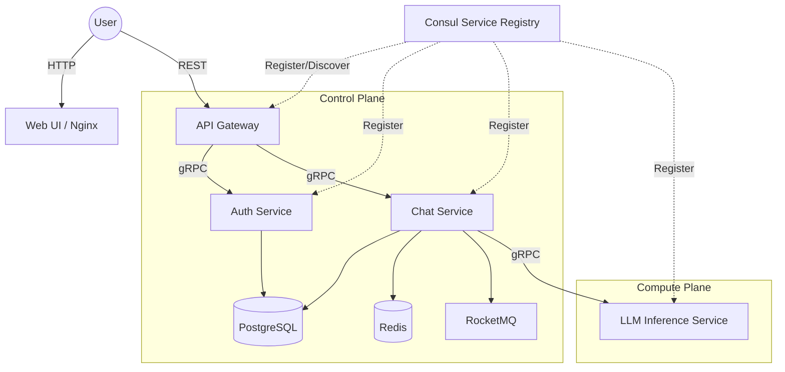
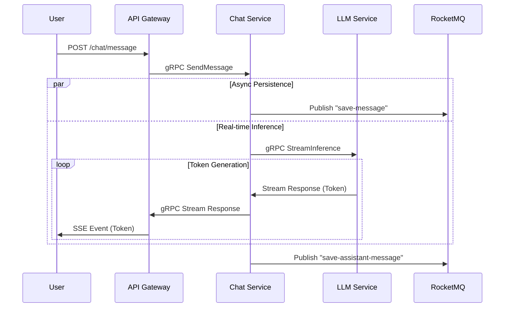

# Free Chat

Microservices-based LLM chat platform with Go backend, Python inference, and distributed deployment support.

[English](README.md) | [中文](README_CN.md)

## Architecture

Standard microservices pattern with control plane and compute plane separation.


```mermaid
graph TD
    User((User)) -->|HTTP| WebUI[Web UI / Nginx]
    User -->|REST| Gateway[API Gateway]
    
    subgraph "Control Plane"
        Gateway -->|gRPC| Auth[Auth Service]
        Gateway -->|gRPC| Chat[Chat Service]
        Auth --> DB[(PostgreSQL)]
        Chat --> DB
        Chat --> Redis[(Redis)]
        Chat --> MQ[RocketMQ]
    end
    
    subgraph "Compute Plane"
        Chat -->|gRPC| LLM[LLM Inference Service]
    end
    
    Consul[Consul Service Registry] -.->|Register/Discover| Gateway
    Consul -.->|Register| Auth
    Consul -.->|Register| Chat
    Consul -.->|Register| LLM
```

## Data Flow

Request path for a chat message with SSE streaming and async persistence via RocketMQ.


```mermaid
sequenceDiagram
    participant U as User
    participant G as API Gateway
    participant C as Chat Service
    participant L as LLM Service
    participant M as RocketMQ
    
    U->>G: POST /chat/message
    G->>C: gRPC SendMessage
    
    %% Async Persistence
    par Async Persistence
        C->>M: Publish "save-message"
    and Real-time Inference
        C->>L: gRPC StreamInference
        
        loop Token Generation
            L->>C: Stream Response (Token)
            C->>G: gRPC Stream Response
            G->>U: SSE Event (Token)
        end
    end
    
    %% Final Save
    C->>M: Publish "save-assistant-message"
```

## Quick Start

### 1. Single Node (Development)

Run all services on a single machine using Docker Compose.

```bash
git clone https://github.com/einspanner/free-chat.git
cd free-chat

docker compose up -d --build
```

Access: `http://localhost:3000`

### 2. Distributed Deployment (Production-Ready)

Separate control plane services from GPU compute services across two machines.

**Server A (Control Plane):** Runs Gateway, Auth, DB, MQ, Consul.

```bash
export ADVERTISE_IP=100.100.1.1  # Server A's Tailscale/LAN IP
docker-compose -f docker-compose-control.yml up -d
```

**Server B (GPU Compute):** Runs Chat Service, LLM Inference.

```bash
export ADVERTISE_IP=100.100.1.2  # Server B's Tailscale/LAN IP
export CONTROL_PLANE_IP=100.100.1.1 # Connect to Server A
docker-compose -f docker-compose-compute.yml up -d
```

### 3. Run with Qwen-3B (High Performance)

The default model is small (0.6B). For better quality, use Qwen-3B, which requires at least 8GB VRAM.

**Method A: Environment Variable (Recommended)**

```bash
export MODEL_NAME="Qwen/Qwen2.5-3B-Instruct"
```

**Method B: Docker Compose Override**

```yaml
  llm-inference:
    environment:
      - MODEL_NAME=Qwen/Qwen2.5-3B-Instruct
```

## Tech Stack

- **Go**: High-concurrency services (Gateway, Auth, Chat)
- **Python**: PyTorch/HuggingFace inference
- **gRPC**: Low-latency inter-service communication
- **RocketMQ**: Asynchronous message persistence
- **Consul**: Dynamic service discovery
- **Tailscale**: Secure mesh networking for distributed nodes

## Project Structure

```text
.
├── cmd/                # Shared command-line tools
├── config/             # Global configuration files
├── deploy/             # Deployment configurations (e.g., HF Spaces)
├── pkg/                # Shared Go packages (Proto, Utils)
├── services/           # Microservices source code
│   ├── api-gateway/    # HTTP Gateway
│   ├── auth-service/   # Authentication Service
│   ├── chat-service/   # Chat Business Logic
│   ├── llm-inference/  # Python LLM Service
│   └── web-ui/         # Frontend Static Files
└── docker-compose.yml  # Local development orchestration
```
