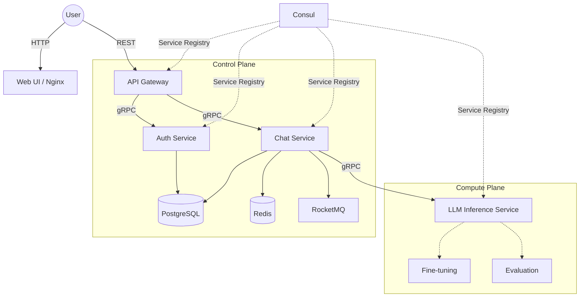

# Free Chat

A microservices-based LLM chat platform. Go backend for business logic, Python for model inference. Supports distributed deployment with separate control and compute planes.

## Architecture

The system separates control-plane services (user auth, session management, API gateway) from compute-plane services (LLM inference, model fine-tuning). They communicate via gRPC and are independently deployable.


```mermaid
graph TD
    User((User)) -->|HTTP| WebUI[Web UI / Nginx]
    User -->|REST| Gateway[API Gateway]
    
    subgraph "Control Plane"
        Gateway -->|gRPC| Auth[Auth Service]
        Gateway -->|gRPC| Chat[Chat Service]
        Auth --> DB[(PostgreSQL)]
        Chat --> DB
        Chat --> Redis[(Redis)]
        Chat --> MQ[RocketMQ]
    end
    
    subgraph "Compute Plane"
        Chat -->|gRPC| LLM[LLM Inference Service]
        LLM -.-> Finetune[Fine-tuning]
        LLM -.-> Evaluation[Evaluation]
    end
    
    Consul[Consul] -.->|Service Registry| Gateway
    Consul -.->|Service Registry| Auth
    Consul -.->|Service Registry| Chat
    Consul -.->|Service Registry| LLM
```

**Why separate planes**: Control plane runs on cost-effective CPU instances. Compute plane requires GPUs. They scale independently—control plane scales with user concurrency, compute plane scales with inference queue depth.

## Services Overview

Free Chat provides tools across the LLM lifecycle:

| Service | Function | Directory |
|---------|----------|-----------|
| api-gateway | HTTP gateway, JWT auth, rate limiting | `services/api-gateway/` |
| auth-service | User registration, login, token management | `services/auth-service/` |
| chat-service | Conversation logic, context window management | `services/chat-service/` |
| llm-inference | Model inference (HF, vLLM), quantization | `services/llm-inference/` |
| finetune | LoRA/QLoRA fine-tuning pipeline | `services/finetune/` |
| alignment | DPO/RLHF preference alignment | `services/alignment/` |
| evaluation | Benchmarks: MMLU, C-Eval, GSM8K, HumanEval | `services/evaluation/` |
| rag | Retrieval-augmented generation pipeline | `services/rag/` |
| synthetic-data | Self-instruct, data augmentation | `services/synthetic-data/` |
| rlhf | PPO-based RLHF training | `services/rlhf/` |

## Data Flow

A chat request follows this path:


```mermaid
sequenceDiagram
    participant U as User
    participant G as API Gateway
    participant C as Chat Service
    participant L as LLM Service
    participant M as RocketMQ
    
    U->>G: POST /chat/message
    G->>C: gRPC SendMessage
    
    par Async Persistence
        C->>M: Publish "save-message"
    and Streaming Inference
        C->>L: gRPC StreamInference
        
        loop Token Generation
            L->>C: Stream Response (Token)
            C->>G: gRPC Stream Response
            G->>U: SSE Event (Token)
        end
    end
    
    C->>M: Publish "save-assistant-message"
```

Two things happen in parallel: the message is queued to RocketMQ for async persistence, and the LLM starts streaming its response via gRPC bidirectional streaming. The Go chat service forwards tokens as SSE events to the frontend. This means the user sees the response incrementally rather than waiting for the full generation + database write to complete.

## Context Management

The chat service manages the LLM context window with a tiered strategy:

### Pipeline

```
User Message → SaveMessage (token_count)
            → GetHistory (last 10 messages)
            → ContextBuilder.Build()
                 ├─ Budget check (tiktoken-go estimation)
                 ├─ Under budget?  → Full context
                 ├─ Over budget?   → Compressor (level-based)
                 └─ Severely over? → TopicAnalyzer → SSE topic_select
            → JSON → LLM Inference (Python)
```

### Token Counting

| Layer | Method | Accuracy | Use |
|-------|--------|----------|-----|
| Python | `tokenizer.encode(text)` | Exact | Input/output metrics |
| Go | `tiktoken-go` + model map | ±3-5% | Real-time budget decisions |
| Go (fallback) | `len(text)/2` | Rough | Unknown model support |

### Compression Strategy

When the token budget is insufficient, messages are compressed by age:

| Level | Range | Treatment |
|-------|-------|-----------|
| 0 (verbatim) | Last 5 turns | Full content preserved |
| 1 (light) | Turns 6-20 | Truncated to first 100 chars |
| 2 (medium) | Turns 21-50 | Truncated to first 50 chars |
| 3 (heavy) | Turns 51+ | Replaced with "[compressed]" |
| 4 (discard) | Beyond budget | Removed from context |

### Topic Analysis

When compression is insufficient and the conversation exceeds 3 turns, the system analyzes the conversation topics:

1. Chat Service sends history to the LLM with an analysis prompt
2. LLM returns structured JSON with identified topics
3. An SSE event carries `event: topic_select` with topic options
4. User selects a topic via `topic_id` in the next request
5. Context is rebuilt using only the selected topic's history

### Attention Sink Optimization

Context messages are structured to reduce attention sink distortion:

```
Position 0:  "\n\n"                          ← Sink token
Position 1:  System: global instruction       ← Primacy effect
Position N:  History (chronological)          ← Conversation turns
Position N+1: System: instruction repeat      ← Recency effect  
Position N+2: User: current input             ← Current query
```

## Inference Engine

`services/llm-inference/` provides a pluggable engine abstraction with two backends:

| Engine | Use Case | Notes |
|--------|----------|-------|
| HuggingFace (HF) | Development, debugging | Direct transformers, no extra deps |
| vLLM | Production | PagedAttention reduces VRAM fragmentation; continuous batching improves throughput |

### Quantization

Supported methods: AWQ, GPTQ, SqueezeLLM. Controlled via the `QUANTIZATION` env var.

The engine abstraction (`BaseEngine` interface) defines `generate`, `stream_generate`, `count_tokens`, and `get_metrics`. The `EngineFactory` auto-selects vLLM when available, falling back to HF.

### Inference Optimizations

**Speculative Decoding**: A small draft model generates γ candidate tokens; the target model verifies them in one forward pass. Accepted tokens are kept; rejected ones trigger a correction step. Expected speedup: 1 / (1 - α + α/γ) where α is the acceptance rate.

**KV Cache**: LRU-evicted cache for KV tensors, avoiding recomputation for shared prefixes across requests. `PrefixCache` matches new prompts against cached prefixes for partial reuse.

## Fine-tuning

`services/finetune/` implements LoRA and QLoRA fine-tuning.

### Supported Data Formats

| Format | Structure | Source |
|--------|-----------|--------|
| ShareGPT | `{"conversations": [{"from": "human", "value": "..."}, ...]}` | Common in open-source datasets |
| Alpaca | `{"instruction": "...", "input": "...", "output": "..."}` | Stanford Alpaca |
| ChatML | `{"messages": [{"role": "...", "content": "..."}, ...]}` | OpenAI-compatible |

### Training Parameters

| Parameter | Default | Notes |
|-----------|---------|-------|
| LoRA rank | 8 | Lower rank = fewer trainable params |
| LoRA alpha | 16 | Scaling factor |
| Target modules | q_proj, k_proj, v_proj, o_proj | Attention layers |
| Learning rate | 2e-4 | Higher than full fine-tuning typical |
| Batch size | 4 | Per-device |
| Gradient accumulation | 4 | Effective batch = batch * accumulation |
| Max sequence length | 2048 | Truncates longer sequences |

## Preference Alignment

Two alignment methods are available:

### DPO (Direct Preference Optimization)

`services/alignment/` implements DPO, which replaces the two-step RLHF process (reward model + PPO) with a single loss function:

```
L_DPO = -E[log σ(β(log πθ(y_w|x)/πref(y_w|x) - log πθ(y_l|x)/πref(y_l|x)))]
```

Parameters:
- **β**: Controls how strongly the model separates chosen vs. rejected responses
- **loss_type**: "sigmoid" (standard DPO), "ipo" (MSE-based), "kto_pair"
- **label_smoothing**: Prevents overfitting to the preference labels

### PPO (Proximal Policy Optimization)

`services/rlhf/` implements the classic two-step RLHF pipeline:
1. Train a reward model (base LM + linear head that outputs a scalar reward)
2. Optimize the policy using PPO-Clip with GAE (Generalized Advantage Estimation)

The PPO loss clips the importance sampling ratio to stabilize training:

```
L_PPO = -E[min(r(θ)·A, clip(r(θ), 1-ε, 1+ε)·A)] + c1·(V-R)² - c2·KL(πθ||πref)
```

## Evaluation

`services/evaluation/` runs benchmarks against any model implementing the engine interface:

| Benchmark | Metric | Few-shot | Description |
|-----------|--------|----------|-------------|
| MMLU | Accuracy | 5-shot | 57 subjects, multi-choice |
| C-Eval | Accuracy | 5-shot | Chinese, 20 subjects |
| GSM8K | Accuracy | 8-shot | Grade-school math |
| HumanEval | pass@1 | - | Python code generation |

Metrics: exact match, token-level F1, ROUGE-1/L, pass@k, confidence intervals.

## RAG (Retrieval-Augmented Generation)

`services/rag/` implements a full RAG pipeline:

**Chunking**: Recursive chunker (by separator priority), semantic chunker (sentence/paragraph/topic).

**Retrieval strategies**:
- **Dense**: Embedding similarity with configurable vector store (in-memory for dev, ChromaDB for production)
- **Sparse**: BM25 Okapi variant (tf-idf-like)
- **Hybrid**: Score normalization + weighted fusion of dense and sparse results

**Pipeline**: `ingest() → chunk → embed → index → retrieve() → build_prompt() → generate()`

## Synthetic Data

`services/synthetic-data/` generates training data:

**Generators**:
- **Self-Instruct**: Generate tasks from seed topics, then generate responses
- **Evol-Question**: Deepen (add constraints) or broaden (expand scope) existing questions
- **Back-Translation**: Paraphrase via round-trip translation

**Quality Filtering**: Length checks, deduplication, HTML removal, repetition detection, instruction-output overlap check.

**EDA Augmentation**: Synonym replacement, random insertion/swap/deletion, back-translation.

## Deployment

### Single Node (Development)

```bash
cp .env.example .env
docker compose up -d --build
```

Access: `http://localhost:3000`

### Distributed (Production)

**Server A (Control Plane)**:
```bash
export ADVERTISE_IP=100.100.1.1
docker-compose -f docker-compose-control.yml up -d
```

**Server B (GPU Compute)**:
```bash
export ADVERTISE_IP=100.100.1.2
export CONTROL_PLANE_IP=100.100.1.1
docker-compose -f docker-compose-compute.yml up -d
```

### Configuration

All configuration is centralized in `.env`. Key variables:

| Variable | Description | Default |
|----------|-------------|---------|
| `ADVERTISE_IP` | IP for Consul registration (distributed) | auto-detect |
| `ENGINE_TYPE` | Inference engine: auto, vllm, hf | auto |
| `QUANTIZATION` | Quantization: awq, gptq, squeezellm, or empty for FP16 | (none) |
| `LLM_MODEL_NAME` | HuggingFace model path | `Qwen/Qwen2.5-0.5B-Instruct` |
| `CONTROL_PLANE_IP` | Control plane address for compute nodes | (required in distributed) |

## Project Structure

```
.
├── .env.example
├── config/
│   ├── config.go
│   └── config.yml
├── pkg/
│   ├── proto/
│   └── registry/
├── services/
│   ├── api-gateway/
│   ├── auth-service/
│   ├── chat-service/
│   │   └── internal/
│   │       ├── application/
│   │       ├── domain/
│   │       └── infrastructure/
│   │           ├── context/       # ContextBuilder, Budget, Compressor, TopicAnalyzer
│   │           ├── mq/            # RocketMQ
│   │           ├── persistence/   # Redis cache + PostgreSQL (GORM)
│   │           └── tokenizer/     # tiktoken-go
│   ├── llm-inference/             # Python inference service
│   │   └── optimization/          # Speculative decoding, KV cache
│   ├── finetune/                  # LoRA/QLoRA
│   ├── alignment/                 # DPO
│   ├── evaluation/                # Benchmarks
│   ├── rag/                       # RAG pipeline
│   ├── synthetic-data/            # Data generation
│   └── rlhf/                      # PPO training
├── testapi/                       # Bruno API collection
├── docker-compose.yml
├── docker-compose-control.yml
└── docker-compute.yml
```

## Tech Stack

| Component | Choice | Reason |
|-----------|--------|--------|
| Backend | Go | Goroutine efficiency for I/O-bound services |
| Inference | Python (PyTorch) | LLM ecosystem standard |
| Inter-service | gRPC | Bidirectional streaming, protobuf contracts |
| Inference engine | vLLM / HF | vLLM for production, HF for fallback |
| Fine-tuning | PEFT + TRL | Community standard for LoRA/DPO |
| Vector store | ChromaDB / In-memory | ChromaDB for prod, in-memory for dev |
| Message queue | RocketMQ | Transactional messages for async persistence |
| Service discovery | Consul | Health checks + distributed KV |
| Networking | Tailscale | Zero-config VPN for cross-machine deployment |

## Test Coverage

| Module | Tests |
|--------|-------|
| llm-inference | 145 |
| finetune | 110 |
| evaluation | 90 |
| rag | 51 |
| alignment | 50 |
| synthetic-data | 38 |
| rlhf | 21 |

Total: 505 tests.
