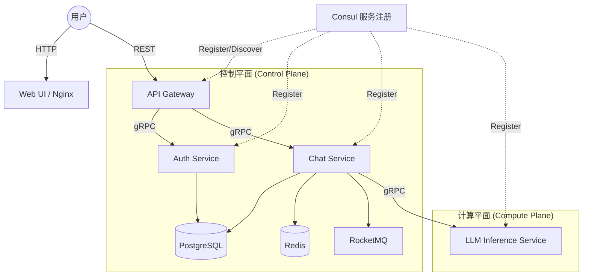
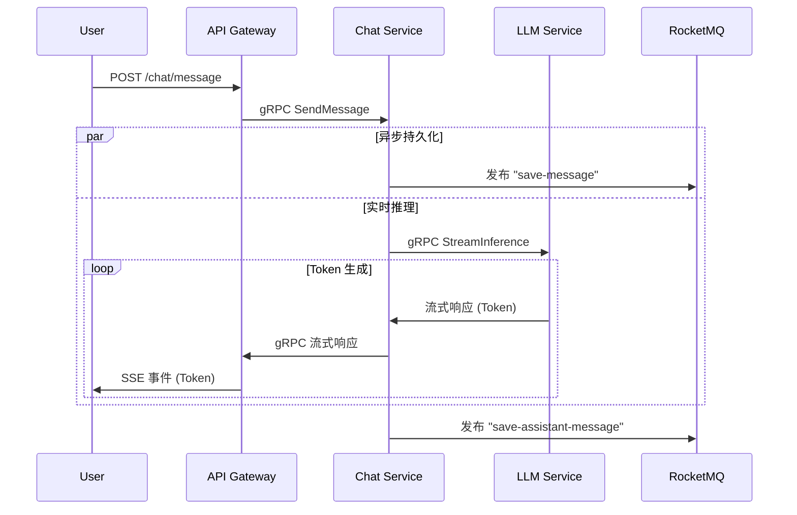

# Free Chat

**拒绝废话，基于微服务的 LLM 聊天平台。**
Go 后端，Python 推理，支持分布式部署。

[English](README.md) | [中文](README_CN.md)

## 🏗 架构

标准微服务模式。没有魔法，只有硬核工程。



## 🔄 数据流

聊天消息的请求路径。纯 SSE 流式传输。



## 🚀 快速开始

### 1. 单节点 (开发)
经典方式。在本地机器上运行所有内容。

```bash
# 克隆项目
git clone https://github.com/einspanner/free-chat.git
cd free-chat

# 运行
docker compose up -d --build
```

访问地址: `http://localhost:3000`

### 2. 分布式部署 (生产就绪)
将大脑（控制平面）与肌肉（GPU 计算）分离。

**服务器 A (控制平面):**
运行 Gateway, Auth, DB, MQ, Consul。
```bash
export ADVERTISE_IP=100.100.1.1  # 服务器 A 的 Tailscale/局域网 IP
docker-compose -f docker-compose-control.yml up -d
```

**服务器 B (GPU 计算):**
运行 Chat Service, LLM Inference。
```bash
export ADVERTISE_IP=100.100.1.2  # 服务器 B 的 Tailscale/局域网 IP
export CONTROL_PLANE_IP=100.100.1.1 # 连接到服务器 A
docker-compose -f docker-compose-compute.yml up -d
```

### 3. 运行 Qwen-3B (高性能)
如果你有显存，别凑合用 0.6B 小模型。

**方法 A：环境变量 (推荐)**
修改 `docker-compose.yml` 或在 export 命令中指定：
```bash
export MODEL_NAME="Qwen/Qwen2.5-3B-Instruct"
```

**方法 B：Docker Compose 覆盖**
```yaml
  llm-inference:
    environment:
      - MODEL_NAME=Qwen/Qwen2.5-3B-Instruct
```
*注意：运行 3B 模型确保你的 GPU 至少有 8GB 显存。*

## 🛠 技术栈
- **Go**: 高并发服务 (Gateway, Auth, Chat)。
- **Python**: PyTorch/HuggingFace 推理。
- **gRPC**: 低延迟服务间通信。
- **RocketMQ**: 异步消息持久化。
- **Consul**: 动态服务发现。
- **Tailscale**: 分布式节点的安全网状网络。

## 📂 项目结构

```text
.
├── cmd/                # 共享命令行工具
├── config/             # 全局配置文件
├── deploy/             # 部署配置 (例如 HF Spaces)
├── pkg/                # Shared Go packages (Proto, Utils)
├── services/           # 微服务源码
│   ├── api-gateway/    # HTTP 网关
│   ├── auth-service/   # 认证服务
│   ├── chat-service/   # 聊天业务逻辑
│   ├── llm-inference/  # Python LLM 服务
│   └── web-ui/         # 前端静态文件
└── docker-compose.yml  # 本地开发编排
```
