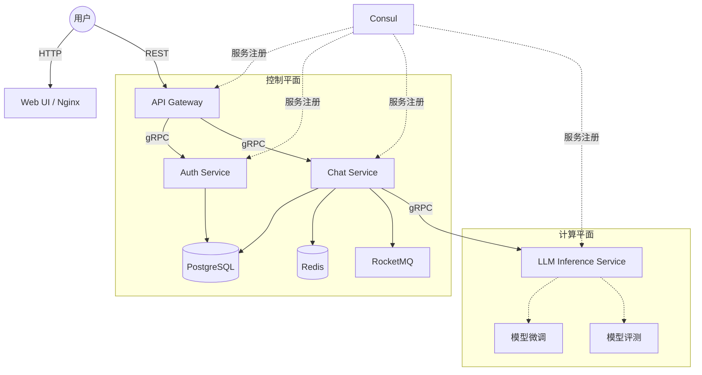
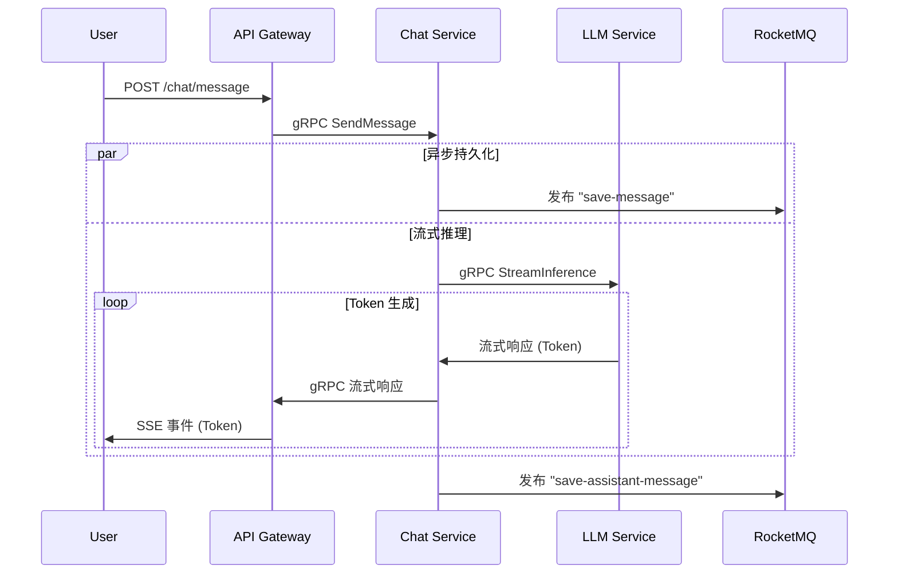

# Free Chat

基于微服务的 LLM 聊天平台。Go 后端处理业务逻辑，Python 处理模型推理。支持控制面和计算面分离部署。

## 架构

系统将控制面服务（用户认证、会话管理、API 网关）与计算面服务（LLM 推理、模型微调）分离。两者通过 gRPC 通信，独立部署和扩缩。


```mermaid
graph TD
    User((用户)) -->|HTTP| WebUI[Web UI / Nginx]
    User -->|REST| Gateway[API Gateway]
    
    subgraph "控制平面"
        Gateway -->|gRPC| Auth[Auth Service]
        Gateway -->|gRPC| Chat[Chat Service]
        Auth --> DB[(PostgreSQL)]
        Chat --> DB
        Chat --> Redis[(Redis)]
        Chat --> MQ[RocketMQ]
    end
    
    subgraph "计算平面"
        Chat -->|gRPC| LLM[LLM Inference Service]
        LLM -.-> Finetune[模型微调]
        LLM -.-> Evaluation[模型评测]
    end
    
    Consul[Consul] -.->|服务注册| Gateway
    Consul -.->|服务注册| Auth
    Consul -.->|服务注册| Chat
    Consul -.->|服务注册| LLM
```

**分离原因**：控制面运行在低成本 CPU 实例上，计算面需要 GPU。两者独立扩缩——控制面按用户并发数扩缩，计算面按推理队列深度扩缩。

## 服务概览

| 服务 | 功能 | 目录 |
|------|------|------|
| api-gateway | HTTP 网关、JWT 认证、限流 | `services/api-gateway/` |
| auth-service | 用户注册、登录、令牌管理 | `services/auth-service/` |
| chat-service | 对话逻辑、上下文窗口管理 | `services/chat-service/` |
| llm-inference | 模型推理 (HF, vLLM)、量化 | `services/llm-inference/` |
| finetune | LoRA/QLoRA 微调管道 | `services/finetune/` |
| alignment | DPO/RLHF 偏好对齐 | `services/alignment/` |
| evaluation | 评测：MMLU, C-Eval, GSM8K, HumanEval | `services/evaluation/` |
| rag | 检索增强生成管道 | `services/rag/` |
| synthetic-data | Self-instruct、数据增强 | `services/synthetic-data/` |
| rlhf | PPO RLHF 训练 | `services/rlhf/` |

## 数据流

聊天请求的处理路径：


```mermaid
sequenceDiagram
    participant U as User
    participant G as API Gateway
    participant C as Chat Service
    participant L as LLM Service
    participant M as RocketMQ
    
    U->>G: POST /chat/message
    G->>C: gRPC SendMessage
    
    par 异步持久化
        C->>M: 发布 "save-message"
    and 流式推理
        C->>L: gRPC StreamInference
        
        loop Token 生成
            L->>C: 流式响应 (Token)
            C->>G: gRPC 流式响应
            G->>U: SSE 事件 (Token)
        end
    end
    
    C->>M: 发布 "save-assistant-message"
```

两条路径并行执行：消息发送到 RocketMQ 异步持久化，同时 LLM 开始流式返回推理结果。Go 聊天服务将 token 以 SSE 事件转发给前端。这种设计使用户逐步看到响应，无需等待全量生成和数据库写入完成。

## 上下文管理

聊天服务使用分级策略管理 LLM 上下文窗口：

### 流水线

```
用户消息 → SaveMessage (记录 token 数)
        → GetHistory (拉取最近 10 条)
        → ContextBuilder.Build()
             ├─ 预算检查 (tiktoken-go 估算)
             ├─ 预算充足?  → 全量上下文
             ├─ 超预算?    → Compressor (层级压缩)
             └─ 严重超预算? → TopicAnalyzer → SSE topic_select
        → JSON → LLM 推理 (Python)
```

### Token 计数

| 层 | 方法 | 精度 | 用途 |
|----|------|------|------|
| Python | `tokenizer.encode(text)` | 精确 | 输入/输出计量 |
| Go | `tiktoken-go` + 模型映射 | ±3-5% | 实时预算决策 |
| Go (退化) | `len(text)/2` | 粗略 | 未知模型回退 |

### 自动压缩策略

| 层级 | 范围 | 处理方式 |
|------|------|---------|
| 0 (原文) | 最近 5 轮 | 完全保留 |
| 1 (轻量) | 第 6-20 轮 | 截断至 100 字符 |
| 2 (中量) | 第 21-50 轮 | 截断至 50 字符 |
| 3 (重量) | 50 轮以上 | 替换为 "[compressed]" |
| 4 (丢弃) | 超出预算 | 从上下文中移除 |

### 话题分析

当压缩策略仍不足以控制预算，且对话超过 3 轮时，系统会分析对话话题：

1. Chat Service 将历史发送给 LLM，附带分析 prompt
2. LLM 返回结构化的 JSON 话题列表
3. SSE 事件推送 `event: topic_select` 含话题选项
4. 用户在下个请求中通过 `topic_id` 选择话题
5. 上下文仅保留选中话题范围内的历史

### Attention Sink 优化

上下文消息按以下结构排列，减轻 attention sink 失真：

```
位置 0:  "\n\n"                          ← Sink token
位置 1:  System: 全局指令                  ← 首位效应
位置 N:  对话历史（按时间顺序）               ← 对话轮次
位置 N+1: System: 指令重申                  ← 近因效应
位置 N+2: User: 当前输入                   ← 当前问题
```

## 推理引擎

`services/llm-inference/` 提供可插拔引擎抽象，支持两个后端：

| 引擎 | 适用场景 | 备注 |
|------|---------|------|
| HuggingFace (HF) | 开发调试 | 直接使用 transformers，无额外依赖 |
| vLLM | 生产环境 | PagedAttention 减少显存碎片；continuous batching 提升吞吐 |

### 量化

支持 AWQ、GPTQ、SqueezeLLM。通过环境变量 `QUANTIZATION` 控制。

引擎抽象层（`BaseEngine` 接口）定义了 `generate`、`stream_generate`、`count_tokens`、`get_metrics` 方法。`EngineFactory` 在有 vLLM 时自动选择 vLLM，否则回退到 HF。

### 推理优化

**推测解码（Speculative Decoding）**：小型 draft model 快速生成 γ 个候选 token，target model 单次前向传播验证。接受的 token 保留，拒绝的触发修正。预计加速比：1 / (1 - α + α/γ)，其中 α 是接受率。

**KV Cache**：LRU 淘汰的 KV 张量缓存，避免跨请求共享前缀的重复计算。`PrefixCache` 将新 prompt 与缓存前缀匹配，实现部分复用。

## 微调

`services/finetune/` 实现 LoRA 和 QLoRA 微调。

### 支持的数据格式

| 格式 | 结构 | 来源 |
|------|------|------|
| ShareGPT | `{"conversations": [{"from": "human", "value": "..."}, ...]}` | 开源数据集常见格式 |
| Alpaca | `{"instruction": "...", "input": "...", "output": "..."}` | Stanford Alpaca |
| ChatML | `{"messages": [{"role": "...", "content": "..."}, ...]}` | OpenAI 兼容格式 |

### 训练参数

| 参数 | 默认值 | 说明 |
|------|--------|------|
| LoRA rank | 8 | rank 越低，可训练参数越少 |
| LoRA alpha | 16 | 缩放因子 |
| 目标模块 | q_proj, k_proj, v_proj, o_proj | 注意力层 |
| 学习率 | 2e-4 | 通常高于全量微调 |
| 批大小 | 4 | 每设备 |
| 梯度累积 | 4 | 有效批大小 = batch * accumulation |
| 最大序列长度 | 2048 | 超过部分截断 |

## 偏好对齐

提供两种对齐方法：

### DPO（直接偏好优化）

`services/alignment/` 实现 DPO，将两步 RLHF（reward model + PPO）替换为单一损失函数：

```
L_DPO = -E[log σ(β(log πθ(y_w|x)/πref(y_w|x) - log πθ(y_l|x)/πref(y_l|x)))]
```

参数：
- **β**：控制 chosen/rejected 的分离程度
- **loss_type**："sigmoid"（标准 DPO）、"ipo"（MSE-based）、"kto_pair"
- **label_smoothing**：防止过拟合偏好标签

### PPO（近端策略优化）

`services/rlhf/` 实现经典两步 RLHF 管道：
1. 训练 reward model（基础 LM + 输出标量奖励的线性层）
2. 使用 PPO-Clip + GAE（广义优势估计）优化策略

PPO 损失通过裁剪重要性采样比率来稳定训练：

```
L_PPO = -E[min(r(θ)·A, clip(r(θ), 1-ε, 1+ε)·A)] + c1·(V-R)² - c2·KL(πθ||πref)
```

## 评测

`services/evaluation/` 对任何实现引擎接口的模型运行基准测试：

| 评测 | 指标 | Few-shot | 说明 |
|------|------|----------|------|
| MMLU | 准确率 | 5-shot | 57 个学科，多项选择 |
| C-Eval | 准确率 | 5-shot | 中文，20 个学科 |
| GSM8K | 准确率 | 8-shot | 小学数学 |
| HumanEval | pass@1 | - | Python 代码生成 |

指标：Exact Match、Token-level F1、ROUGE-1/L、Pass@k、置信区间。

## RAG（检索增强生成）

`services/rag/` 实现完整 RAG 管道：

**文本分块**：递归分块器（按分隔符优先级）、语义分块器（句子/段落/话题）。

**检索策略**：
- **Dense**：嵌入相似度，可配置向量存储（开发用内存，生产用 ChromaDB）
- **Sparse**：BM25 Okapi 变体
- **Hybrid**：分数归一化 + 加权融合

**管道**：`ingest() → chunk → embed → index → retrieve() → build_prompt() → generate()`

## 合成数据

`services/synthetic-data/` 生成训练数据：

**生成器**：
- **Self-Instruct**：从种子话题生成任务，再生成回复
- **Evol-Question**：加深（添加约束）或拓宽（扩展范围）已有问题
- **Back-Translation**：通过往返翻译改写文本

**质量过滤**：长度检查、去重、HTML 移除、重复检测、指令-输出重叠检查。

**EDA 增强**：同义词替换、随机插入/交换/删除、回译增强。

## 部署

### 单节点（开发环境）

```bash
cp .env.example .env
docker compose up -d --build
```

访问地址：`http://localhost:3000`

### 分布式（生产环境）

**服务器 A（控制平面）**：
```bash
export ADVERTISE_IP=100.100.1.1
docker-compose -f docker-compose-control.yml up -d
```

**服务器 B（GPU 计算）**：
```bash
export ADVERTISE_IP=100.100.1.2
export CONTROL_PLANE_IP=100.100.1.1
docker-compose -f docker-compose-compute.yml up -d
```

### 配置

所有配置集中在 `.env` 文件中：

| 变量 | 说明 | 默认值 |
|------|------|--------|
| `ADVERTISE_IP` | Consul 注册 IP（分布式） | 自动检测 |
| `ENGINE_TYPE` | 推理引擎：auto, vllm, hf | auto |
| `QUANTIZATION` | 量化方法：awq, gptq, squeezellm，或空（FP16） | (none) |
| `LLM_MODEL_NAME` | HuggingFace 模型路径 | `Qwen/Qwen2.5-0.5B-Instruct` |
| `CONTROL_PLANE_IP` | 计算节点连接的控制面地址 | 分布式必填 |

## 项目结构

```
.
├── .env.example
├── config/
│   ├── config.go
│   └── config.yml
├── pkg/
│   ├── proto/
│   └── registry/
├── services/
│   ├── api-gateway/
│   ├── auth-service/
│   ├── chat-service/
│   │   └── internal/
│   │       ├── application/
│   │       ├── domain/
│   │       └── infrastructure/
│   │           ├── context/       # ContextBuilder, Budget, Compressor, TopicAnalyzer
│   │           ├── mq/            # RocketMQ
│   │           ├── persistence/   # Redis + PostgreSQL (GORM)
│   │           └── tokenizer/     # tiktoken-go
│   ├── llm-inference/             # Python 推理服务
│   │   └── optimization/          # 推测解码, KV 缓存
│   ├── finetune/                  # LoRA/QLoRA
│   ├── alignment/                 # DPO
│   ├── evaluation/                # 评测
│   ├── rag/                       # RAG 管道
│   ├── synthetic-data/            # 数据生成
│   └── rlhf/                      # PPO 训练
├── testapi/
├── docker-compose.yml
├── docker-compose-control.yml
└── docker-compute.yml
```

## 技术栈

| 组件 | 选型 | 原因 |
|------|------|------|
| 后端 | Go | IO 密集型服务的 goroutine 效率 |
| 推理 | Python (PyTorch) | LLM 生态标准 |
| 服务通信 | gRPC | 双向流、protobuf 接口契约 |
| 推理引擎 | vLLM / HF | vLLM 用于生产，HF 作为回退 |
| 微调 | PEFT + TRL | LoRA/DPO 的社区标准 |
| 向量存储 | ChromaDB / 内存 | 生产用 ChromaDB，开发用内存 |
| 消息队列 | RocketMQ | 异步持久化的事务消息 |
| 服务发现 | Consul | 健康检查 + 分布式 KV |
| 组网 | Tailscale | 跨机器部署的零配置 VPN |

## 测试覆盖

| 模块 | 测试数 |
|------|--------|
| llm-inference | 145 |
| finetune | 110 |
| evaluation | 90 |
| rag | 51 |
| alignment | 50 |
| synthetic-data | 38 |
| rlhf | 21 |

总计：505 个测试。
