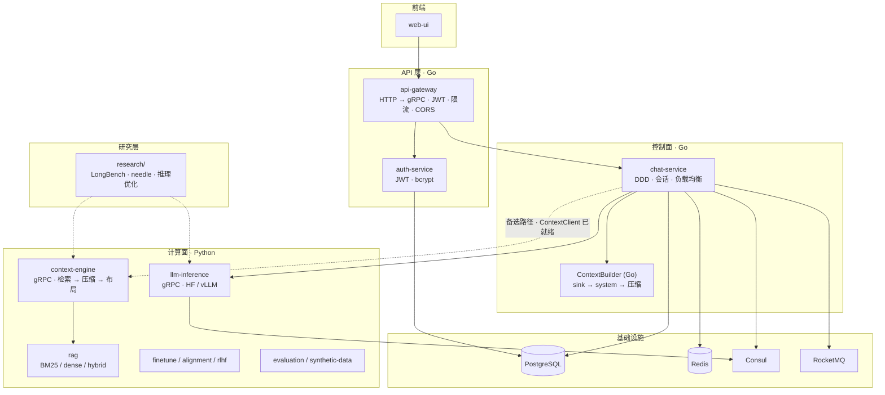
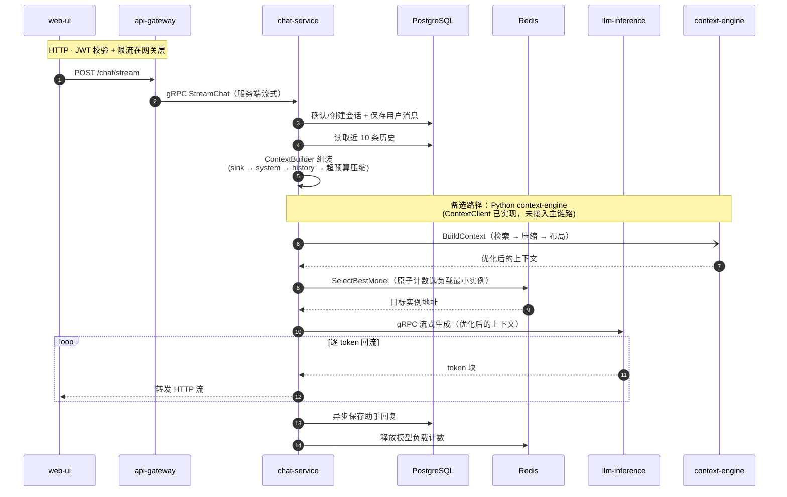

# Free Chat — 面向小模型的长上下文框架

[English](README.md) | [中文](README_CN.md)

通过**上下文管理 + RAG 检索**，扩展小语言模型（0.5B–3B）的有效上下文长度 —— 在真实硬件（RTX A6000）上验证，而非仿真。

Go 控制面，Python 计算面。一个微服务聊天平台 + 一个专门测量"什么真的有效"的研究层。

---

## 核心指标

| | 结果 | 对比基线 |
|---|---|---|
| **段落定位**（LongBench passage_retrieval_en） | **98%**（BM25 top-1 检索） | 截断仅 10% |
| **框架增益跨模型尺度** | **7.4×**（0.6B）/ **10×**（7B） | 相对截断 |
| **批处理吞吐** | **6.23×**（batch 8） | 相对 batch 1 |
| **前缀缓存 prefill** | **最高 2.97×** | 相对全量重 prefill |

---

## 核心贡献

1. **分层上下文引擎** —— `检索 → 压缩 → 布局` 三层管线，在硬 token 预算内为小模型准备优化上下文。杀手锏：段落定位 98%。
2. **尺度不变性结论** —— 框架增益跨模型规模成立（0.6B 上 7.4×、7B 上 10×），方法可泛化到整个小模型族。
3. **真实硬件推理测量** —— 批处理、前缀缓存、KV 缓存分析在真实 GPU 上测量，支撑批大小、前缀缓存复用等服务配置决策。
4. **双栈平台** —— Go 服务（网关/认证/聊天）+ Python 服务（推理/上下文/RAG/微调/评测），gRPC 契约、服务发现、MQ 异步持久化。

---

## 系统架构


```mermaid
flowchart TB
    subgraph FE["前端"]
        UI["web-ui"]
    end

    subgraph API["API 层 · Go"]
        GW["api-gateway<br/>HTTP → gRPC · JWT · 限流 · CORS"]
        AUTH["auth-service<br/>JWT · bcrypt"]
    end

    subgraph CONTROL["控制面 · Go"]
        CHAT["chat-service<br/>DDD · 会话 · 负载均衡"]
        GOCTX["ContextBuilder (Go)<br/>sink → system → 压缩"]
    end

    subgraph COMPUTE["计算面 · Python"]
        LLM["llm-inference<br/>gRPC · HF / vLLM"]
        CE["context-engine<br/>gRPC · 检索 → 压缩 → 布局"]
        RAG["rag<br/>BM25 / dense / hybrid"]
        TRAIN["finetune / alignment / rlhf"]
        EVAL["evaluation / synthetic-data"]
    end

    subgraph INFRA["基础设施"]
        PG[("PostgreSQL")]
        RD[("Redis")]
        CSL["Consul"]
        RMQ["RocketMQ"]
    end

    subgraph RESEARCH["研究层"]
        RES["research/<br/>LongBench · needle · 推理优化"]
    end

    UI --> GW
    GW --> AUTH
    GW --> CHAT
    AUTH --> PG
    CHAT --> GOCTX
    CHAT -.->|"备选路径 · ContextClient 已就绪"| CE
    CE --> RAG
    CHAT --> LLM
    CHAT --> PG
    CHAT --> RD
    CHAT --> RMQ
    CHAT --> CSL
    LLM --> CSL
    RES -.-> CE
    RES -.-> LLM
```

**设计说明**

- **主聊天链路**（实线）用 Go 原生 `ContextBuilder` 组装上下文，再向 `llm-inference` 流式推理。
- Python **`context-engine`** 以独立 gRPC 服务暴露；Go 侧 `ContextClient`（实现 `domain.ContextOptimizer`）已就绪，但**尚未接入主请求链路** —— 虚线标记为下一步集成点。
- **研究层**反哺计算面：上下文压缩与推理优化的结论沉淀进 `context-engine` 与 `llm-inference`。

---

## 一次聊天请求流转


```mermaid
sequenceDiagram
    autonumber
    participant UI as web-ui
    participant GW as api-gateway
    participant CS as chat-service
    participant PG as PostgreSQL
    participant RD as Redis
    participant LI as llm-inference
    participant CE as context-engine

    Note over UI,GW: HTTP · JWT 校验 + 限流在网关层
    UI->>GW: POST /chat/stream
    GW->>CS: gRPC StreamChat（服务端流式）
    CS->>PG: 确认/创建会话 + 保存用户消息
    CS->>PG: 读取近 10 条历史
    CS->>CS: ContextBuilder 组装<br/>(sink → system → history → 超预算压缩)
    Note over CS,CE: 备选路径：Python context-engine<br/>(ContextClient 已实现，未接入主链路)
    CS-)CE: BuildContext（检索 → 压缩 → 布局）
    CE-->>CS: 优化后的上下文
    CS->>RD: SelectBestModel（原子计数选负载最小实例）
    RD-->>CS: 目标实例地址
    CS->>LI: gRPC 流式生成（优化后的上下文）
    loop 逐 token 回流
        LI-->>CS: token 块
        CS-->>UI: 转发 HTTP 流
    end
    CS->>PG: 异步保存助手回复
    CS->>RD: 释放模型负载计数
```

---

## 关键发现

实验运行在 **NVIDIA RTX A6000**，模型为 **Qwen3-0.6B** 与 **Qwen2.5-7B**。

### 长上下文应用（RAG）

**passage_retrieval_en** —— 给定多段落文档，找到与描述匹配的段落。200 样本，每样本约 12.7K tokens。

| 方法 | 准确率 |
|---|---|
| 截断 | 10% |
| 关键词压缩 | 74% |
| **BM25 检索（top-1）** | **98%** |

BM25 命中率 100%（答案段落总在 top-1）；0.6B 模型凭单个检索段落即可达 98%。

**模型尺度不变性** —— 相同压缩上下文，两种模型规模（20 样本）：

| 策略 | Qwen3-0.6B | Qwen2.5-7B |
|---|---|---|
| 截断 | 10% | 10% |
| Project + Topic | 74% | 95% |
| Attention Sink | 60% | 100% |
| Sink + Topic | 60% | 100% |

框架增益**跨尺度成立**（相对截断 7.4× vs 10×）；策略价值随模型能力增长（7B 更能利用布局）。

**任务边界** —— 方法是**定位**工具，不是万灵药：

| 任务类型 | 框架效果 |
|---|---|
| 段落定位（passage_retrieval_en） | 98–100%（杀手锏） |
| 单文档 QA（multifieldqa_en） | F1 0.174 → 0.357（2.1×） |
| 科学 QA（qasper） | F1 0.132 → 0.253（1.9×） |
| 叙述生成（narrativeqa） | 无增益（需综合生成，非定位） |
| 中文理解/分类 | 有限（0.6B 理解边界） |

### 推理优化（真实硬件）

| 实验 | 结果 | 解读 |
|---|---|---|
| 批处理解码 | batch 8 达 6.23× 吞吐 | 内存带宽摊销 |
| 前缀缓存 | 1.68–2.97× prefill 加速 | 共享前缀免重算 |
| INT8（bitsandbytes）@ Ampere | **慢 5.7×** | 反量化开销；此处 INT8 买的是显存不是速度 |
| KV 逐出 | 0.97–1.0×（无增益） | 逐出不加速解码 |
| KV 低秩分析 | 第 0 层 rank95≈2，中层≈50 | token 冗余 → 支持 token 剪枝；每 token 维度 PCA ≈ MLA 的 latent 压缩（推理侧类比） |
| RoPE 扩展（NTK/YaRN） | 默认 RoPE 在 30K–80K 已 100%；YaRN 无增益，80K 掉到 75% | 0.6B 根本不需要 YaRN |

结果为负的测量也如实记录——它们界定了一项技术在什么条件下有效，避免后人盲目重试。

---

## 快速开始

```bash
# 1. 安装依赖
uv venv --python 3.12 --seed .venv
source .venv/bin/activate
pip install torch transformers

# 2. 运行聊天平台
cp .env.example .env
docker compose up -d --build

# 3. 启动 llm-inference 服务
ENGINE_TYPE=hf MODEL_NAME=Qwen/Qwen3-0.6B .venv/bin/python -m grpc_server --port 8089

# 4. 运行 benchmark（先下载数据）
python scripts/download_benchmark_data.py
.venv/bin/python research/longbench_v1/run_passage_retrieval.py
```

---

## 项目结构

```
services/                    # 应用层
├── api-gateway/             # HTTP 网关 (Go)
├── auth-service/            # 用户认证, JWT (Go)
├── chat-service/            # 对话服务，含上下文管理 (Go)
├── llm-inference/           # 推理：HF / vLLM 引擎、量化 (Python)
├── context-engine/          # 上下文优化：strategies/retriever/pipeline + gRPC (Python)
├── rag/                     # 分块、embedding、BM25/稠密/混合检索 (Python)
├── finetune/                # LoRA / QLoRA 微调 (Python)
├── alignment/               # DPO 偏好对齐 (Python)
├── rlhf/                    # PPO RLHF (Python)
├── evaluation/              # MMLU, C-Eval, GSM8K, HumanEval (Python)
├── synthetic-data/          # Self-instruct, 数据增强 (Python)
└── web-ui/                  # 前端壳

research/                    # 研究层 —— benchmark 与结论
├── long_context/            # Needle-in-a-haystack, 压缩消融
├── longbench_v1/            # LongBench 多任务评测
├── longbench/               # LongBench 风格 QA (v2)
├── loong/                   # 中文多文档 QA
├── zero_scrolls/            # 长文本理解
└── inference_optimization/  # 真实推理测量（结果见 results/ JSON）

pkg/proto/                   # 共享 gRPC 契约（Go + Python 桩）
scripts/download_benchmark_data.py  # 按需下载 benchmark 数据
```

### 应用 / 研究边界

| 层 | 用途 | 数据 | 稳定性 |
|---|---|---|---|
| `services/` | 生产功能 | 无外部数据集 | 有测试（559+） |
| `research/` | 实验、benchmark、结论 | 大数据集（gitignore） | 探索性 |
| `pkg/proto/` | 共享契约 | — | 稳定接口 |

benchmark 数据集（495MB）不提交到 git，通过 `scripts/download_benchmark_data.py` 按需下载。

---

## 测试覆盖

| 模块 | 测试数 |
|---|---|
| llm-inference | 161 |
| evaluation | 90 |
| rag | 52 |
| context-engine | 47 |
| alignment | 50 |
| synthetic-data | 38 |
| finetune | 115 |
| rlhf | 21 |
| long_context 研究 | 14 |
| chat-service (Go) | + gRPC / context-client 测试 |

---

## 深入阅读

- **context-engine**（`services/context-engine/`）—— 分层管线为三个无状态阶段：`strategies`（分块、关键词提取、截断、分级压缩、attention-sink 布局）→ `retriever`（BM25 / 关键词 / 可选稠密，统一接口）→ `pipeline`（编排）。以 gRPC 暴露。
- **llm-inference**（`services/llm-inference/`）—— 可插拔 HF / vLLM 引擎与量化。服务化主路径使用 vLLM（`AsyncLLM`）实现真正的 token 级流式；HF 引擎作为兜底。
- **仓库大小** —— benchmark 数据已从 git 排除；仓库约 51MB（源码 + 生成产物），数据按需下载。
