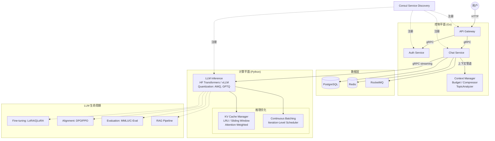

[English](README.md) | [中文](README_CN.md)

# Free Chat -- 面向长上下文推理的大模型 Context Engineering 平台

专注于扩展和优化 LLM 长上下文推理能力的平台。覆盖上下文管理、记忆优化、推理加速和模型生命周期工具。Go 控制面，Python 计算面。

---

## 概述

LLM 上下文窗口是有限的。对话是无限增长的。两者之间的矛盾是这个项目要解决的核心问题。

平台实现了长上下文推理的完整 pipeline：token-budget 驱动的上下文管理、话题感知的记忆重建、KV cache 与 continuous batching 优化，以及微调、RAG、评测的闭环。

---

## (1) Context Pipeline: Token Budget + Compression + Reconstruction

`services/chat-service/internal/infrastructure/context/`

Token budget 估算 -> 分级压缩 -> 话题感知重建。Pipeline 在每一轮决定保留、压缩或丢弃哪些内容。

```
用户消息 -> Budget 检查 (tiktoken 估算, +-3-5%)
        -> 预算充足? -> 全量上下文
        -> 超预算?   -> 按时间递减的分级压缩
        -> 严重超预算? -> 话题提取 -> 用户选择焦点
        -> Attention-sink 优化的 prompt -> LLM
```

### 分级压缩

| 级别 | 范围 | 处理方式 |
|------|------|---------|
| 原文保留 | 最近 5 轮 | 完全保留 |
| 轻量压缩 | 第 6-20 轮 | 截断至 100 字符 |
| 中量压缩 | 第 21-50 轮 | 截断至 50 字符 |
| 重量压缩 | 51 轮以上 | 替换为 "[compressed]" |
| 丢弃 | 超出预算 | 移除 |

### 话题感知重建

当对话覆盖多个话题且压缩不足以控制预算时，系统用 LLM 从历史中提取话题，让用户选择保留哪些。上下文仅从选中话题的消息重建。

### Attention Sink 缓解

Transformer 对前几个 token 的注意力不成比例地高。上下文构建器利用 sink token、system prompt、对话历史和指令重申来利用首位效应和近因效应。

### 效率

50 轮对话（12,847 tokens）：分级压缩到 3,824 tokens（70.2%），话题重建后到 2,156 tokens（83.2%）。

---

## (2) Topic-Aware Memory Management

`services/chat-service/internal/infrastructure/context/topic_analyzer.go`

在超预算且对话超过 3 轮时触发：
1. LLM 分析历史提取话题
2. 返回结构化 JSON 话题列表
3. SSE 推送 `event: topic_select` 给用户
4. 用户通过 `topic_id` 选择话题
5. 仅用选中话题的消息重建上下文

---

## (3) KV Cache 优化与 Continuous Batching

`inference-engine/memory-manager/` + `inference-engine/scheduler/`

### KV Cache Manager

基于 block 的内存池，可插拔驱逐策略。Prefix cache 按 prompt hash 存储 KV 状态，命中时直接复用。

### Continuous Batching Scheduler

迭代级调度（Orca, SOSP 2022）。请求在每步解码时进出 batch，不必等待整个 batch 完成。与 KV Cache Manager 联动，每步分配和释放 block。

### 量化

支持 AWQ、GPTQ、SqueezeLLM。

### Speculative Decoding

草稿-验证循环，拒绝采样。加速比公式：`1 / (1 - a + a/g)`。

---

## (4) RAG + LoRA + 评测

| 模块 | 功能 | 位置 |
|------|------|------|
| RAG | 文档切分、稠密/稀疏/混合检索、prompt 增强 | `services/rag/` |
| 微调 | LoRA/QLoRA | `services/finetune/` |
| 对齐 | DPO, PPO RLHF | `services/alignment/`, `services/rlhf/` |
| 评测 | MMLU(57 学科), C-Eval, GSM8K, HumanEval | `services/evaluation/` |
| 合成数据 | Self-instruct, evol-question, EDA | `services/synthetic-data/` |

---

## 架构


```mermaid
graph TB
    subgraph "控制平面 (Go)"
        Gateway[API Gateway]
        Auth[Auth Service]
        Chat[Chat Service]
        Chat -->|上下文管道| Context[Context Manager
Budget / Compressor
TopicAnalyzer]
    end
    
    subgraph "数据层"
        DB[(PostgreSQL)]
        Cache[(Redis)]
        MQ[RocketMQ]
    end
    
    subgraph "计算平面 (Python)"
        LLM[LLM Inference
HF Transformers / vLLM
Quantization: AWQ, GPTQ]
        subgraph "推理优化"
            KV[KV Cache Manager
LRU / Sliding Window
Attention-Weighted]
            Sched[Continuous Batching
Iteration-Level Scheduler]
        end
    end
    
    subgraph "LLM 生命周期"
        Finetune[Fine-tuning: LoRA/QLoRA]
        Align[Alignment: DPO/PPO]
        Eval[Evaluation: MMLU/C-Eval]
        RAG[RAG Pipeline]
    end
    
    User((用户)) -->|HTTP| Gateway
    Gateway -->|gRPC| Auth
    Gateway -->|gRPC| Chat
    Chat --> DB
    Chat --> Cache
    Chat --> MQ
    Chat -->|gRPC streaming| LLM
    LLM --> KV
    LLM --> Sched
    LLM -.-> Finetune
    LLM -.-> Align
    LLM -.-> Eval
    LLM -.-> RAG
    
    Consul[Consul Service Discovery] -.->|注册| Gateway
    Consul -.->|注册| Auth
    Consul -.->|注册| Chat
    Consul -.->|注册| LLM
```

---

## 测试覆盖

| 模块 | 测试数 | 范围 |
|------|--------|------|
| inference-engine | 68 | KV cache, 调度器, benchmark |
| llm-inference | 145 | 引擎后端, 量化, 优化 |
| finetune | 110 | LoRA/QLoRA 训练, 数据加载 |
| evaluation | 90 | MMLU/C-Eval/GSM8K/HumanEval |
| rag | 51 | 检索策略, 分块 |
| alignment | 50 | DPO 损失, 偏好数据 |
| synthetic-data | 38 | 数据生成, 质量过滤 |
| rlhf | 21 | PPO 损失, GAE 估计 |

总计: **573 个测试**。
