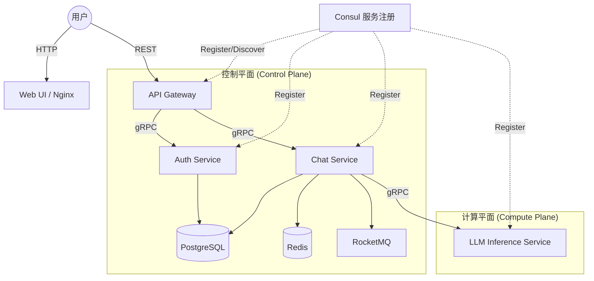
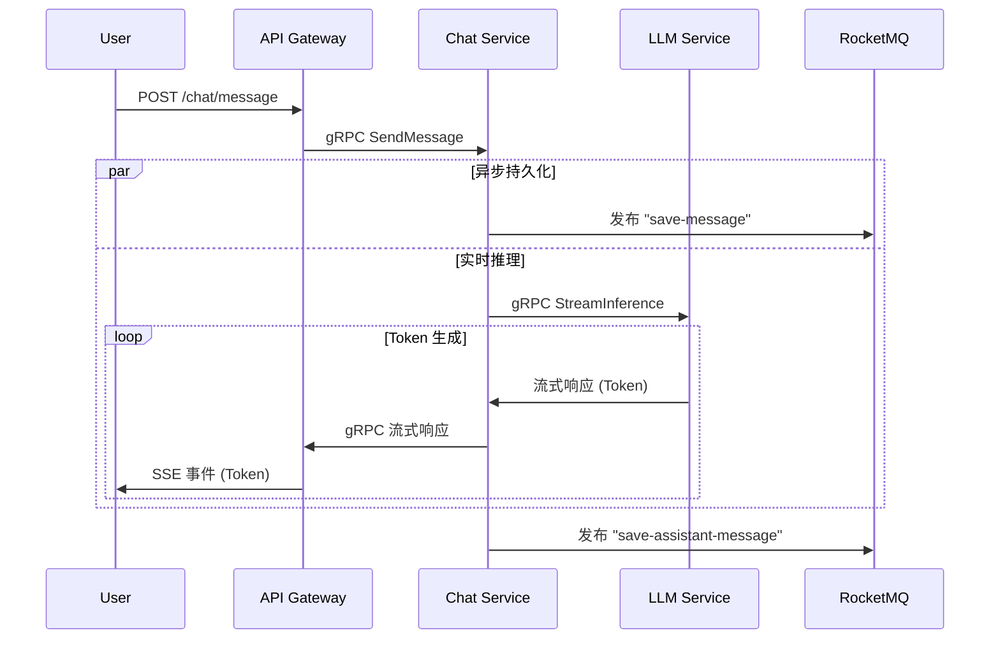

# Free Chat

基于微服务的 LLM 聊天平台，Go 后端 + Python 推理，支持分布式部署。

[English](README.md) | [中文](README_CN.md)

## 架构

标准的微服务模式，控制平面与计算平面分离。


```mermaid
graph TD
    User((用户)) -->|HTTP| WebUI[Web UI / Nginx]
    User -->|REST| Gateway[API Gateway]
    
    subgraph "控制平面 (Control Plane)"
        Gateway -->|gRPC| Auth[Auth Service]
        Gateway -->|gRPC| Chat[Chat Service]
        Auth --> DB[(PostgreSQL)]
        Chat --> DB
        Chat --> Redis[(Redis)]
        Chat --> MQ[RocketMQ]
    end
    
    subgraph "计算平面 (Compute Plane)"
        Chat -->|gRPC| LLM[LLM Inference Service]
    end
    
    Consul[Consul 服务注册] -.->|Register/Discover| Gateway
    Consul -.->|Register| Auth
    Consul -.->|Register| Chat
    Consul -.->|Register| LLM
```

## 数据流

聊天消息的请求路径，SSE 流式传输，通过 RocketMQ 异步持久化。


```mermaid
sequenceDiagram
    participant U as User
    participant G as API Gateway
    participant C as Chat Service
    participant L as LLM Service
    participant M as RocketMQ
    
    U->>G: POST /chat/message
    G->>C: gRPC SendMessage
    
    par 异步持久化
        C->>M: 发布 "save-message"
    and 实时推理
        C->>L: gRPC StreamInference
        
        loop Token 生成
            L->>C: 流式响应 (Token)
            C->>G: gRPC 流式响应
            G->>U: SSE 事件 (Token)
        end
    end
    
    C->>M: 发布 "save-assistant-message"
```

## 上下文管理

上下文系统管理 LLM 的 context window，包含 token 预算、自动压缩、话题分析和 attention sink 优化。

### 流水线

```
用户消息 → SaveMessage (记录 token 数)
        → GetHistory (拉取最近 10 条)
        → ContextBuilder.Build()
             ├─ 预算检查 (tiktoken-go 估算)
             ├─ 预算充足?  → 全量上下文
             ├─ 超预算?    → Compressor (层级压缩)
             └─ 严重超预算? → TopicAnalyzer → SSE topic_select
        → JSON → LLM 推理 (Python)
```

### Token 计数

| 层 | 方法 | 精度 | 用途 |
|----|------|------|------|
| Python (精确) | `tokenizer.encode(text)` | 精确 | 输入/输出计量 |
| Go (估算) | `tiktoken-go` + 模型映射 | ±3-5% | 实时预算决策 |
| Go (退化) | `len(text)/2` | 粗略 | 未知模型回退 |

### 自动压缩策略

当 token 预算不足时，按消息新旧程度分层压缩：

| 层级 | 范围 | 处理方式 |
|------|------|---------|
| 0 (原文) | 最近 5 轮 | 完全保留 |
| 1 (轻量) | 第 6-20 轮 | 截断至 100 字符 |
| 2 (中量) | 第 21-50 轮 | 截断至 50 字符 |
| 3 (重量) | 50 轮以上 | 替换为 "[compressed]" |
| 4 (丢弃) | 超出预算 | 从上下文中移除 |

### 话题分析（交互式）

当压缩仍不足且对话超过 3 轮时，触发话题分析：

1. Chat Service 将历史发送给 LLM 附带分析 prompt
2. LLM 返回结构化的 JSON 话题列表
3. 首个 SSE 事件推送 `event: topic_select` 含话题列表
4. 用户在下个请求中通过 `topic_id` 选择话题
5. 上下文仅保留选中话题范围内的历史

### Attention Sink 优化

上下文消息按以下结构排列，减轻 attention sink 失真：

```
位置 0:  "\n\n"                          ← Sink token（吸收异常注意力）
位置 1:  System: 全局指令                  ← 首位效应
位置 N:  对话历史（按时间顺序）               ← 对话轮次
位置 N+1: System: 指令重申                  ← 近因效应
位置 N+2: User: 当前输入                   ← 当前问题
```

## 快速开始

### 1. 单节点 (开发环境)

```bash
git clone https://github.com/einspanner/free-chat.git
cd free-chat

cp .env.example .env
docker compose up -d --build
```

访问地址: `http://localhost:3000`

### 2. 分布式部署 (生产环境)

**服务器 A (控制平面):** 运行 Gateway, Auth, DB, MQ, Consul。

```bash
export ADVERTISE_IP=100.100.1.1  # 服务器 A 的 Tailscale/局域网 IP
docker-compose -f docker-compose-control.yml up -d
```

**服务器 B (GPU 计算):** 运行 Chat Service, LLM Inference。

```bash
export ADVERTISE_IP=100.100.1.2  # 服务器 B 的 Tailscale/局域网 IP
export CONTROL_PLANE_IP=100.100.1.1 # 连接到服务器 A
docker-compose -f docker-compose-compute.yml up -d
```

### 3. 运行 Qwen-3B (高性能)

默认 0.6B 模型，切换至 Qwen-3B 需 8GB+ 显存。

```bash
export MODEL_NAME="Qwen/Qwen2.5-3B-Instruct"
```

Docker 环境：
```yaml
  llm-inference:
    environment:
      - MODEL_NAME=Qwen/Qwen2.5-3B-Instruct
```

## 配置

复制 `.env.example` 为 `.env` 并修改：

```bash
cp .env.example .env
```

| 变量 | 说明 | 默认值 |
|------|------|--------|
| `ADVERTISE_IP` | Consul 注册 IP（分布式必填） | 自动检测 |
| `AUTH_JWT_SECRET` | JWT 签名密钥 | `change-me` |
| `POSTGRES_PASSWORD` | 数据库密码 | `change-me` |
| `LLM_MODEL_NAME` | HuggingFace 模型路径 | `Qwen/Qwen3-0.6B` |
| `CONTROL_PLANE_IP` | 控制平面地址（计算节点用） | 分布式必填 |

## 技术栈

- **Go**: 聊天服务、认证服务、API 网关
- **Python**: PyTorch/HuggingFace Transformers 推理
- **gRPC**: 服务间通信
- **RocketMQ**: 异步消息持久化
- **Consul**: 动态服务发现
- **Redis**: 缓存、限流、模型负载均衡
- **PostgreSQL**: 消息和会话持久化
- **Tailscale**: 分布式节点安全组网（可选）

## 项目结构

```text
.
├── .env.example               # 环境变量模板
├── config/                    # 全局配置
│   ├── config.go              # Viper 配置加载
│   └── config.yml             # 默认配置
├── pkg/                       # 共享包
│   ├── proto/                 # gRPC proto 定义
│   └── registry/              # Consul 服务发现
├── services/
│   ├── api-gateway/           # HTTP 网关 (Gin)
│   ├── auth-service/          # JWT 认证 + 用户管理
│   ├── chat-service/          # 聊天业务 + 上下文管理
│   │   └── internal/
│   │       ├── application/   # 用例层
│   │       ├── domain/        # 实体 + 接口
│   │       └── infrastructure/
│   │           ├── context/   # ContextBuilder, Budget, Compressor, TopicAnalyzer
│   │           ├── mq/        # RocketMQ 生产者/消费者
│   │           ├── persistence/ # Redis 缓存 + PostgreSQL (GORM)
│   │           └── tokenizer/ # tiktoken-go 计数
│   ├── llm-inference/         # Python LLM 服务 (gRPC)
│   └── web-ui/                # 前端 (Nginx)
├── testapi/                   # Bruno API 集合
├── docker-compose.yml         # 单节点编排
├── docker-compose-control.yml # 分布式：控制平面
└── docker-compose-compute.yml # 分布式：计算平面
```

## API 测试

项目包含 [Bruno](https://www.usebruno.com) API 集合（`testapi/`），覆盖全部 10 个路由。使用时设置 `base_url` 和 `jwt_token` 变量。

## 测试覆盖

```
pkg/registry/consul_test.go              — ResolveAdvertiseIP
services/api-gateway/internal/
  handler/chat_handler_test.go           — SSE sentinel, topic_id
  middleware/                             — CORS, JWT 认证, 限流
services/auth-service/internal/
  infrastructure/security/jwt_test.go    — JWT 过期时间, claims, 刷新
services/chat-service/internal/
  domain/entity_test.go                  — Message.TokenCount
  infrastructure/
    context/                             — Budget, Builder, Compressor,
                                           TopicAnalyzer, Attention Sink (23 个测试)
    tokenizer/                           — tiktoken-go (5 个测试)
```
