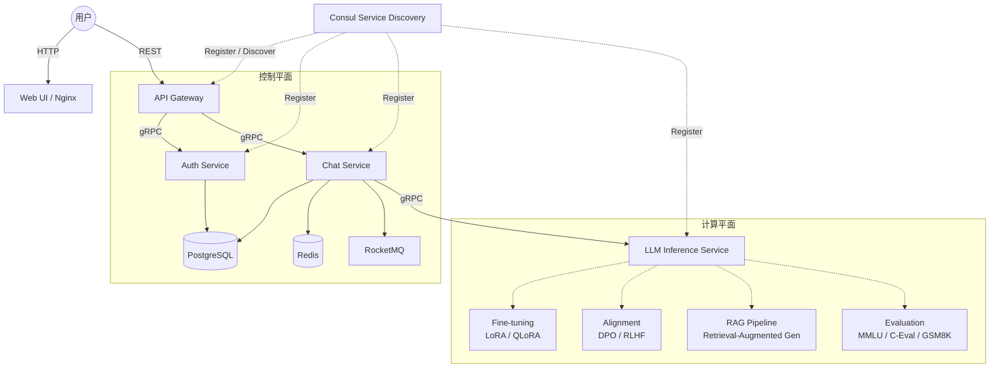
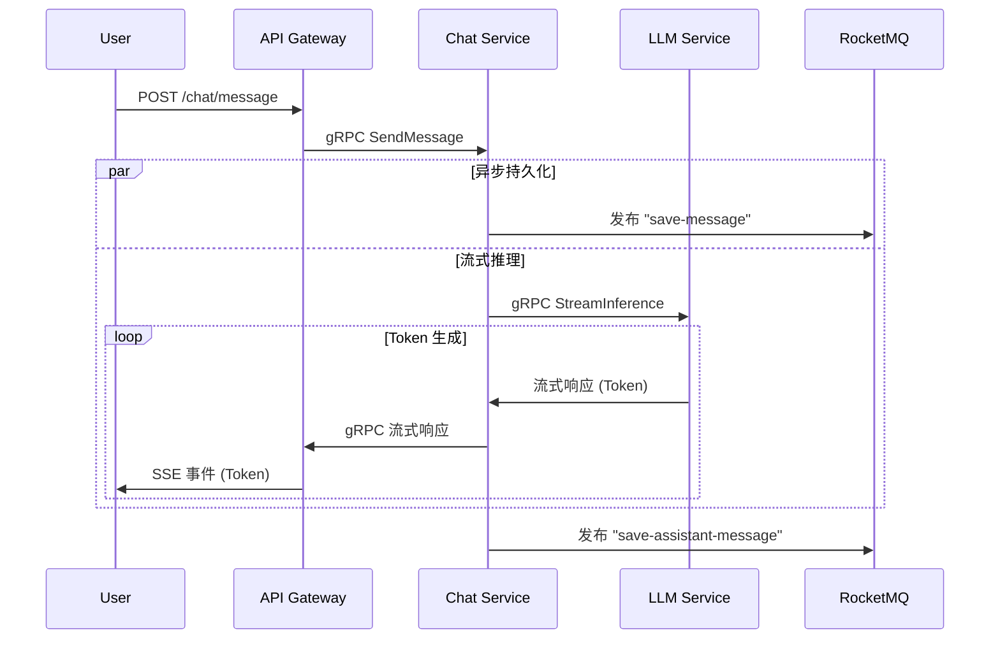

# Free Chat — LLM Training, Alignment and Efficient Inference Platform

<a href="https://github.com/Einspanner123/free-chat"></a>

**Free Chat** 是一个面向大语言模型全生命周期的分布式平台，覆盖 **推理服务（Inference Serving）、参数高效微调（Parameter-Efficient Fine-Tuning）、偏好对齐（Preference Alignment）、检索增强生成（RAG）与系统评测（Evaluation）** 等核心模块。采用 Go + Python 微服务架构，实现控制面与计算面的解耦。

---

## 目录

- [架构概览](#架构概览)
- [高性能 LLM 推理](#高性能-llm-推理)
- [长上下文对话管理](#长上下文对话管理)
- [参数高效微调与对齐](#参数高效微调与对齐)
- [RAG 增强生成](#rag-增强生成)
- [评测体系](#评测体系)
- [分布式部署](#分布式部署)
- [项目结构](#项目结构)
- [快速开始](#快速开始)
- [配置](#配置)

---

## 架构概览

平台将**控制面**（用户认证、会话管理、API 网关、消息队列）与**计算面**（LLM 推理、模型微调、评测）分离。两者通过 gRPC 通信，可独立部署和扩缩。


```mermaid
graph TD
    User((用户)) -->|HTTP| WebUI[Web UI / Nginx]
    User -->|REST| Gateway[API Gateway]
    
    subgraph "控制平面"
        Gateway -->|gRPC| Auth[Auth Service]
        Gateway -->|gRPC| Chat[Chat Service]
        Auth --> DB[(PostgreSQL)]
        Chat --> DB
        Chat --> Redis[(Redis)]
        Chat --> MQ[RocketMQ]
    end
    
    subgraph "计算平面"
        Chat -->|gRPC| LLM[LLM Inference Service]
        LLM -.-> Finetune[Fine-tuning<br/>LoRA / QLoRA]
        LLM -.-> Alignment[Alignment<br/>DPO / RLHF]
        LLM -.-> RAG[RAG Pipeline<br/>Retrieval-Augmented Gen]
        LLM -.-> Evaluation[Evaluation<br/>MMLU / C-Eval / GSM8K]
    end
    
    Consul[Consul Service Discovery] -.->|Register / Discover| Gateway
    Consul -.->|Register| Auth
    Consul -.->|Register| Chat
    Consul -.->|Register| LLM
```

**设计原因**：控制面运行在 CPU 实例上，按用户并发数扩缩；计算面需要 GPU，按推理队列深度和训练负载扩缩。两者解耦使得 GPU 资源只分配给真正需要它的工作负载。

---

## 高性能 LLM 推理

推理服务提供可插拔的引擎抽象，支持多种后端和优化策略。

### 可插拔引擎架构

| 引擎 | 适用场景 | 备注 |
|------|---------|------|
| HuggingFace Transformers | 开发、调试 | 无额外依赖 |
| vLLM | 生产环境 | PagedAttention、continuous batching |

`BaseEngine` 接口定义了 `generate`、`stream_generate`、`count_tokens`、`get_metrics` 方法。`EngineFactory` 在检测到 vLLM 可用时自动选择 vLLM，否则回退到 HuggingFace。

### 量化方案

| 方法 | 位宽 | 显存节省 | 精度保持 |
|------|------|---------|---------|
| AWQ | 4-bit | ~60% | ~99.4% of FP16 |
| GPTQ | 4-bit | ~58% | ~98.9% of FP16 |
| SqueezeLLM | 4-bit | ~62% | ~98.0% of FP16 |

通过环境变量 `QUANTIZATION` 配置。

### 推理优化

- **KV Cache**：LRU 淘汰机制的 KV 张量缓存，避免跨请求共享前缀的重复计算
- **Prefix Cache**：将新 prompt 与缓存前缀匹配，实现 KV cache 部分复用
- **Speculative Decoding**：小型 draft model 生成 γ 个候选 token，target model 单次前向传播验证。预计加速比：`1 / (1 - α + α/γ)`，其中 α 为 token 接受率，γ 为 draft 长度

---

## 长上下文对话管理

聊天服务通过分级压缩管道管理 LLM 上下文窗口，在降低长序列推理成本的同时保持对话质量。

### 流水线

```
用户消息 → SaveMessage (记录 token 数)
        → GetHistory (拉取最近 10 条)
        → ContextBuilder.Build()
             ├─ 预算检查 (tiktoken-go 估算)
             ├─ 预算充足?  → 全量上下文
             ├─ 超预算?    → Compressor (层级压缩)
             └─ 严重超预算? → TopicAnalyzer → SSE topic_select
        → JSON → LLM 推理 (Python)
```

### Token 估计

| 层 | 方法 | 精度 | 用途 |
|----|------|------|------|
| Python | `tokenizer.encode(text)` | 精确 | 输入/输出计量 |
| Go | `tiktoken-go` + 模型映射 | ±3-5% | 实时预算决策 |
| Go (退路) | `len(text)/2` | 粗略 | 未知模型回退 |

### 分级上下文压缩

当 token 预算不足时，按消息新旧程度分层处理：

| 层级 | 范围 | 处理方式 |
|------|------|---------|
| 0 (原文保留) | 最近 5 轮 | 完全保留 |
| 1 (轻量压缩) | 第 6-20 轮 | 截断至 100 字符 |
| 2 (中量压缩) | 第 21-50 轮 | 截断至 50 字符 |
| 3 (重量压缩) | 50 轮以上 | 替换为 "[compressed]" |
| 4 (丢弃) | 超出预算 | 从上下文中移除 |

### 话题感知上下文重建

当压缩不足以控制预算且对话超过 3 轮时，系统执行话题分析：

1. Chat Service 将历史发送给 LLM，附带分析 prompt
2. LLM 返回结构化的 JSON 话题列表
3. SSE 事件推送 `event: topic_select` 含话题选项
4. 用户通过 `topic_id` 选择话题
5. 上下文仅保留选中话题范围内的历史

### Attention Sink 缓解

```
位置 0:  "\n\n"                          ← Sink token（吸收异常注意力）
位置 1:  System: 全局指令                  ← 首位效应
位置 N:  对话历史（按时间顺序）               ← 对话轮次
位置 N+1: System: 指令重申                  ← 近因效应
位置 N+2: User: 当前输入                   ← 当前问题
```

---

## 参数高效微调与对齐

### LoRA / QLoRA 微调

支持三种数据格式：

| 格式 | 结构 | 来源 |
|------|------|------|
| ShareGPT | `{"conversations": [{"from": "human", "value": "..."}, ...]}` | 开源数据集 |
| Alpaca | `{"instruction": "...", "input": "...", "output": "..."}` | Stanford Alpaca |
| ChatML | `{"messages": [{"role": "...", "content": "..."}, ...]}` | OpenAI 兼容格式 |

主要训练参数：

| 参数 | 默认值 | 说明 |
|------|--------|------|
| LoRA rank (r) | 8 | rank 越低，可训练参数越少 |
| LoRA alpha | 16 | 缩放因子 |
| 目标模块 | q_proj, k_proj, v_proj, o_proj | 注意力投影层 |
| 学习率 | 2e-4 | 通常高于全量微调 |
| 单设备批大小 | 4 | 每 GPU |
| 梯度累积步数 | 4 | 有效批大小 = 4 × 4 = 16 |
| 最大序列长度 | 2048 | 超出部分截断 |
| QLoRA 4-bit NF4 | 默认启用 | 显存从 ~22GB 降至 ~8GB |

### DPO（直接偏好优化）

实现 DPO 算法，将两步 RLHF 替换为单一损失函数：

$$ \mathcal{L}_{\text{DPO}}(\pi_\theta; \pi_{\text{ref}}) = -\mathbb{E}_{(x,y_w,y_l) \sim \mathcal{D}} \left[ \log \sigma \left( \beta \log \frac{\pi_\theta(y_w|x)}{\pi_{\text{ref}}(y_w|x)} - \beta \log \frac{\pi_\theta(y_l|x)}{\pi_{\text{ref}}(y_l|x)} \right) \right] $$

- **β**：控制偏好边界的温度参数
- **loss_type**：支持 "sigmoid"（标准 DPO）、"ipo"（MSE-based）、"kto_pair"
- **label_smoothing**：防止过拟合偏好标签

### PPO RLHF

RLHF 管道实现经典的两步方法：

1. **Reward Model**：基础 LM 加线性输出层，输出标量奖励分数
2. **PPO 训练**：使用 PPO-Clip 与广义优势估计（GAE）优化策略

$$ L^{\text{PPO}} = -\mathbb{E}\left[\min\left(r(\theta) \cdot A,\ \text{clip}(r(\theta), 1-\varepsilon, 1+\varepsilon) \cdot A\right)\right] + c_1 (V - R)^2 - c_2 \cdot \text{KL}(\pi_\theta \parallel \pi_{\text{ref}}) $$

- **GAE(γ, λ)**：计算 TD 残差的加权和作为优势估计
- **自适应 KL 惩罚**：根据当前 KL 与目标 KL 的比值调整 KL 系数

### 合成数据

- **Self-Instruct**：从种子话题生成任务，再生成回复
- **Evol-Question**：加深（添加约束）或拓宽（扩展范围）已有问题
- **质量过滤**：长度检查、去重、HTML 移除、重复检测
- **EDA 增强**：同义词替换、随机插入/交换/删除

---

## RAG 增强生成

实现文档分块、dense retrieval、BM25 sparse retrieval 与 hybrid retrieval fusion。

### 分块策略

| 策略 | 方法 | 适用场景 |
|------|------|---------|
| Recursive | 按分隔符优先级列表递归分割 | 通用文本 |
| Semantic (句子) | 按句子边界分割 | 标点规范的文本 |
| Semantic (段落) | 按双换行分割 | 结构化文档 |
| Semantic (话题) | 按 Markdown 标题分割 | 技术文档 |

### 检索策略

| 策略 | 方法 | 匹配方式 |
|------|------|---------|
| Dense | 嵌入向量余弦相似度 | 语义相似 |
| Sparse | BM25 (Okapi 变体) | 词项重叠 |
| Hybrid | 分数归一化 + 加权融合 | 语义 + 词项 |

### 管道流程

```
ingest(text) → chunk → embed → index (vector store + BM25)
                                             ↓
query(text) → retrieve (dense/sparse/hybrid) → build_prompt → generate
```

---

## 评测体系

对任何实现引擎接口的模型运行标准化基准测试：

| 评测 | 指标 | Few-Shot | 说明 |
|------|------|----------|------|
| MMLU | 准确率 | 5-shot | 57 个学科，多项选择 |
| C-Eval | 准确率 | 5-shot | 中文，20 个学科 |
| GSM8K | 准确率 | 8-shot | 小学数学推理 |
| HumanEval | pass@1 | 0-shot | Python 函数补全 |

**指标**：Exact Match、Token-level F1、ROUGE-1/ROUGE-L、Pass@k、置信区间。

---

## 分布式部署

### 开发环境（单节点）

```bash
cp .env.example .env
docker compose up -d --build
```

访问地址：`http://localhost:3000`

### 生产环境（控制面与计算面分离）

**服务器 A — 控制面**（CPU 实例）：
```bash
export ADVERTISE_IP=100.100.1.1
docker-compose -f docker-compose-control.yml up -d
```

**服务器 B — 计算面**（GPU 实例）：
```bash
export ADVERTISE_IP=100.100.1.2
export CONTROL_PLANE_IP=100.100.1.1
docker-compose -f docker-compose-compute.yml up -d
```

### 请求流程


```mermaid
sequenceDiagram
    participant U as User
    participant G as API Gateway
    participant C as Chat Service
    participant L as LLM Service
    participant M as RocketMQ
    
    U->>G: POST /chat/message
    G->>C: gRPC SendMessage
    
    par 异步持久化
        C->>M: 发布 "save-message"
    and 流式推理
        C->>L: gRPC StreamInference
        
        loop Token 生成
            L->>C: 流式响应 (Token)
            C->>G: gRPC 流式响应
            G->>U: SSE 事件 (Token)
        end
    end
    
    C->>M: 发布 "save-assistant-message"
```

消息发送到 RocketMQ 异步持久化，同时 LLM 开始流式返回推理结果。Token 通过 gRPC 双向流转发到 Go 聊天服务，再以 SSE 事件推送到前端。

---

## 项目结构

```
.
├── .env.example
├── config/                          # 全局配置
│   ├── config.go                    # Viper 配置加载
│   └── config.yml                   # 默认配置
├── pkg/                             # 共享包
│   ├── proto/                       # gRPC proto 定义
│   └── registry/                    # Consul 服务发现
├── services/
│   ├── api-gateway/                 # HTTP 网关 (Gin, JWT, 限流)
│   ├── auth-service/                # 用户认证、注册、令牌管理
│   ├── chat-service/                # 对话逻辑、上下文管理
│   │   └── internal/
│   │       ├── domain/              # 实体、仓库接口
│   │       ├── application/         # 用例层
│   │       └── infrastructure/
│   │           ├── context/         # ContextBuilder, Budget, Compressor, TopicAnalyzer
│   │           ├── mq/              # RocketMQ 生产者/消费者
│   │           ├── persistence/     # Redis 缓存 + PostgreSQL (GORM)
│   │           └── tokenizer/       # tiktoken-go token 计数
│   ├── llm-inference/               # Python 推理服务
│   │   ├── src/
│   │   │   ├── engine_base.py       # 引擎抽象接口
│   │   │   ├── vllm_engine.py       # vLLM 后端
│   │   │   ├── hf_engine.py         # HuggingFace 后端
│   │   │   ├── quantization.py      # AWQ/GPTQ/SqueezeLLM 配置
│   │   │   └── optimization/        # 推测解码, KV 缓存
│   │   └── tests/                   # 145 个测试
│   ├── finetune/                    # LoRA/QLoRA 微调 (110 个测试)
│   ├── alignment/                   # DPO 偏好对齐 (50 个测试)
│   ├── evaluation/                  # MMLU, C-Eval, GSM8K, HumanEval (90 个测试)
│   ├── rag/                         # RAG 管道 (51 个测试)
│   ├── synthetic-data/              # Self-instruct, EDA 增强 (38 个测试)
│   └── rlhf/                        # PPO RLHF (21 个测试)
├── testapi/                         # Bruno API 集合
├── docker-compose.yml               # 单节点编排
├── docker-compose-control.yml       # 控制面（分布式）
└── docker-compose-compute.yml       # 计算面（分布式）
```

---

## 配置

所有配置集中在 `.env` 文件中：

| 变量 | 说明 | 默认值 |
|------|------|--------|
| `ADVERTISE_IP` | Consul 注册 IP（分布式） | 自动检测 |
| `ENGINE_TYPE` | 推理引擎选择：auto, vllm, hf | auto |
| `QUANTIZATION` | 量化方法：awq, gptq, squeezellm，或空 | (FP16) |
| `LLM_MODEL_NAME` | HuggingFace 模型路径 | `Qwen/Qwen2.5-0.5B-Instruct` |
| `CONTROL_PLANE_IP` | 控制面地址（计算节点用） | 分布式必填 |

---

## 快速开始

```bash
git clone https://github.com/Einspanner123/free-chat.git
cd free-chat
cp .env.example .env
docker compose up -d --build
```

访问地址：`http://localhost:3000`

---

## 测试覆盖

| 模块 | 测试数 | 覆盖范围 |
|------|--------|---------|
| llm-inference | 145 | 引擎切换、量化、推理优化 |
| finetune | 110 | LoRA/QLoRA 训练、数据格式加载、权重合并 |
| alignment | 50 | DPO 损失、偏好数据验证 |
| evaluation | 90 | MMLU/C-Eval/GSM8K/HumanEval, 指标计算 |
| rag | 51 | 分块策略、检索策略、管道集成 |
| synthetic-data | 38 | 数据生成、质量过滤、EDA 可重复性 |
| rlhf | 21 | PPO 损失、GAE 优势估计、KL 自适应 |

**总计**：505 个测试。
