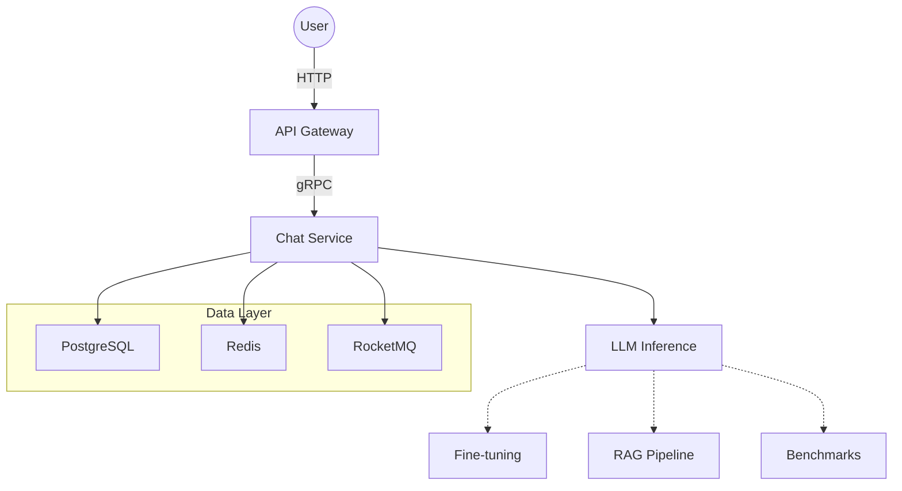

[English](README.md) | [中文](README_CN.md)

# Free Chat -- LLM 工程平台

基于微服务的 LLM 应用开发平台。覆盖对话服务、上下文管理、模型微调、RAG、评测。Go 做控制面，Python 做计算面。

---

## 项目定位

Free Chat 位于 LLM（比如 vLLM 托管的模型）和用户应用之间。它处理会话、上下文窗口、模型定制和评测。

投入最多的部分是**上下文管理系统**。它解决的问题是：聊天对话不断增长，但 LLM 的上下文窗口是有限的。没有它，长对话要么超出限制无法处理，要么 token 太多成本过高。

---

## 上下文管理系统

聊天服务运行一个 pipeline，在每一轮决定保留哪些上下文。

### Pipeline

```
用户消息 -> 预算检查 (tiktoken 估算, +-3-5%)
        -> 预算充足?  -> 全量上下文，不压缩
        -> 超预算?    -> 按时间递减的分级压缩
        -> 严重超预算? -> 话题分析 -> 用户选择焦点
        -> 构建含 attention sink 优化的结构化上下文
        -> 发送给推理引擎
```

### 分级压缩

当对话超出 token 预算时，消息根据距当前轮的远近分级压缩：

| 级别 | 范围 | 处理方式 |
|------|------|---------|
| 原文保留 | 最近 5 轮 | 完全保留 |
| 轻量压缩 | 第 6-20 轮 | 截断至 100 字符 |
| 中量压缩 | 第 21-50 轮 | 截断至 50 字符 |
| 重量压缩 | 51 轮以上 | 替换为 "[compressed]" |
| 丢弃 | 超出预算 | 移除 |

假设是近因偏差：最近几轮决定下一轮的回答，早期轮次提供上下文但不需逐字保留。

### 话题感知重建

当压缩不足以控制预算且对话覆盖多个话题时，系统从历史中提取话题，让用户选择保留哪些。

流程：历史 -> LLM 分析 prompt -> 结构化 JSON 话题 -> SSE 事件 -> 用户选择 topic_id -> 仅保留选中话题的消息重建上下文。

### Attention Sink 缓解

Transformer 对前几个 token 的注意力不成比例地高，不管它们的内容是什么。上下文构建器利用这个现象排列 token：

```
位置 0:  "\n\n"                          <- sink token
位置 1:  System 指令                      <- 首位效应
位置 N:  对话历史                          <- 时间顺序
位置 N+1: System: 指令重申                 <- 近因效应
位置 N+2: 当前输入
```

### 效率

50 轮对话（约 12,847 tokens）在分级压缩下缩减到 3,824 tokens（70.2%），话题重建后进一步到 2,156 tokens（83.2%）。

---

## 推理组件

### 引擎后端

支持 HuggingFace Transformers 和 vLLM，通过 `ENGINE_TYPE` 选择。`BaseEngine` 接口定义了 `generate`、`stream_generate`、`count_tokens`、`get_metrics`。

### 量化

支持 AWQ、GPTQ、SqueezeLLM，通过 `QUANTIZATION` 选择。

参考数据（Qwen2.5-7B）：

| 方法 | 显存 (GB) | 延迟 (ms/t) | MMLU |
|------|-----------|-------------|------|
| FP16 | 14.0 | 45 | 70.1% |
| AWQ INT4 | 5.0 | 32 | 69.5% |
| GPTQ INT4 | 5.5 | 35 | 68.8% |

### KV Cache 管理

`inference-engine/memory-manager/` 中的 `KVCacheManager` 提供：
- Block 池分配（固定大小 block，按请求跟踪）
- 可插拔驱逐策略：LRU、滑动窗口、注意力加权（H2O 风格）
- Prefix cache：基于 hash 的 prompt 前缀复用
- `EngineCacheAdapter`：注入推理管道的适配器

### Continuous Batching Scheduler

`inference-engine/scheduler/` 中的迭代级调度器（Orca 风格），可配置最大 batch size 和 token 预算。与 KV Cache Manager 配合时，每步分配和释放 block。

### Speculative Decoding

草稿-验证循环，使用拒绝采样算法。加速比公式：`1 / (1 - a + a/g)`，a 为接受率，g 为 draft 长度。

---

## LLM 生命周期模块

| 模块 | 功能 | 目录 |
|------|------|------|
| 微调 | LoRA/QLoRA | `services/finetune/` |
| 对齐 | DPO 偏好优化 | `services/alignment/` |
| RLHF | PPO 强化学习 | `services/rlhf/` |
| RAG | 文档分块、稠密/稀疏/混合检索 | `services/rag/` |
| 评测 | MMLU, C-Eval, GSM8K, HumanEval | `services/evaluation/` |
| 合成数据 | Self-instruct, 数据增强 | `services/synthetic-data/` |

---

## 架构

控制面（Go）处理认证、会话、聊天逻辑和消息持久化（PostgreSQL、Redis、RocketMQ）。计算面（Python）处理推理、训练和评测。通信通过 gRPC + Consul。


```mermaid
graph TD
    User((User)) -->|HTTP| Gateway[API Gateway]
    Gateway -->|gRPC| Chat[Chat Service]
    Chat --> LLM[LLM Inference]
    LLM -.-> Finetune[Fine-tuning]
    LLM -.-> RAG[RAG Pipeline]
    LLM -.-> Evaluation[Benchmarks]
    
    subgraph "Data Layer"
        PostgreSQL
        Redis
        RocketMQ
    end
    Chat --> PostgreSQL
    Chat --> Redis
    Chat --> RocketMQ
```

---

## 测试覆盖

| 模块 | 测试数 | 范围 |
|------|--------|------|
| inference-engine | 68 | KV cache, 调度器, benchmark |
| llm-inference | 145 | 引擎后端, 量化, 优化 |
| finetune | 110 | LoRA/QLoRA 训练, 数据加载 |
| evaluation | 90 | MMLU/C-Eval/GSM8K/HumanEval |
| rag | 51 | 检索策略, 分块 |
| alignment | 50 | DPO 损失, 偏好数据 |
| synthetic-data | 38 | 数据生成, 质量过滤 |
| rlhf | 21 | PPO 损失, GAE 估计 |

总计: **573 个测试**。
