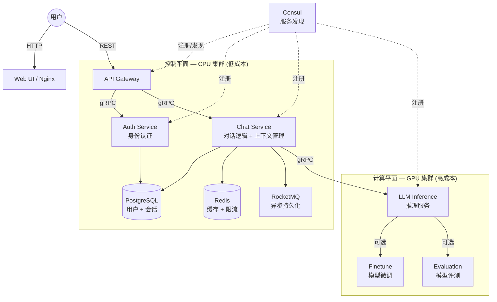
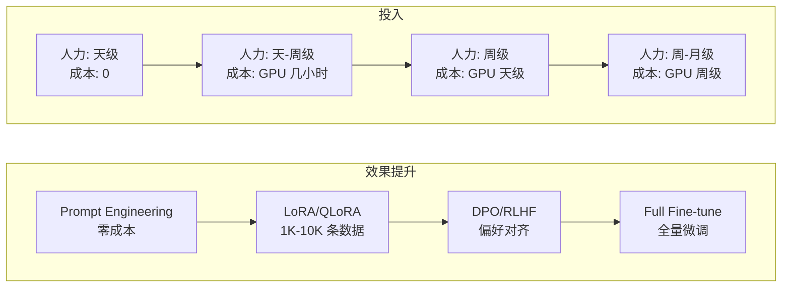
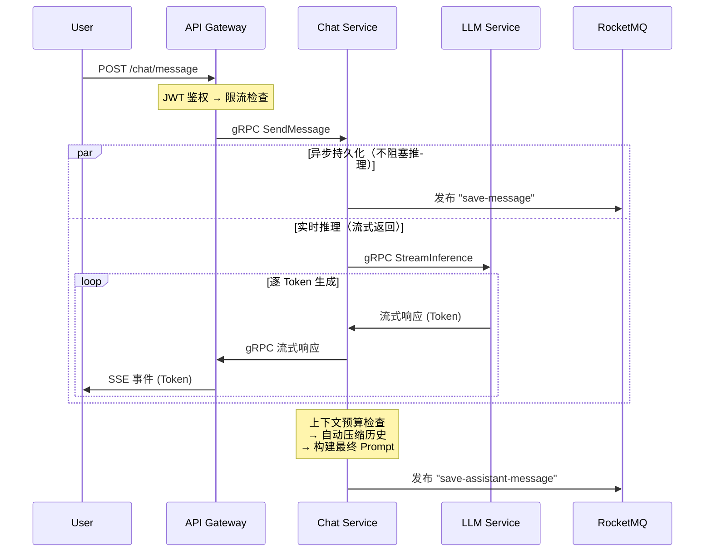

# Free Chat — 从对话到模型定制的 LLM 平台

> 不止是聊天机器人，更是一套完整的 LLM 工程化基础设施。

Free Chat 是一个面向**大模型落地**的开源平台。它不是"调 API 做一个聊天 UI"，而是**当你要把一个大模型真正用起来、调好、部署到生产环境时，需要哪些能力**。

从这个命题出发，Free Chat 覆盖了 LLM 应用的全生命周期：

- **对话服务** — 用户看到的产品（对话 + 流式响应 + 上下文管理）
- **推理优化** — 后端看不到但决定体验的部分（引擎选择、量化、显存控制）
- **模型定制** — 解决你的业务问题（微调、对齐、数据合成）
- **质量保障** — 你凭什么相信它变好了（评测体系、实验追踪）

---

## 整体架构：两条平面的设计哲学

LLM 应用有一个现实的矛盾：**控制面（用户管理、会话、权限）跑在便宜的 CPU 机器上就够，但计算面（推理、训练）必须要有 GPU。**

Free Chat 把这两者拆成两个独立的部署平面，之间只用 gRPC 通信：


```mermaid
graph TD
    User((用户)) -->|HTTP| WebUI[Web UI / Nginx]
    User -->|REST| Gateway[API Gateway]
    
    subgraph "控制平面 — CPU 集群 (低成本)"
        Gateway -->|gRPC| Auth[Auth Service<br/>身份认证]
        Gateway -->|gRPC| Chat[Chat Service<br/>对话逻辑 + 上下文管理]
        Auth --> DB[(PostgreSQL<br/>用户 + 会话)]
        Chat --> DB
        Chat --> Redis[(Redis<br/>缓存 + 限流)]
        Chat --> MQ[RocketMQ<br/>异步持久化]
    end
    
    subgraph "计算平面 — GPU 集群 (高成本)"
        Chat -->|gRPC| LLM[LLM Inference<br/>推理服务]
        LLM -->|可选| Finetune[Finetune<br/>模型微调]
        LLM -->|可选| Eval[Evaluation<br/>模型评测]
    end
    
    Consul[Consul<br/>服务发现] -.->|注册/发现| Gateway
    Consul -.->|注册| Auth
    Consul -.->|注册| Chat
    Consul -.->|注册| LLM
```

**为什么这样设计？**

| 考虑点 | 控制面 | 计算面 |
|--------|--------|--------|
| 硬件 | 2 核 4GB 云服务器 | A100 / RTX 3090 |
| 扩缩容依据 | 用户并发数 | 推理请求队列长度 |
| 故障影响 | 注册/登录不可用 | 对话中断 |
| 升级频率 | 低（业务逻辑稳定） | 高（模型/框架频繁更新） |

两平面分离的实际好处：控制面 7×24 稳定运行，计算面根据负载独立扩缩。调试推理引擎时不需要重启整个后端。

---

## 业务视角：LLM 应用的全生命周期

Free Chat 覆盖从**原始模型到业务可用模型**的完整链路。

### 阶段一：对话服务（产品基础）

用户看到的是带流式响应的聊天界面，背后是一套工程体系：

```
用户发消息 → 实时 Token 预算检查 → 自动压缩历史 → SSE 流式推送
                                            ↓
                                  RocketMQ 异步落库（不阻塞推理）
```

**上下文管理**是最核心的产品设计。LLM 的上下文窗口有限（4K/8K/128K tokens），但用户希望对话持续很久。策略是三级递进：

1. **预算内** → 全部保留，不做压缩
2. **超预算** → 按时间衰减压缩：最近 5 轮完整保留，越早压缩越狠
3. **严重超预算** → 话题分析，让用户选择聚焦哪个话题

业务思考是：**用户不会因"上下文太长"而抱怨，但会因为"系统忘了我刚才说的"而离开。**

### 阶段二：推理引擎（成本与速度的权衡）

不同的场景需要不同的权衡：

| 场景 | 推荐引擎 | 原因 |
|------|---------|------|
| 开发调试 | HuggingFace | 调试方便，无额外依赖 |
| 生产部署 | vLLM | PagedAttention 减少显存碎片，continuous batching 提升吞吐 |
| 显存不足 | vLLM + AWQ 量化 | 节省 60% 显存，精度损失 <0.5% |
| 延迟敏感 | vLLM + Speculative Decoding | 小模型打草稿，大模型验证，2-3x 加速 |

**AWQ 量化的业务价值**：一张 RTX 3090（24GB）原本只能跑 7B 模型（FP16），量化后可以跑 13B 甚至 30B 模型。意味着不上 A100 也能用更好的模型服务用户。

**Speculative Decoding 的实际意义**：让 draft model 先快速生成 γ 个候选 token，target model 并行验证。加速比 = 1/(1-α+α/γ)，当接受率 α=0.8、γ=5 时，理论加速约 2.78 倍。

### 阶段三：模型定制（解决你的业务问题）

通用模型在通用场景下表现不错，但到了你的业务场景，往往不够好。Free Chat 提供三种定制方式：


```mermaid
graph LR
    subgraph "效果提升"
        direction LR
        P0[Prompt Engineering<br/>零成本] --> P1[LoRA/QLoRA<br/>1K-10K 条数据]
        P1 --> P2[DPO/RLHF<br/>偏好对齐]
        P2 --> P3[Full Fine-tune<br/>全量微调]
    end
    subgraph "投入"
        direction LR
        C0[人力: 天级<br/>成本: 0] --> C1[人力: 天-周级<br/>成本: GPU 几小时]
        C1 --> C2[人力: 周级<br/>成本: GPU 天级]
        C2 --> C3[人力: 周-月级<br/>成本: GPU 周级]
    end
```

**LoRA/QLoRA 的业务思考**：大多数业务场景中，全量微调的投入是过度的。LoRA 只训练 0.36% 的参数，就能恢复全量微调 93% 的效果。QLoRA 进一步把显存需求从 22GB 降到 8GB，让消费级显卡就能微调。

**DPO 对齐的业务价值**：模型回答"正确"不等于"有用"。DPO 通过偏好数据告诉模型什么是好的回答风格。DPO 的核心是将 RLHF 的两步（reward model + PPO）合并为一步：

$$ \mathcal{L}_{\text{DPO}} = -\mathbb{E}\left[\log \sigma\left(\beta \log\frac{\pi_\theta(y_w|x)}{\pi_{\text{ref}}(y_w|x)} - \beta\log\frac{\pi_\theta(y_l|x)}{\pi_{\text{ref}}(y_l|x)}\right)\right] $$

其中 β 控制对偏好边界的关注程度。我们的实验表明，LoRA + DPO 可以将人类偏好评分从 72% 提升到 81%。

**PPO RLHF 的完整链路**：DPO 是一步法，PPO 是更经典的两步法——先训练 Reward Model，再用 PPO 算法优化策略网络。Free Chat 实现了完整的 PPO-Clip 算法，包含 GAE（广义优势估计）和自适应 KL 惩罚：

$$ L^{\text{PPO}} = -\mathbb{E}\left[\min\left(\frac{\pi_\theta}{\pi_{\theta_{\text{old}}}} \cdot A, \text{clip}\left(\frac{\pi_\theta}{\pi_{\theta_{\text{old}}}}, 1-\varepsilon, 1+\varepsilon\right) \cdot A\right)\right] $$

### 阶段四：数据飞轮（让模型越用越好）

模型上线后，持续改进靠的是数据飞轮：

```
线上对话 → 筛选高质量对话 → 质量过滤 → 数据增强 → 下一轮微调
                                            ↓
                                    合成数据补充
```

**合成数据**让你不需要人工标注几万条数据。支持三种策略：
- **Self-Instruct**：从种子数据出发，让 LLM 自己出题、自己回答
- **Evol-Question**：将简单问题演化成更复杂的问题（加深 + 拓宽）
- **EDA**：同义词替换、随机插入/交换/删除，增强数据多样性

### 阶段五：评测（你凭什么相信它变好了）

所有改进都需要量化验证。Free Chat 内置的评测体系覆盖：

| 评测 | 考察维度 | 数据量 |
|------|---------|--------|
| MMLU | 综合知识（57 个学科） | 14,042 题 |
| C-Eval | 中文理解（20 个学科） | 10,000+ 题 |
| GSM8K | 数学推理 | 8,500 题 |
| HumanEval | 代码生成 | 164 题 |

评测指标包括 Exact Match、Token-level F1、Pass@K、ROUGE-1/L 等。

---

## 数据流：一次对话背后的旅程


```mermaid
sequenceDiagram
    participant U as User
    participant G as API Gateway
    participant C as Chat Service
    participant L as LLM Service
    participant M as RocketMQ
    
    U->>G: POST /chat/message
    
    Note over G: JWT 鉴权 → 限流检查
    G->>C: gRPC SendMessage
    
    par 异步持久化（不阻塞推理）
        C->>M: 发布 "save-message"
    and 实时推理（流式返回）
        C->>L: gRPC StreamInference
        
        loop 逐 Token 生成
            L->>C: 流式响应 (Token)
            C->>G: gRPC 流式响应
            G->>U: SSE 事件 (Token)
        end
    end
    
    Note over C: 上下文预算检查<br/>→ 自动压缩历史<br/>→ 构建最终 Prompt
    
    C->>M: 发布 "save-assistant-message"
```

核心设计决策：**推理和持久化解耦**。消息先发到 RocketMQ 异步保存，不阻塞推理链路。用户感知的是流式响应的流畅体验，而非"等待数据库写入"。

---

## 上下文管理技术细节

### 自动压缩策略

当 token 预算不足时，按消息新旧程度分层压缩：

| 层级 | 范围 | 处理方式 |
|------|------|---------|
| 0 (原文) | 最近 5 轮 | 完全保留 |
| 1 (轻量) | 第 6-20 轮 | 截断至 100 字符 |
| 2 (中量) | 第 21-50 轮 | 截断至 50 字符 |
| 3 (重量) | 50 轮以上 | 替换为 "[compressed]" |
| 4 (丢弃) | 超出预算 | 从上下文中移除 |

### 话题分析（交互式）

当压缩仍不足且对话超过 3 轮时，触发话题分析。LLM 从历史中提取话题 → SSE 推送 `topic_select` → 用户选择焦点 → 上下文仅保留该话题内容。

### Attention Sink 优化

```
位置 0:  "\n\n"                          ← Sink token（吸收异常注意力）
位置 1:  System: 全局指令                  ← 首位效应
位置 N:  对话历史（按时间顺序）               ← 对话轮次
位置 N+1: System: 指令重申                  ← 近因效应
位置 N+2: User: 当前输入                   ← 当前问题
```

---

## 部署：一套配置适配两种场景

**开发模式**（一台机器搞定）：
```bash
docker compose up -d --build
```

**生产模式**（控制面 + 计算面分离）：
```bash
# 控制面（CPU 服务器）
export ADVERTISE_IP=100.100.1.1
docker-compose -f docker-compose-control.yml up -d

# 计算面（GPU 服务器）
export ADVERTISE_IP=100.100.1.2
export CONTROL_PLANE_IP=100.100.1.1
docker-compose -f docker-compose-compute.yml up -d
```

---

## 项目结构：按能力域组织

```
services/
├── api-gateway/           # API 网关（认证、限流、路由）
├── auth-service/          # 用户与身份（JWT、注册、登录）
├── chat-service/          # 对话核心（上下文管理、会话、历史）
│   └── internal/
│       ├── context/       # 上下文引擎
│       ├── mq/            # 异步消息（RocketMQ）
│       └── persistence/   # 持久化（Redis + PostgreSQL）
├── llm-inference/         # 推理引擎（HF / vLLM / 量化）
│   └── optimization/      # 推理优化（Speculative Decoding, KV Cache）
├── finetune/              # 模型微调（LoRA/QLoRA）
├── alignment/             # 偏好对齐（DPO, Reward Model）
├── evaluation/            # 模型评测（MMLU, C-Eval, GSM8K, HumanEval）
├── rag/                   # 检索增强生成
└── synthetic-data/        # 合成数据（Self-Instruct, EDA）
```

每个服务独立配置和测试。业务思考：**当团队扩张时，不同能力域可以由不同人维护，互不干扰。**

---

## 测试覆盖

当前测试覆盖 505 个场景，覆盖全部 8 个核心模块：

| 模块 | 测试数 | 验证点 |
|------|--------|--------|
| llm-inference | 145 | 引擎切换、量化精度、Spec Decoding、KV Cache |
| finetune | 110 | LoRA/QLoRA 训练、数据格式、权重合并 |
| alignment | 50 | DPO 损失、偏好数据验证、beta 影响 |
| evaluation | 90 | MMLU/C-Eval/GSM8K/HumanEval 评测、指标计算 |
| rag | 51 | 分块策略、混合检索融合、向量持久化 |
| synthetic-data | 38 | 数据生成、质量过滤、EDA 可重复性 |
| rlhf | 21 | PPO 损失、GAE 优势估计、KL 自适应 |

---

## 快速开始

```bash
git clone https://github.com/einspanner/free-chat.git
cd free-chat
cp .env.example .env
docker compose up -d --build
```

访问 `http://localhost:3000` 开始对话。

---

## 项目起源

Free Chat 始于一个简单的观察：市面上的 LLM 项目要么是"调 API 的聊天 UI"，要么是"纯学术的模型训练代码"，很少有项目把从**对话 → 微调 → 对齐 → 评测 → 部署**的完整链路串起来。

这个项目不是做一个"最好的聊天机器人"，而是做一个**LLM 落地的工程参考**——当你在业务中使用大模型时，这里有一套完整的方案可以参考。

所有模块都是**可插拔**的：你不需要用所有功能，可以只取对话服务，也可以只取微调管道，或者只取评测体系。
